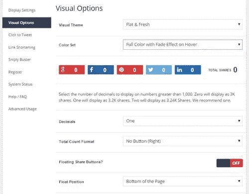
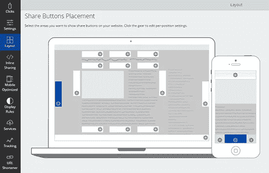
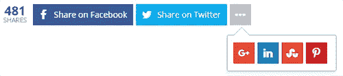
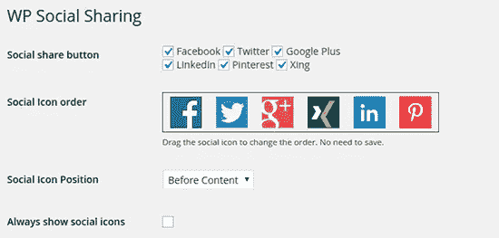
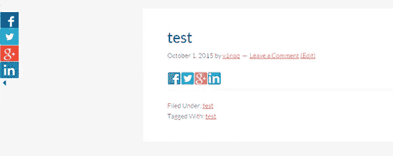

# 最佳社交分享插件

> 原文：<https://medium.com/visualmodo/best-social-sharing-wordpress-plugins-3de75bf12095?source=collection_archive---------0----------------------->

找到一个像样的社交分享插件要比想象中困难得多。因此，我们建立了一个列表，列出了一些社交媒体分享的最佳插件。

这难道不疯狂吗？

WordPress 知识库中有成千上万的插件，但是我发现自己切换插件太频繁了。但是不应该是这样的。对我们来说，找到一个能做我们需要的功能的社交分享插件应该更容易。还有一个最重要的因素，就是在我们需要的时候获得支持。*事实是，合适的社交插件已经为你准备好了。我在这个列表中加入了我的个人社交分享插件，还有一些我相信你会喜欢的插件。*

无论是添加社交分享按钮、关注者计数、鼓励社交分享还是在 WordPress 中监控社交分享，这里都有适合你的插件。所有的 [Visualmodo WordPress 主题](https://visualmodo.com/)完全兼容并优化了所有的社交分享 WordPress 插件。

让我们开始吧:

# 最佳社交分享插件

# 社会战争

社交战现在是我的社交分享插件。

这个插件可以很容易地在你的博客的不同位置添加视觉上惊艳的分享按钮——你可以通过短代码甚至浮动分享按钮在你的文章上面/下面添加分享按钮。更好的是:你还可以使用许多强大的功能，这些功能可以极大地提高你的社交份额。

**一位客户报告称，使用该插件后，社交分享增加了 300%。**

以下几个特征可以解释这种增长水平:

首先，你可以上传 Pinterest 特有的图片和描述。Pinterest 在推动某些行业的流量方面具有巨大的潜力，但问题是，当你的访问者点击“Pin”按钮时，大多数默认图片的大小都不合适。

我注意到，在 Pinterest 上使用高个子图片时，我比分享矮个子图片获得了更多的关注。因此，通过社交战，你可以创建一个 Pinterest 友好的图片，并上传到你的帖子上。这一点也不会影响你的常规特色图片——太棒了！

其次，你可以选择在你的内容中添加可在推特上发布的报价框，并且有许多聪明的设计可供选择。我曾经成功地使用过这些方法。还有很多，这包括-自定义推文，隐藏低份额计数等等。

**功能:**

*   支持流行的社交网络。
*   一些引人注目的主题。
*   支持 Twitter 卡(不是必需的，因为 Yoast SEO 提供了 Twitter 卡支持)
*   显示总股份数和个人股份数。
*   仅在超过指定数值时显示份额计数。
*   显示浮动共享按钮。
*   在你的内容中添加“点击发布”框。
*   为单个帖子添加自定义推文文本。
*   显示按共享计数组织的热门帖子小部件。
*   将 Pinterest 的特定图片和描述上传到你的帖子中(这对提高 Pinterest 的流量很有帮助)。
*   使用 UTM 跟踪代码跟踪社交分享(查看这个插件给你带来了多少流量)。
*   别上扣子。
*   支持 Pinterest 提及。
*   完全移动[响应](https://visualmodo.com/wordpress-membership/)。

**价格:**29 美元/年起(随时取消)。

*注:* [*免费版*](https://en-gb.wordpress.org/plugins/social-warfare/) *只有基本功能。我选择了高级版本，因为它包括社交分享功能，如独特的 Pinterest 图片(以及更多)。*

# 相扑份额

这不是典型的 WordPress 插件。

相扑是一套应用程序，旨在帮助您增加流量。虽然你可以在任何支持 HTML 的网站上使用这些应用程序，但它们有一个特定的 WordPress 插件，这使得设置非常容易。

允许你添加社交分享按钮的 app 叫做“Share”，它的表现非常出色。

你可以在很多地方添加社交按钮，这都是通过一个可点击的界面完成的。只要点击你想让他们去的地方。您也可以为移动设备选择不同的位置。

虽然相扑有大量的功能，但我特别喜欢你如何能够排序你的社交分享按钮，通过这些按钮，哪些网络获得了最多的份额。

你还可以访问基本的分析数据，显示有多少人点击了你的分享按钮——这可以帮助你找出哪些网络最受你的读者欢迎。

**功能:**

*   支持多种服务，包括脸书、Twitter、LinkedIn、WhatsApp 等。
*   易于使用的界面。
*   自定义共享按钮的大小和其他方面。
*   分享按钮的位置有大量的选择。
*   为移动设备选择各种按钮位置。
*   显示规则允许您选择将您的共享按钮添加到哪些帖子/页面，以及其他过滤选项。
*   对份额计数显示方式的重要控制—例如，您可以选择隐藏单个计数并显示总计数，或者仅显示超过某个数量的计数。
*   增加流量的其他应用程序，共享电子邮件列表。

**价格:**免费。您可以升级以解锁这个和所有其他相扑应用程序的高级功能，起价为每月 20 美元(按年支付)。

# WordPress 的简易社交分享按钮

WordPress 的简易社交分享按钮可能是我见过的功能最丰富的插件。首先，您可以获得广泛的摆放选择和视觉设计。

视觉设计也有大量的定制选项，插件支持大量的社交网络。你可以手动放置社交分享按钮，设置分享次数，并在你选择的数量之后显示，还有许多其他功能。我对这个插件唯一的问题是，它需要一段时间来找到你的用户界面。

但这有点像一把双刃剑，因为好处是你可以获得比任何其他社交分享插件更多的功能。我在下面列出了一些主要特性，但除此之外还有更多。

**特色:**

*   支持 45 个以上的社交网络和书签网站(包括 WhatsApp、Telegram、Viber 等)。
*   22 个不同的位置添加您的共享按钮。
*   40+内置模板。
*   11 个计数器位置和 6 个总计数器位置。
*   社交粉丝计数器& widgets。
*   鼓励社交分享的弹出窗口和飞入窗口。
*   支持短代码布局。
*   共享操作后。
*   可自定义的按钮文本。
*   内置社会指标。
*   支持任何自定义帖子类型。
*   移动优化显示。
*   兼容 WooCommerce、JigoShop、WP 电子商务和轻松数字下载。
*   免费附加功能，如帖子浏览量、脸书评论和谷歌 AMP 支持。
*   社交按钮 a/b 测试功能。
*   社交媒体关注者侧边栏小工具。
*   内置电子邮件订阅选项(目前支持 MailChimp 和其他一些流行的提供商)。

**价格:** $19。

[获取简单的社交分享按钮](https://bloggingwizard.com/go/easysocialshare/)

# MashShare

MashShare 为部署社交分享按钮提供了一个简洁而引人注目的解决方案。这个插件最初流行是因为它的按钮看起来和 Mashable.com 使用的按钮非常相似。有一个免费版本有一些很棒(但有些有限)的功能，你可以选择购买附加组件来扩展这些功能。

它活跃在 70，000 多个网站上，并在 WordPress 插件库中获得了很多好评。我喜欢你可以隐藏低于某个数字的股份数，但我不喜欢“虚假股份数”功能。MashShare 可用的一些附加组件特别有用。例如，有一个“选择和分享”插件，当用户在你的网站上高亮显示文本时，它会显示分享按钮。以及一个“点击发微博”插件。

**功能:**

*   仅支持 Twitter 和脸书，其他网络可通过其附件获得
*   大多数共享帖子小部件
*   隐藏低于某个数字的股份数的选项
*   引人注目的份额计数动画
*   Twitter 卡片支持
*   开放图形支持
*   通过 Bitly 或 Goo.gl 支持短 URL
*   移动响应功能仅作为附加功能提供

**价格:**免费核心插件，带付费插件

获取 MASHSHARE

# WP 社交分享

[WP 社交分享](https://wordpress.org/plugins/wp-social-sharing/)让你轻松添加 6 个主要社交网络的分享按钮。

这包括脸书、Twitter、LinkedIn 和 Pinterest。在设置中，你会发现自动显示这些分享按钮的选项。您可以选择它们是否出现在帖子、页面、媒体和自定义帖子类型上。

这个插件简单但有效！

**功能:**

*   支持 6 个主要的社交网络。
*   允许您自定义社交按钮文本。
*   为移动设备调整大小。
*   将 Twitter 用户名添加到您的推文中。
*   使用短代码添加共享按钮。

**价格:**免费。

[获取 WP 社交分享](https://wordpress.org/plugins/wp-social-sharing/)

# 自定义共享按钮

这个插件的全称是“[带浮动工具条的自定义分享按钮](https://wordpress.org/plugins/custom-share-buttons-with-floating-sidebar/)”。

这不是最直截了当的名字，但插件本身提供了一个简单的解决方案，在你的内容顶部或底部添加基本的分享按钮。你可以选择它是否显示在你的主页、页面、文章或类别/档案上——给你一个很好的控制。

我对这个插件唯一的问题是，浮动分享按钮只有在插件的专业版手机响应。但是你可以选择对任何使用移动设备访问你的网站的人禁用这些按钮。

**功能:**

*   支持流行的社交网络，如脸书、Twitter、LinkedIn、Pinterest 和 Google+。
*   选择是否在您的主页、页面、帖子或类别/档案上显示共享按钮。
*   你可以选择隐藏移动设备的浮动按钮，这很有帮助，因为除非你购买了专业版，否则浮动侧边栏不会响应移动设备。

**价格:**免费。

[获取自定义共享按钮](https://wordpress.org/plugins/custom-share-buttons-with-floating-sidebar/)

# 斯威夫特酒吧

Swifty Bar 与列表中的其他插件完全不同。

虽然它仍然做着典型的社交分享——但它是如何做的，以及其他使它脱颖而出的功能。这个插件在你文章的底部显示一个粘性栏。

这有所有常见的社交分享按钮，但它也显示你的帖子标题，评论数，作者姓名，上一篇/下一篇帖子，阅读时间和类别。因为这个插件不是专门的社交媒体插件——它的分享功能有些有限。但是，它拥有所有的基本功能，并提供其他很酷的功能。

该插件是移动响应的，但在移动设备上查看时，它确实会删除帖子标题、类别和作者姓名等内容。不过，它确实保留了社交分享按钮。

**特性:**

*   支持脸书、Twitter、Google+、LinkedIn 和 Pinterest
*   显示您的股份的股份数
*   通过@username 将 Twitter 添加到您的推文中的选项
*   禁用任何不想使用的网络的选项
*   禁用份额计数的选项
*   移动响应

**价格:**免费

[搞定 SWIFTY 吧](https://en-gb.wordpress.org/plugins/swifty-bar/)

# 你应该选择哪个插件？

下面，我根据某些情况，整理了一些关于哪个插件可能效果最好的建议:如果你正在寻找一个免费且提供重要功能的插件，Sumo 的 Share 应用程序会很棒。《社会战争》的[免费版](https://en-gb.wordpress.org/plugins/social-warfare/)是另一个很好的选择。

社交战和分享是我最喜欢的插件，它们可以让你控制分享数和总分享数的显示方式。这意味着您可以显示或隐藏它们，直到计数超过某个数字。这对于避免负面的社会证明非常有用。

如果你想要一个插件，让你的读者能够分享适合社交网络推荐尺寸的图片，而不必改变你的特色图片尺寸，Social war 将会做到这一点。

如果你需要非常精确的控制分享按钮的显示方式，WordPress 的简易社交分享按钮是一个很好的选择。它有大量的功能，而且大多数在其他插件中找不到。

Share 将使您能够跟踪哪些共享按钮获得了最多的点击，并允许您在不同的位置为移动用户显示共享按钮(这改善了用户体验)。

MashShare 使得添加看起来类似于 Mashable.com 上使用的共享按钮变得很容易。它在很大程度上是免费的，但额外的功能，如移动响应按钮，需要作为附加产品购买。

# 结论

如果你的目标是从社交[媒体](https://visualmodo.com/)为你的博客带来更多流量，那么这些社交分享插件只是你需要做的事情的开始。当然，有一些插件，如 Social war，可以鼓励 Pinterest 或 Sumo Image Sharer 的流量，这些插件可以利用图像共享来增加流量。

那么你还需要做什么呢？围绕你的社交媒体建立一个社区，然后培养(并参与)这个社区是关键。要有效地做到这一点，确实需要社交媒体管理工具的帮助。如果你喜欢的话，甚至可能是一个 Instagram 日程安排工具。

最终，一套完整的策略和流程来管理你的社交活动会让一切变得容易得多。并让你节省大量时间，你可以投资到社会或其他将推动你的博客增长的东西。