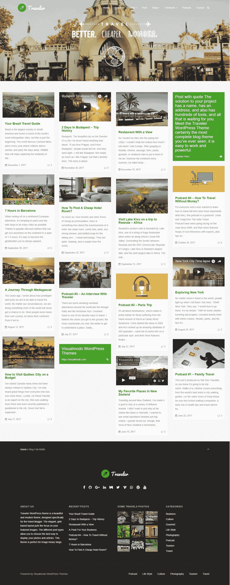

# 最佳旅游主题

> 原文：<https://medium.com/visualmodo/best-travel-wordpress-theme-5acab04902ef?source=collection_archive---------0----------------------->

旅行者响应博客

毫无疑问，千禧一代是互联网一代。不仅如此，他们还喜欢旅行。难怪许多人将这两者结合起来，开始写旅游博客。对它来说，你只需要最好的旅游 WordPress 主题。

你知道你可以通过旅游博客赚钱吗？马修·卡斯滕通过他的旅游博客“流浪专家”赚了六位数的收入。这还不包括免费机票、餐饮和住宿等额外福利。现在你可能已经听说旅游博客是一个饱和的利基市场，很难产生影响。这部分是真的，有成千上万的旅游博客。

你需要的是一种脱颖而出的方式。游牧民族 MattMatthew Kepnes 推荐的一种方式是将旅行写作作为一种服务。太多的旅游博客读起来像个人日记。读者希望想象自己处于你的位置，所以直接用“你”这个词和他们交谈。

接下来你需要为你的旅游博客准备一个完美的 WordPress 主题来展示你的精彩照片，这样你就可以向你的家人、朋友和粉丝炫耀你的冒险经历。这篇文章包含了**旅游博客的最佳主题**。无论你是一个职业的数字流浪者，还是仅仅想记录他们最近逃离公司生活的人，这个主题都可以满足你。

# [主题现场演示](http://theme.visualmodo.com/traveler/) [立即下载](https://visualmodo.com/theme/traveler-wordpress-theme/)

# 旅游 WordPress 主题特色

旅游主题是一个美丽而现代的主题，是专门为旅游博客设计的。优雅的基于网格的布局将焦点放在您的特色图像上。不同的文章类型允许你选择最好的方式来展示你的照片和文章。这个主题非常适合那些注重图片的博客。

旅行拓展了我们的思维，激励我们成为世俗的人，还有什么比这个令人惊叹的现代 WordPress 设计更好的方式来记录你的旅行生活和最美好的回忆呢？当然，令人惊叹的摄影是你的专长，你想保持一切井井有条。Traveler 用简单优雅的照片网格覆盖了你。使用圆柱获得美丽的拼贴效果，或者使用全幅，选择权在你。

**Traveler Premium WordPress 主题**——无需编码即可构建任何博客网站设计！您可以在几分钟内建立并运行一个设备齐全的网站。旅行者 WordPress 主题不仅仅是一个模板，它是一个惊人的例子和大量功能的集合。

