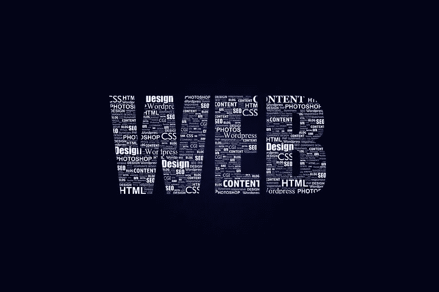

# 2021 年及以后的最佳网页设计软件

> 原文：<https://medium.com/visualmodo/best-web-design-software-to-choose-in-2021-and-beyond-831a949f3640?source=collection_archive---------0----------------------->

俗话说得好，“任何人都可以想出伟大的想法，但在实现之前，想法什么都不是，无论是作为一个网站，一个物理产品，一个应用程序，还是一个用户界面。”在这篇文章中，你会看到 2021 年及以后可供选择的最佳网页设计软件列表。

你也打算设计一个值得投资的新网站吗？你是否在寻找最好的网页设计软件，它有很多功能并能满足你的需求？所以，你正在阅读正确的文章。

嗯！网站设计过程是不断变化的，因此设计师要达到目标变得很棘手，也很耗时。这就是为什么每个人都在充分利用工具来设计一个留下持久印象的网站。一些组织也利用网页设计服务来获得优秀的结果。

如果我考虑选择最好的网页设计软件，那么名单是相当大的。分析成千上万的软件并选择最好的真的很难。但是为了让你轻松完成这个任务，我创建了一个清单，列出了 7 个最成功和最受网页设计师喜爱的软件。

现在，没有任何进一步的讨论，让我们跳进每个工具选择正确的工具，使网站更加强大。

# 2021 年 7 款最佳网页设计软件

让我们开始吧…

1- HubSpot 网页设计软件

无论你是铁杆设计师还是希望创建网站的营销人员，如果你是 HubSpot 的用户，你都可以轻松地创建杀手级网站。基本上是集客营销、销售和服务软件提供了出色的预建模板。所有这些资源都可以使用拖放编辑器轻松定制。此外，其非凡的功能和无限的风格选择肯定会帮助您像专业人士一样设计网站。

**特色-**

*   用户友好的界面
*   拖放编辑器
*   高度安全
*   成千上万的模板和主题
*   提供顺畅的数据关系
*   24*7 客户支持
*   最后，注重网站优化等。

2- Wix 网页设计软件

这是另一个被网站建设者普遍选择的网站设计软件。由于其灵活的支付等级范围和出色的功能，访问者喜欢将此工具添加到他们的遗愿清单中。它是一个完全托管的订阅服务工具；处理不同的领域，包括安全，托管和数据备份。此外，它增加了数百个模板，让您可以创建有吸引力的网站。

**功能-**

*   使用方便
*   各种免费模板
*   拖放编辑器
*   创建优化的网站
*   提供购物车
*   最后，管理发票等。

3- Weebly

如果你正在为一个电子商务网站寻找最好的网页设计软件，那么我会推荐你选择 weebly。这个软件可以让你利用最好的用户友好的模板更有效地做网站设计。尤其是如果你没有任何编码经验，那么 Weebly 就像 HubSpot 一样是另一个选择。

**功能-**

*   使用方便
*   50 多个行业定制模板
*   拖放生成器
*   提供废弃的手推车
*   提供动态运输定价
*   从实时网站更改模板
*   最后，定制的负载，等等。

4- Bootstrap 网页设计软件

想要在最短的时间内建立一个响应迅速的网站吗？开始使用 Bootstrap。这是网页设计师的另一个最佳框架。它是一个开源工具，包括画布区域和一个用于编写或显示代码的窗口。此外，它的拖放元素和可定制的模板不仅简化了网页设计过程，还允许您创建一个网站，实际转换。

**特色-**

*   所见即所得桌面编辑器
*   惊人的文档
*   创建响应性网站
*   大型组件库
*   网格系统
*   可定制的块
*   最后是 HTML 编辑等。

偏好阅读——网页设计如何响应