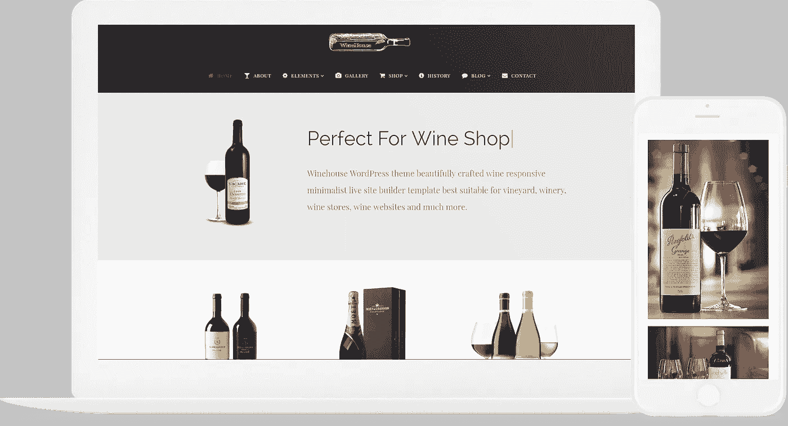
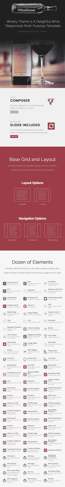
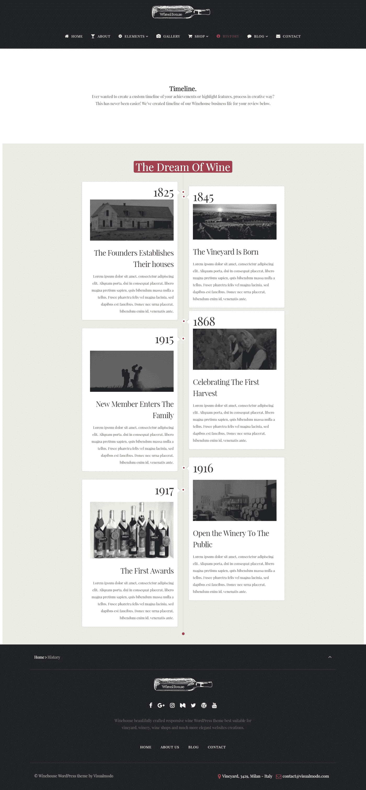

# 最佳葡萄酒主题

> 原文：<https://medium.com/visualmodo/best-wine-wordpress-theme-60f6284d06d1?source=collection_archive---------0----------------------->

响应式葡萄酒网站建设者

最佳葡萄酒 WordPress 主题，为葡萄酒厂、葡萄园、葡萄酒商店或其他与葡萄酒相关的项目创建专业网站的正确选择。

wine WordPress 主题是专门为创建专注于葡萄酒的商业网站而构建的。然而，还有一个多用途的主题，也适合创建葡萄酒相关的网站。因此，无论你想要一个网站来推广你的品牌或业务，还是你需要推出一个销售葡萄酒行业产品的网店，这些主题都将为你提供大量的选择。

由于选择合适的葡萄酒既是视觉决定，也是味觉决定，这些主题都具有高品质的设计，非常适合以最佳方式展示您的产品。从分享葡萄园和葡萄酒厂的照片到发布产品及其品牌的图片，你的葡萄酒网站将拥有成功所需的优质外观。

Wine WordPress 主题还包括网站定制选项，无论是以选项和设置控制面板的形式还是以拖放页面生成器的形式，这样你就能够确保你的网站与你的品牌和产品的风格相匹配。

# 葡萄酒主题

# [立即下载](https://visualmodo.com/theme/winehouse-wordpress-theme/) [现场演示](http://theme.visualmodo.com/winehouse/)

**一键式演示内容导入**——WordPress 主题最有用的功能之一。你会喜欢在与精彩的主题演示页面相同的起点上开始网站开发过程，这样你就可以快速设计出你梦想中的网站。您可以充分利用我们精心制作的演示内容，只需点击一下鼠标，就可以创建一个现成的网站！

漂亮的 WooCommerce 主题对于任何种类的葡萄酒爱好者、葡萄酒商店、餐馆和其他类似的利基市场来说都是一个很好的选择。虽然这个主题的名字表明它是一个关于酒和食物的相关网站，但它实际上是一个多功能的 WordPress 主题，你可以用它来创建一个功能齐全的网站并销售其他产品。这是一个完全响应和视网膜就绪的设计，将使您的网站在所有现代设备上看起来很棒。