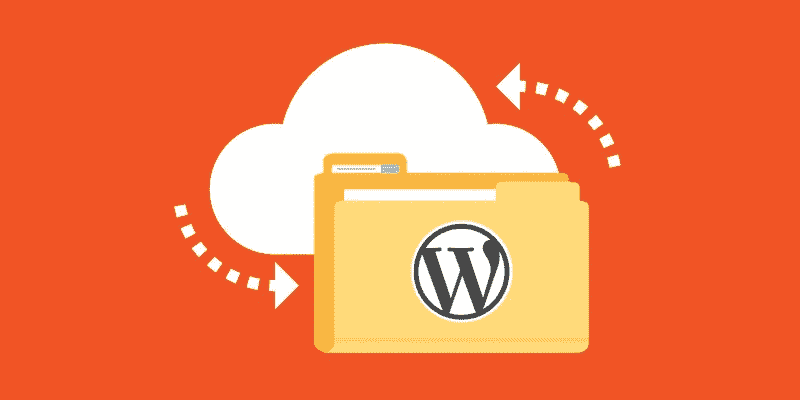
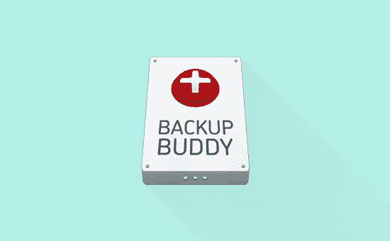
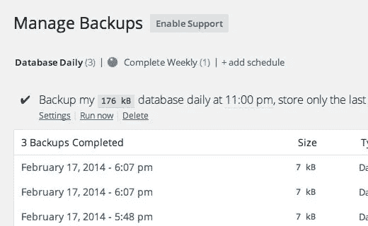
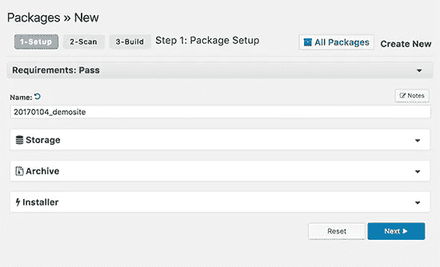
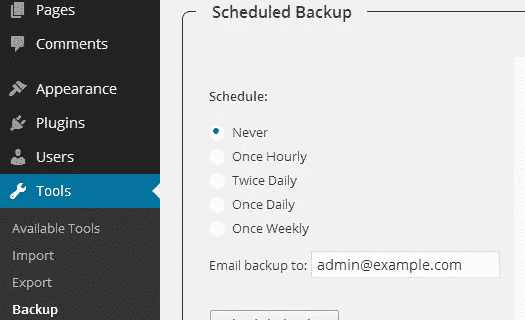
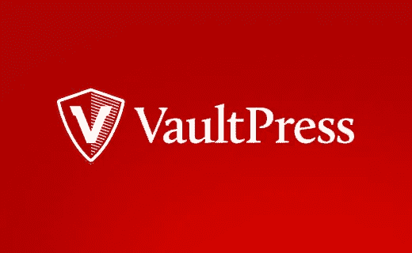

# 最佳 WordPress 备份插件

> 原文：<https://medium.com/visualmodo/best-wordpress-backup-plugins-ee98306a862a?source=collection_archive---------0----------------------->

用 WordPress 备份插件创建常规备份是你能为你的网站做的最好的事情。备份让你安心，当你的网站被黑或者你不小心把自己锁在外面时，备份可以在灾难性的情况下拯救你。

WordPress 有几个免费和付费的备份插件，大多数都相当容易使用。在这篇文章中，我们将展示 WordPress 的最佳备份插件列表。

重要提示:许多 WordPress 主机提供商提供有限的备份服务，但是请记住，你有责任自己备份你的网站。不要完全依赖你的主机提供商进行备份。

如果你还没有备份你的网站，那么你应该从这 7 个最好的 WordPress 备份插件中选择一个，并马上开始使用它。

# 最佳 WordPress 备份插件 1。BackupBuddy

[BackupBuddy](http://www.wpbeginner.com/refer/backupbuddy/) 是最流行的高级 WordPress 备份插件。它允许您轻松安排每日、每周或每月备份。它还可以自动将你的备份存储在 Dropbox、亚马逊 S3、Rackspace Cloud、FTP、Stash(他们的云服务)中，甚至可以用电子邮件发给你自己。

如果你使用他们的 Stash 服务，那么你也有能力做实时备份。

使用 [BackupBuddy](http://www.wpbeginner.com/refer/backupbuddy/) 的最大优势在于它不是基于订阅的服务，所以没有月费。你可以在你的计划中提到的一些网站上使用插件。您还可以访问高级支持论坛、定期更新和 1GB 的云存储空间来存储您的备份。

您甚至可以使用 [BackupBuddy](http://www.wpbeginner.com/refer/backupbuddy/) 来复制、迁移和恢复网站。

# 最佳 WordPress 备份插件 2。UpdraftPlus

UpdraftPlus 是一个免费的 WordPress 备份插件。它允许你为你的 WordPress 站点创建完整的备份，并存储在云上或者下载到你的电脑上。

该插件支持计划备份和按需备份。您还可以选择要备份的文件。它可以自动将您的备份上传到 Dropbox、Google Drive、S3、Rackspace、FTP、SFTP、电子邮件和其他几种云存储服务。

[UpdraftPlus](http://www.wpbeginner.com/refer/updraftplus/) 还有一个高级版本，带有迁移或克隆站点、数据库搜索和替换以及多站点支持等附加功能。高级版还可以让您获得优先支持。

# 最佳 WordPress 备份插件 3。后退

BackWPup 是一个免费插件，允许你免费创建完整的 WordPress 备份，并将其存储在云(Dropbox、亚马逊 S3、Rackspace 等)、FTP、电子邮件或你的计算机上。

它非常易于使用，并允许您根据站点的更新频率安排自动备份。

从备份中恢复 WordPress 站点也非常简单。BackWPup Pro 版本带有优先级支持，能够在 Google Drive 上存储备份，以及其他一些很酷的功能。

# 最佳 WordPress 备份插件 4。备份

BackupWordPress 是一个完整的 WordPress 备份插件，支持自动计划。它允许您为数据库和文件创建不同的计划。唯一的问题是免费版不允许你将 WordPress 的备份存储到云存储服务中。

如果你想在 Dropbox，Google Drive，FTP 等上存储你的备份，那么你需要为它购买一个高级扩展。每个服务都有扩展，你可以购买你需要的或者整个包。

# 最佳 WordPress 备份插件 5。复印机

顾名思义，Duplicator 是一个流行的 WordPress 插件，用于[迁移 WordPress 站点](http://www.wpbeginner.com/wp-tutorials/how-to-properly-move-wordpress-to-a-new-domain-without-losing-seo/)。然而，它也有备份功能。

它不允许你创建自动的计划备份，这使得它对于一个定期维护的站点来说不是理想的主要 WordPress 备份解决方案。

# 最佳 WordPress 备份插件 6。WP-DB-备份

WP-DB-Backup 拥有超过 400，000 个活跃安装，是最受欢迎的 WordPress 备份插件之一。唯一的问题是它只备份你的 [WordPress 数据库](http://www.wpbeginner.com/glossary/database/)。

这意味着您必须手动备份您的媒体文件。如果你不经常更新网站或者不上传图片，那么你可以使用 WP-DB-Backup 作为你的主要 WordPress 备份插件。

WP-DB-Backup 使创建数据库备份、安排自动备份和恢复数据库变得非常简单。对于没有 phpMyAdmin 权限的用户来说，手动备份【WordPress dataabase】也是一个非常有用的工具。

# 最佳 WordPress 备份插件 7。VaultPress(带喷气背包)

在 WPBeginner，我们使用 VaultPress 来备份我们的站点。VaultPress 是由马特·莫楞威格(WordPress 联合创始人)和他在 Automattic 的团队创建的。

它最近成为 Automattic 的另一款产品 JetPack 的一部分。要使用 VaultPress，您需要一个 JetPack 订阅计划。不同的定价方案具有不同的功能。

VaultPress 提供自动化实时云备份解决方案，起价为每月 3.50 美元。设置 VaultPress 并从备份中恢复只需点击几下。他们的一些软件包甚至提供安全扫描。

使用 VaultPress 有一些缺点。首先，如果你有多个 WordPress 网站，这是一个经常性的花费。其次，你必须订阅 Jetpack，获得一个 WordPress.com 账户，并在你的网站上安装 JetPack 插件。

最后，在较低的计划中，备份仅存储 30 天的归档。如果你想要无限量的备份存档，那么你必须支付每个网站每月 29 美元的费用，与这里列出的其他解决方案相比，这对初学者来说要贵得多。

我们仍在使用 VaultPress，因为我们享受了他们更优惠的旧定价。

## 最后的想法

每个 WordPress 备份插件都有它的优点和缺点。我们使用 VaultPress 有两个主要原因。它非常易于使用，并且提供实时增量备份。这意味着，它不是每天或每小时备份所有文件，而是在更新后的几分钟内创建已更新内容的备份。这对于像我们这样的大型网站来说是理想的，因为它允许我们有效地使用我们的服务器资源。

然而，如果你运行一个中小型网站，并且讨厌支付月费，那么我们推荐流行的 [BackupBuddy](http://www.wpbeginner.com/refer/backupbuddy/) 插件。为什么？因为他们有自己的云存储，Stash，这使得初学者只需点击几下就可以轻松地将备份存储在云中。

无论你最终选择哪个 WordPress 备份插件，请不要把你的备份和你的网站放在同一个服务器上。

这样做，你是在孤注一掷。如果你的服务器硬件出现故障，或者最坏的情况是你被黑客攻击，那么你就没有备份，这就违背了建立定期备份的目的。

这就是为什么我们强烈建议将您的备份存储在第三方存储服务上，如 Dropbox、亚马逊 S3、Google Drive 等。

仅此而已。我们希望这个列表能帮助你为你的网站选择最好的 WordPress 备份插件。

来源:https://visualmodo.com/