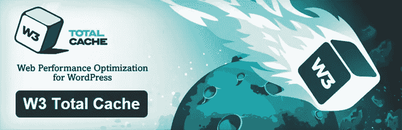
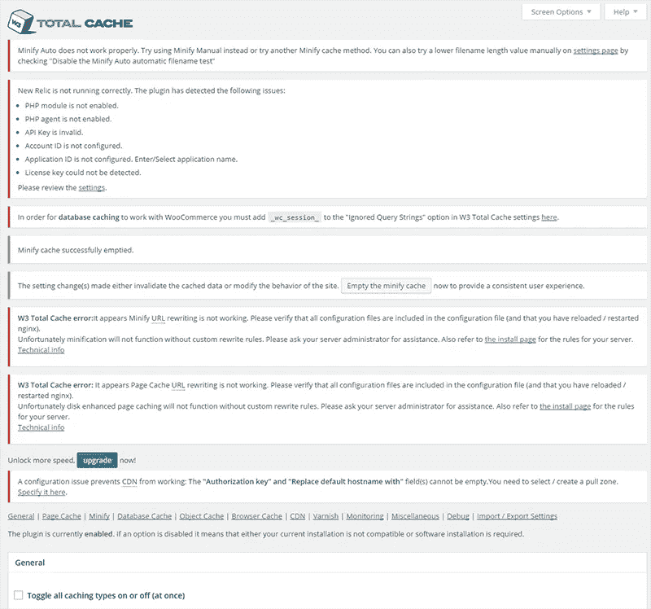
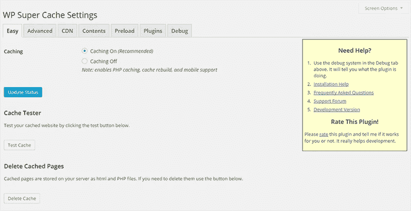
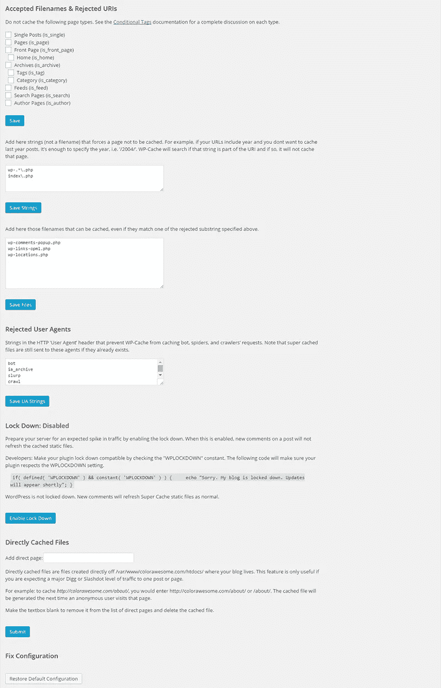
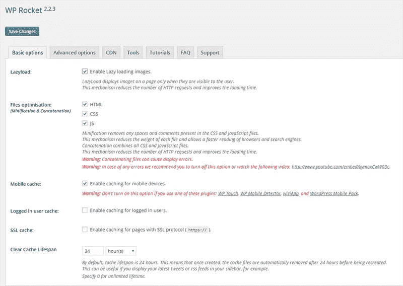
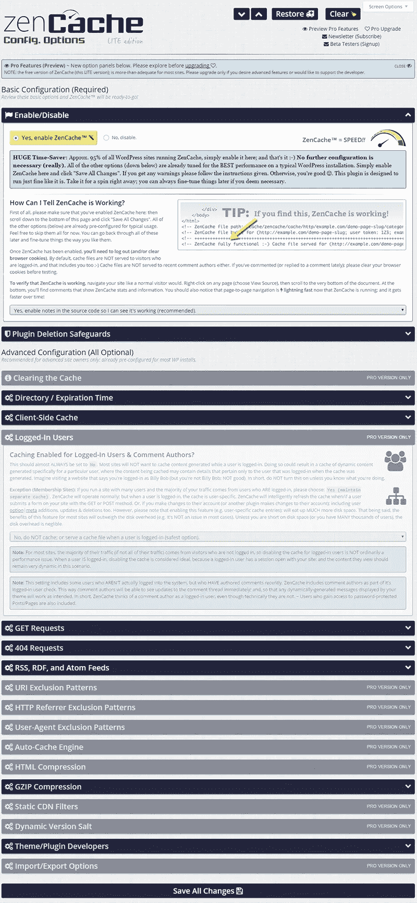
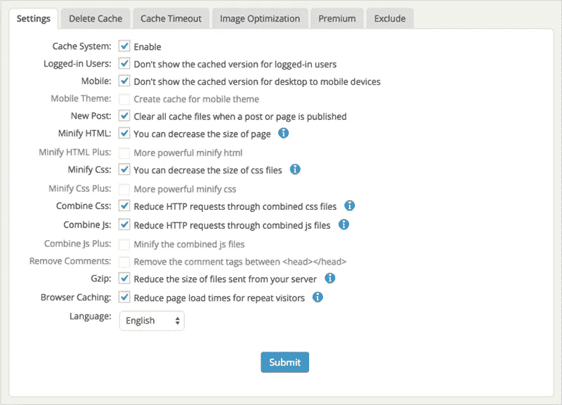
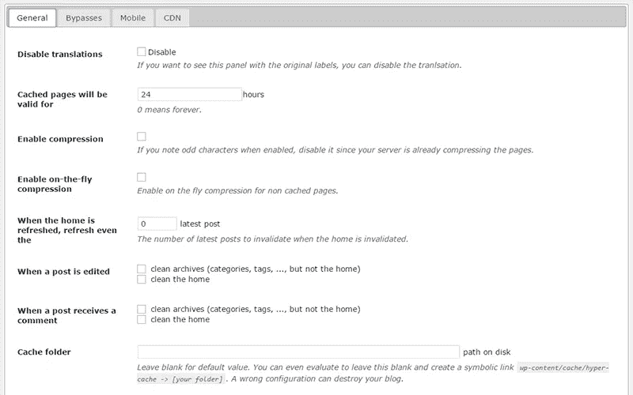

# 快速网站的最佳 WordPress 缓存插件

> 原文：<https://medium.com/visualmodo/best-wordpress-cache-plugins-for-fast-sites-a7245c59b243?source=collection_archive---------4----------------------->

一个 WordPress 缓存插件真的可以让你的网站加载更快，并且对网站导航的用户体验有很大帮助，现在看看一个让你的 WordPress 网站运行更快的最佳插件列表。

您的互联网体验与您访问的网站一样快。通常，最好的网站也是加载速度最快的网站。一个缓慢的网站会带来糟糕的用户体验，我们不要忘记它可能会对你的搜索引擎排名产生影响，[谷歌在过去也证实了这一点](https://googlewebmastercentral.blogspot.in/2010/04/using-site-speed-in-web-search-ranking.html)。

如果你运行一个 WordPress 站点，一个缓存插件可以显著地改善站点加载时间。通常，当您访问任何网站时，您都会从它们的服务器上请求信息。WordPress 运行一个数据库，每次有人在他们的浏览器上加载你的站点时，他们都会以 CSS、图像和 javascript 的形式检索文件。

WordPress 是动态的，虽然这有助于保持你的网站的更新和活力，但它也减慢了你的网站。所以为了解决这个小问题，创建了缓存插件。他们帮助制作你的网站的静态版本，这使得你的网站更快。

我将带你浏览几个缓存插件，它们可以帮助你加速你的 WordPress 站点。如果你目前没有使用缓存插件，你肯定会发现这是一本有趣且相当重要的读物。如果你使用的是缓存插件，那么你会有更多的选择来看看哪个插件最适合你。

如果所有这些缓存插件都让你失望，并且没有让你的网站更快，那么你可能不得不升级你的主机。但是在你这样做之前，尝试一些缓存插件，看看它们如何为你的网站工作。

# WordPress 最好的缓存插件

# W3 总缓存

[caption id = " attachment _ 55164 " align = " align center " width = " 800 "]

快速网站的最佳 WordPress 缓存插件[/caption]

这个插件被广泛吹捧为最强大的缓存插件之一，有过多的选项供用户选择。它被 Yoast(最受欢迎的 WordPress SEO 插件的作者，我们也在 Colorlib 上使用它)、Matt Cutts(为 Google 处理搜索质量和网络垃圾邮件)、Mashable、Smashing Magazine 和许多其他同样有影响力的网站使用。这是一个令人印象深刻的用户列表。

**更新(1):** Yoast 不再使用基于插件的缓存，转而使用服务器端缓存。类似的缓存我们用在 Colorlib 上，它是 HHVM、Redis 和 fastcgi_cache 的组合。

**更新(2):** 马特卡茨从 W3 总缓存切换到 WP 超级缓存。它类似于 W3，但更容易设置，而且根据一些基准测试，[在某些条件下甚至可以提供更好的网站性能。](https://colorlib.com/wp/wordpress-cache-plugin-benchmarks/)

**更新(3):** 我们现在使用完全定制的服务器端缓存。它使用 Nginx，HHVM 和 Redis 作为基础，但我们专门为 Colorlib 做了一些调整。这包括自定义评论和 bbPress 论坛线程处理，以确保它们是实时发布的。如果你喜欢我们网站的表现，请务必阅读我们的托管指南，了解你如何能够[获得类似的结果。](https://colorlib.com/wp/how-to-choose-wordpress-hosting/)

它可以缓存页面、WordPress 数据库和对象，它可以在浏览器端启用缓存。W3 Total Cache 可用于缩小 CSS 和 Javascript。它还兼容专用服务器、虚拟专用服务器和内容交付网络，这可能是为什么这个插件可以扩展到非常受欢迎的高流量网站。

WordPress 新手可能会发现在插件的众多选项中进行协商是令人畏惧的。也就是说，W3 Total Cache 在你的 WP 仪表盘上的插件设置页面上方提供了如何最好地使用插件的提示。

这些提示实际上似乎比高级选项本身更令人生畏，你如何使用这个插件取决于你是否能注意到所提供的每一个指令。在底部，你会注意到一个“切换所有缓存类型”，这是足够的，但没有最大化插件的影响。

即使是有经验的用户也会发现这些说明很有帮助，因为安装插件只是这个过程的一部分，它需要进行适当的配置才能发挥全部作用。否则你可以简单地选择启用默认设置，这对大多数网站来说应该足够了。

这个插件并不复杂，只是有很多选项。如果你能避开杂乱的选项，按照你的 WordPress 仪表盘下面的插件给出的建议去做，并且可能正在看一个[教程](https://www.youtube.com/watch?v=Mz7TStqciwI)或[两个](https://www.youtube.com/watch?v=LVteYk-rG-A)，那么它能让你的网站速度提高十倍，这是一个令人印象深刻的壮举。

付费版本每年 99 美元，你可以启用片段缓存模块，使用 WordPress transient API 的主题/插件获得更好的性能，付费版本还提供 CDN 镜像。

[更多信息/下载](https://wordpress.org/plugins/w3-total-cache/)

# WP 超级缓存

当我第一次使用这个插件时，它比以前的插件更容易解决问题。插件设置屏幕向你展示一个易于使用的插件版本。有多个选项卡，首先显示标题为“简单”的第一个选项卡。当您没有 W3 Total Cache 那么多选项时，它会更容易。

一个有 7 个标签的简单设置，非常适合 WP 新用户和有经验的用户。

WP Super Cache 创建一个静态 HTML 文件，提供给没有登录的用户，没有在你的博客上发表评论的用户，以及没有在你的网站上查看过受密码保护的帖子的用户。这几乎意味着你网站的每一个访问者。

这个插件以三种方式缓存文件，

1.  超级缓存的静态文件——PHP 被完全绕过，并为未知的访问者服务。
2.  超级缓存的静态文件(由 PHP 提供)——服务器更有可能与流量的大量增加或突发作斗争。
3.  传统缓存—已知用户使用的最慢的缓存方法。

PHP 提供的超级缓存和非 PHP 提供的超级缓存之间的差异只有在流量增加时才会变得更加明显，以至于主机服务器很难跟上流量，否则这种差异是难以察觉的。

您可以有选择地选择网站的哪些部分被缓存。该插件可以用来处理使用锁定和直接缓存文件的流量突然激增。

WP 超级缓存通过在指定的时间间隔删除缓存文件来帮助清除缓存文件。这些文件可以预加载，它会为你最近发布的帖子或你网站上的每个页面和帖子创建超级缓存的静态文件。有了预加载，在缓存文件变得多余后处理它们就变得更加重要了。

[更多信息/下载](https://wordpress.org/plugins/wp-super-cache/)

# WP 火箭

WP Rocket 是一个宣传速度和简单性的高级插件。而且它们确实让用户不费吹灰之力就能得到结果。该插件目前在 26，000 多个网站上活跃使用。

WP 火箭缓存的几个网站。

插件的功能包括安装和激活后立即激活的页面缓存，缓存预加载和按需加载图像，以确保图像仅在需要时加载。WP Rocket 让你网站上的 HTML、CSS 和 Javascript 变得更轻。

由于完全兼容电子商务插件，您可以运行一个电子商务网站。它与 CloudFlare 兼容，可以利用浏览器缓存。这个插件提供了谷歌字体和图像优化以及多站点和多语言兼容性。除了这些功能之外，WP Rocket 还提供了 DNS 预取功能，并且对开发者非常友好。

一个没有废话的插件，只是简单地处理最少的问题，设置面板非常类似于超级缓存，易于操作。

图片来自- WpSeer，点击图片查看 WpRocket 的详细回顾

该插件的个人版价格为每年 39 美元。商业版每年售价 99 美元，可用于 3 个网站，专业版售价 199 美元，可用于不限数量的网站。如果你因为某种原因不喜欢这个插件，你可以要求 30 天的退款。支持和更新必须每年支付，如果你选择不支付，你仍然可以使用插件，但没有支持或更新。通常尝试后者是不可取的。

[更多信息/下载](http://wp-rocket.me/)

# Zen 缓存(快速缓存的继任者)

通常，我会写 Quick Cache，这是一个众所周知的缓存插件，但该插件的所有更新都在两个月前停止了。开发者将这个插件更名为“Zen Cache”。他们更改了名称，以避免被认为是一个“简单”的插件。

从快速缓存迁移到 Zen 缓存很容易，你的设置从快速缓存转移到新安装的 Zen 缓存。

但是足够的是，Zen Cache/Quick Cache 是一个伟大的插件，它需要最少的设置时间，并轻松实现缓存插件的预期。

为有经验的用户提供一个带有可选高级面板的简单设置。灯光功能仅出现在插件的专业版中。

这个插件能帮你完成的事情很少，设置简单，使用直观。在每个选项的最后，有一些提示可以帮助你更好地利用插件。

Zen Cache 的单站点使用价格为每年 39 美元，多站点(不限数量)使用该插件将花费你每年 139 美元。购买可确保至少三年的支持，此后，超过三年的持续支持将收取每年 9 美元或 29 美元的最低费用。与大多数高级插件不同，它们提供一次性购买的终身更新。购买带有 30 天退款保证。

[更多信息/下载](https://zencache.com/features/)

# WP 最快的缓存

最快的缓存采用多种方法来缓存您的网站。Mod Rewrite 把你的动态 WordPress 变成静态的。缓存文件会在适当的时间间隔或基于事件(如发布页面或帖子)被删除。

有了最快的缓存，你可以用一个短代码阻止特定页面/帖子的缓存。该插件允许您分别为移动设备和登录用户启用和禁用缓存。最快的缓存提供 CDN 支持。

如果你知道每种缓存方法能为你做什么，这应该是一个非常容易处理的插件。只需勾选您的缓存方法并提交即可。

该插件缩小你的 HTML，CSS 并用 Gzip 压缩。它可以结合 CSS 来帮助减少对主机服务器的 HTTP 请求，同样它也可以结合 Javascript。最快缓存还提供浏览器缓存，这对于经常返回您网站的访问者非常有用。

[更多信息/下载](https://wordpress.org/plugins/wp-fastest-cache/)

# 超级缓存

超高速缓存在插件的设置页面上只有 4 个标签。显然，它的可配置性较差，但是对于那些想找一个插件来完成这项工作的人来说，这很好，只需要很少或不需要修改。

使用 HyperCache，您可以在指定的时间间隔进行缓存，启用动态压缩，在发表新评论或新帖子时清理缓存，并启用浏览器缓存。

超高速缓存可以设置为不缓存特定的页面或网址，您可以通过阻止缓存超过指定天数的帖子来仅缓存最新的帖子。它支持 CDN 和移动缓存。

[更多信息/下载](https://wordpress.org/plugins/hyper-cache/)

# 哪个是最好的？

我看了不同人对缓存插件的不同建议所做的测试。

这些测试确实提供了大量的信息，但它们不包括 WP Rocket，我觉得 WP Rocket 肯定会和竞争对手一样好。[这个测试](https://colorlib.com/wp/wordpress-cache-plugin-benchmarks/)非常全面，我们比较了 WordPress 的几个缓存解决方案。WP Rocket 脱颖而出，特别提到了 WP Super Cache 和 W3 Total Cache。

事实是很难找出所有插件中哪个是最好的。在我看来，WP 火箭当然似乎有优势。但是狼群的其他成员并没有落后太多。

如果你选择一个缓存插件，那么你应该考虑你的需求。你是否需要 CDN 的支持？像这样的问题与为你的网站选择最好的插件有关。因为性能上的差异对于普通用户来说是很难察觉的。

# 使用完全配置的缓存插件测试您的站点

您可以使用以下方法之一，

*   [GTmetrix](https://gtmetrix.com/)
*   [网页测试](http://www.webpagetest.org/)
*   [页面速度工具](https://developers.google.com/speed/pagespeed/)

为了定期跟踪您的网站，如果您已经将网站添加到 GA，您可以通过 Google Analytics 帐户访问 labs 下的网站性能。大多数主机服务也提供基本的页面加载速度信息。

但是，如果你坚持运行一个缓存插件，并彻底地对你的网站进行基准测试，如果你理解了我们的帖子中使用的[基准测试方法，它会派上用场。你会发现进行一次彻底的检查是相当累人的。只有当你的网站有足够的流量时，这才是值得的。否则，上述三种工具中的一种就足够了。](https://colorlib.com/wp/wordpress-cache-plugin-benchmarks/)

根据你对缓存插件的熟悉程度，你可以选择这篇文章中的 6 个插件中的任何一个。尝试每一种方法(即使是付费的也有退款期),找到适合你的方法。

确保你的测试使用相同的主题、插件和主机。此外，还要测试一些 URL(除了你的网站主页)的可变性，以确保测试的公平性。

# 结论

选择你觉得舒服的插件，每天花一个小时不断地重新配置你的插件是不值得的。当比较这 6 个插件时，差异是微不足道的。但是，根据您正确配置相关缓存插件的能力，它可能会成为一个鸿沟。

就我个人而言，如果我阅读这篇文章，我会查看插件截图，检查看起来最不令人生畏的插件，并首先尝试那个插件，前提是它满足我的所有要求。然后测试你的插件。与以速度和人气著称的同类网站进行比较。

如果你第一次尝试的结果非常好，你可以就此打住，除非你需要专门解决一个问题，比如交通堵塞。然后事情变得有点棘手，我强烈建议您在尝试自己的测试之前，先阅读一下我们测试中使用的[基准测试方法。](https://colorlib.com/wp/wordpress-cache-plugin-benchmarks/)

如果你想知道，Colorlib 使用 [W3TC](https://wordpress.org/plugins/w3-total-cache/) 结合 Memcached 进行对象和数据库缓存以及 CDN 管理。

每个网站都有一个速度上限，一旦你达到这个上限，你就需要升级你的硬件，也许是顶级的 CDN 服务，如 [MaxCDN](https://colorlib.com/out/maxcdn) 或 [CloudFlare](https://www.cloudflare.com/) 。

如果我错过了一个很棒的插件，或者你的主机提供了一个很棒的内部缓存解决方案，请在评论区加入进来。我期待着阅读它们！

所有的 [Visualmodo WordPress 主题](https://visualmodo.com/)都与这个插件完全兼容，当我们使用明文代码开发时，默认情况下它会加载得更快。