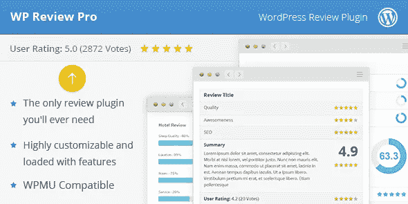
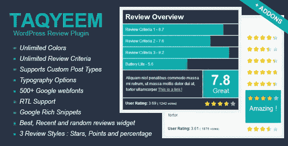
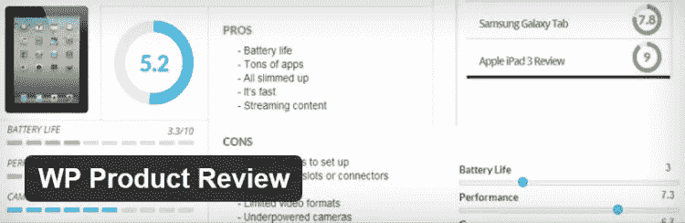

# 最佳 WordPress 评论插件

> 原文：<https://medium.com/visualmodo/best-wordpress-review-plugins-df7d179565fb?source=collection_archive---------0----------------------->

如果你想给你的网站商店、产品甚至博客文章添加评论，你来对地方了，我们列出了最好的 WordPress 评论插件供你使用。

从产品到电影，再到餐馆评论，互联网让每个人都有机会分享他们对任何事情的看法。这使得评论成为现代生活的重要组成部分，网上有大量的评论。这么多评论只需点击鼠标，我们大多数人在做出任何购买决定之前都会阅读它们。事实上，88%的人在网上信任网下的评论，而不是个人推荐。

如今，在线评论被赋予了如此高的可信度，从中可以赚到很多钱，因此，这些年来出现过多的专门网站也就不足为奇了——从烂番茄或猫途鹰这样的知名网站到小众联盟网站。

只要看看亚马逊的繁荣，这有很多要感谢成功整合突出的客户评论。

只要有你小众的产品，就有机会写评论。这使它们成为博客的理想选择，当博客陷入困境时，他们可以求助于评论。对于那些经营博客的人来说，除了提供真正有用的内容，你还需要确保你的评论看起来不错。为此，您需要专门的功能。

你可能已经猜到了，这就是这篇文章的目的。我将分享五个最好的 WordPress 评论插件，你可以用它们来给你的网站添加漂亮的评论。尽情享受吧！下面所有的插件都很棒，并且完全兼容我们的 [Visualmodo WordPress 主题](https://visualmodo.com/)。

# 最佳 WordPress 评论插件

# WP Review Pro(29 美元)

我会用一个评价最高的评论插件开始:WP Review Pro。这个插件可以从 MyThemeShop 获得，价格仅为 29 美元，包括一年的全天候支持。

这些评论看起来干净而专业，引人注目的 CSS 动画立即引起了观众的注意。

这些评论也是完全可定制的，WP Review Pro 可以完全控制你的配色方案(无限的颜色)、评论框大小和一些标准。你可以在页面的固定位置显示你的评论，或者，如果你喜欢更多的[灵活性](https://visualmodo.com/)，你可以在需要的时候使用短代码来放置它们。

WP Review Pro 还提供了四种审核系统:星(/5)、分(/10)、圈(/100)，当然还有百分比(/100！).总体评分可以放在你的文章缩略图上，这样访问者可以很容易地找到评分最高的文章。为了进一步改进导航，该插件还附带了一个选项卡式评论小部件。

读者也可以通过一次点击评级来发表意见，这些用户评论显示在评论框的底部。或者，如果读者喜欢更详细地分享他们的想法，他们可以通过帖子底部的评论留下他们的评论和评级。

现在来看看丰富的片段。你可能知道，rich snippet 是显示在 SERPs 中的额外信息——甚至有一个专门的 *review* rich snippet。WP Review Pro 自动添加相关的 Schema.org 标记，为丰富的片段提供动力，这意味着你的评论帖子在 SERPS 中看起来会像这样:

这些额外的信息有助于搜索引擎用户找到相关内容，并被证明可以提高点击率——这对你的 SEO 策略来说是个好消息。此外，为了进一步提高你的搜索引擎优化性能，该插件是速度优化，所以它运行快如闪电。为了进一步提高速度，WP Review Pro 也完全兼容缓存插件。

对于那些希望在购买之前试用*的人来说，这个插件有一个免费版本，尽管功能有限。*

[官网](https://winningwp.com/ref/mythemeshop-wp-review-pro/)

# taqyeem(17 美元)

接下来是，在我看来，评论插件中最酷的*Taqyeem。你只需花 17 美元就可以从 CodeCanyon 买到它——这个价格包括六个月的支持。*

我非常喜欢这个插件圆滑的设计，有一个黑暗和光明的主题。这两个主题都可以通过无限的颜色选择来完全定制(获得正确的组合，这些评论框看起来很华丽)。你也可以从 600 多种谷歌字体中定制字体，摘要框有两种尺寸:全角和半角。

Taqyeem 还提供了三种评估系统:星级、百分比和点数。它还支持无限数量的自定义标准，读者可以自由地留下用户评级。

通过从文本编辑器下面的金属框中激活 Taqyeem，您可以将任何帖子、页面或自定义帖子类型转换为评论。所有设置都在这个元框中控制，评论可以放在屏幕的顶部或底部，或者通过复制和粘贴一个短代码放在一个自定义的位置。评论很容易配置，它应该不会超过一两分钟。

该插件以三种专用小部件的形式提供了额外的评论功能:最佳、最近和随机评论，还添加了填充丰富片段的相关模式标记。

如果您想要更多的高级功能，Taqyeem 开发人员已经发布了两个扩展:

*   Taqyeem Buttons Addon($ 6)——给你的评论框添加按钮，有无限的颜色和近 500 个图标。您可以将按钮指向您喜欢的 URL，这是添加附属链接的一种简单方式。
*   **Taqyeem 预定义标准插件**($ 7)——如果你经常为你的评论使用相同的标准集，这个扩展允许你重复使用它们并节省时间。

[官网](http://codecanyon.net/item/taqyeem-wordpress-review-plugin/4558799?ref=WinningWP)

# WP 产品评论精简版(免费)

对于那些预算紧张的人来说，WP Product Review Lite 是一个免费插件，由备受推崇的 ThemeIsle 开发者提供。

这个插件只需点击一下鼠标就能把任何帖子变成评论。然后在文本编辑器的正下方配置评论。

评论框看起来棒极了——尤其是对于一个免费插件来说。这个盒子被分成多个部分，为固定数量的标准(和 10 分的评分)以及优点和缺点留有空间。您还可以在评论框中添加缩略图，以及两个附属链接。

你也可以完全定制你的评论: [WP 产品](https://visualmodo.com/)评论提供了排版、定位和颜色的选择。除了常见的边框颜色选项，该插件还允许您根据每个标准的评分选择不同的颜色——例如，您可以使用绿色表示高评分，使用红色表示低评分。

为用户提供一个分享观点的平台并不是什么新鲜事，但 WP 产品评论有一个创新的转折:用户评级影响*整体*评论评级，两者之间没有分离(尽管你可以通过设置屏幕加权用户评级来减少/增加他们对整体评级的影响)。该插件还会自动为你的评论文章添加模式标记。

这个免费插件本身是一个非常可靠的选择，但是如果你想要更强大的功能，开发者已经发布了四个高级插件:

*   **WPPR 比较表**(35 美元)——在一个可过滤的表格中显示产品，允许快速比较和排名。
*   **WPPR 简易预加载器**(20 美元)——保存以前评论文章中的功能，并在你正在写的评论中使用它们。
*   **WPPR 单一评论短码**(20 美元)——使用短码在你页面的任何地方添加评论。您还可以使用这个扩展向一个页面添加多个评论。
*   **WPPR 定制图标**($ 15)——用 13 个高级图标定制*星*等级系统。

如果你想购买所有这四个插件，一个捆绑包的价格是 59 美元，比全价节省 41 美元。还有一个免费的*插件*可用， **WPPR 相关评论**，它可以让你在你的工具条上添加一个评论小工具。

[官网](https://wordpress.org/plugins/wp-product-review/)

# WP 评论(69 美元)

WP 评论只作为三插件套装的一部分，售价 69 美元。捆绑包中还包括作者 hReview 插件——另一个拥有评论功能的插件，补充了 WP 评论——和 WordPress 客户评价。然而，为了这篇文章的目的，我们将把重点放在 WP 评论插件上。

该插件创建了整洁有序的盒装评论，包括大型产品图片、产品细节和底部的代销商链接按钮。

WP 评论也很重视社区整合，评论框包括编辑和用户评级的空间。您可以添加无限数量的自定义标准，插件将显示每个标准的编辑和用户评分。这不像今天的其他插件，它们通常只显示*总体*用户评分。

使用短代码将评论添加到你的帖子中，该插件支持两个专用的小部件:热门评论和最近评论。默认情况下，它还添加了模式标记，以提高来自 SERPs 的 CTR。

如果你想要更多的功能，[开发者](https://visualmodo.com/)已经发布了一个额外的高级扩展:**前端评论提交**，价值 49 美元。使用核心 WP 评论插件的所有功能，这个扩展允许注册用户向你的网站提交评论，但是，为了防止劣质评论/垃圾评论被显示，你必须在向公众展示之前批准这些评论。

[官网](http://authorhreview.com/plugins/wp-reviews/)

# 审阅者(25 美元)

最后一个插件是 evoG 的 Reviewer，可以从 CodeCanyon 获得，售价 25 美元。

它可以让你给你的 WordPress 文章和页面添加时髦的评论，分为七个部分，包括无限制的标准、总体评分、用户评分、缩略图、优缺点和评论摘要。

与我们讨论过的其他插件一样，这些评论是完全可定制的——有许多评级系统，而且你可以选择无限的颜色。然而，与其他插件不同，Reviewer 附带了九个模板，每个模板都有独特的风格和布局。此外，您还可以随心所欲地定制它们。

这位评论家还有另外一个创新的特点:比较表格。这允许您并排放置评论分数，这使得比较对于您的读者来说更加直观。

该插件在社区上也很大，读者可以选择三种方式来分享他们的意见——要么是整体评分，要么是使用星级或滑动评级系统的逐标准评分。用户评论可以通过评论留下， [Reviewer](https://visualmodo.com/) 允许读者按日期、有用性或高/低评分对评论进行排序。

不过，我们还没有完成，因为 Reviewer 还支持多达七个自定义小部件，包括:

*   最新编辑评论
*   最新用户评论
*   按编辑评分排列的最高评价评论
*   按用户得分排列的最高评价
*   最有帮助的编辑评论
*   最高评级的个人用户评论
*   基于编辑和用户评分的最高评分评论

这为你的边栏提供了大量的评论功能，使你的评论更容易浏览。

[官网](http://codecanyon.net/item/reviewer-wordpress-plugin/5532349?ref=WinningWP)

# 最后的想法

可以想象，这五个插件的特性和功能有相当多的重叠。然而，如果你仍然犹豫不决，这里有一个总结:

*   **WP 评论 Pro**——最佳全能选手。
*   最时尚的评论。
*   WP 产品评论精简版 —最佳免费选项。
*   **WP 评论** —最适合社区整合。
*   **审阅者** —九个审阅模板可供选择。

这里介绍的所有插件都允许您构建时尚的评论框，将您的评论分成自定义的评级标准，并为丰富的片段添加相关的模式标记——换句话说，真正重要的评论功能。

**你最喜欢的点评插件是什么？想法？**