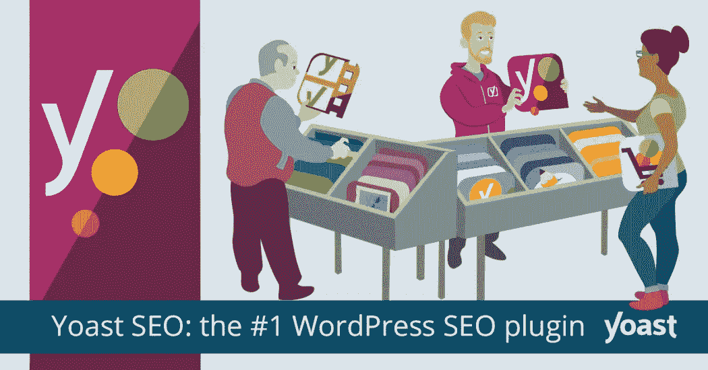
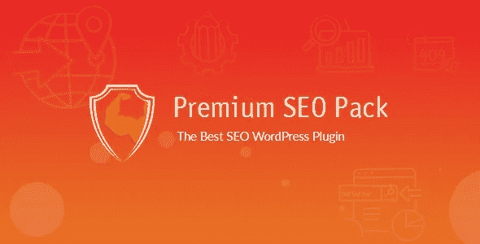
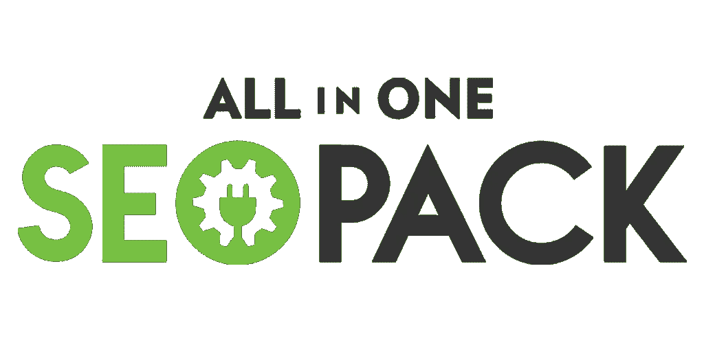
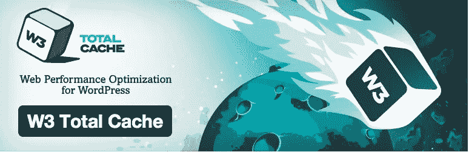

# 2019 年最佳 WordPress SEO 插件

> 原文：<https://medium.com/visualmodo/best-wordpress-seo-plugin-in-2019-2522c1bdc6b5?source=collection_archive---------0----------------------->

搜索引擎负责为你的网站带来流量或客户。努力做好网站的搜索引擎优化，使其对搜索引擎友好是至关重要的。否则，你无法有机地接触到你的目标受众。你需要在搜索引擎中为至少一个特定的关键词排列你的页面。在这篇文章中，我们创建了一个 2019 年 10 个最佳 WordPress SEO 插件的列表，以使网站 SEO 友好和优化快速简单。

站长们总是担心 SEO。他们一直在寻找不同的 SEO 技巧来改善他们的 WordPress 网站的 SEO。[速度优化](https://visualmodo.com/page-speed-test-optimizing-wordpress-sites/)对于任何 WordPress 网站的 SEO 来说也是一个非常重要的因素。

# [Yoast SEO 插件](https://yoast.com/wordpress/plugins/seo/)

Yoast SEO WordPress 插件已经存在十多年了。超过 500 万个网站安装了它，使它成为最受欢迎的选择之一。

Yoast SEO 最好的部分之一是创建和管理 XML 站点地图的能力。这比自己编写网站地图要容易得多，尤其是如果你没有太多的技术背景。

Yoast SEO 帮助你识别和避免重复的内容，所以你不必担心被 Google 惩罚，它提供了标题和元描述的模板，这将使你的页面在 SERPs 中更有吸引力。

# [高级搜索引擎优化包](https://codecanyon.net/item/premium-seo-pack-wordpress-plugin/6109437)

Premium SEO Pack 是一个众所周知的 SEO 插件，配备了一整套很酷的 SEO 功能，包括社交共享、图像优化和 SERP 跟踪，等等。这个全面的、高质量的插件为你提供了优化你的网站所需要的一切。

# [全在一个 SEO 包插件](https://wordpress.org/plugins/all-in-one-seo-pack/)

All in One SEO Pack 插件是 Yoast SEO 最接近的竞争对手，对于那些想要一套几乎完整的 SEO 后端工具的人来说，它是一个完全可行的选择。此外，All in One SEO 在更长的一段时间内提供了优质的功能和支持，所以你可能会发现，为这个插件付费会让你得到更多的回报。不过，那都是猜测。

# [SEO 框架](https://wordpress.org/plugins/autodescription/)

SEO 框架插件为那些想要一个没有任何广告或追加销售的快速、轻量级 SEO 插件的人提供了帮助。它去掉了一些你可能不需要的花里胡哨的东西，专注于帮助那些更关心保持网站速度的人，同时减少花在令人困惑的 SEO 文章上的时间。它通常被认为是 Yoast 或 All in One SEO 的最佳替代方案，这与 SEO 评级的视觉特性有很大关系——以及针对关键词的更灵活的选项

# 【WordPress 的模式丰富片段

片段是对你在雅虎或谷歌等搜索引擎中的页面的精确总结。它只向搜索引擎提供重要和精确的信息。这将帮助你在搜索结果中排名更高。这个插件支持不同类型的模式，如评论、事件、人物、产品、食谱、软件应用、视频和文章。

# [KeywordTool.io](https://keywordtool.io/)

这个关键词工具是谷歌关键词规划器的一个很好的替代品。它能够为每个搜索词生成 750 多个长尾关键词建议。它可以完全免费使用，甚至不需要创建一个帐户。关键词的重要性无需介绍。找出你的潜在客户在搜索什么，并围绕他们创建你的内容是非常重要的。关键词工具在谷歌自动完成的帮助下生成关键词。Google Keyword planner 广告的数据对博客、SEO 或内容营销都没有用。这些数据用于 Google Adwords 内部的付费广告。所以他们的关键词没有太多描述性。如果您需要查找除英语之外的任何语言的关键字，关键字工具将会帮助您。

# [SEO by squirly](https://wordpress.org/plugins/squirrly-seo/)

有数百个插件可以用来优化你网站的搜索引擎优化。但是巧妙地消除了优化过程中的大部分危险。这是一个伟大的插件，当谈到优化您的内容包含某些关键字。它检查最重要的部分，如关键词是否有效地用于标题、内容和 Url。

# [秒按](https://www.seopress.org/)

SEOPress 是一个免费的 SEO 插件，没有广告。它完全是白色标签，即使在免费版本中也没有足迹。它简单、快速、强大，让你管理你所有的文章/页面/文章类型/术语的标题和元描述。

# [WP 放大器](https://wordpress.org/plugins/accelerated-mobile-pages/)

随着移动搜索迅速主导桌面搜索，让你的网站移动响应变得非常重要。这个插件会自动为你的 WordPress 网站添加加速移动页面功能，让移动用户的网站速度更快。有了这个插件，你只需点击几下就可以让你的网站移动起来。

# [W3 总缓存](https://wordpress.org/plugins/w3-total-cache/)

谷歌和营销人员都非常重视网站速度。W3 Total Cache 插件帮助一个站点在不崩溃的情况下扩展和维持大量的流量。该插件通过 CDN(内容交付网络)集成减少下载时间并提高网站性能，从而增强网站的 SEO 和用户体验。

# 结论

网上有数百个 WordPress SEO 插件。上面提到的 10 个插件属于最常用的类别，能够解决[站长](https://www.alexa.com/)遇到的大部分问题。如果你同时使用大量插件，有可能会降低你网站的速度。理想情况下，您应该停用不常用的插件，并在需要时重新激活它们。

最后，如果这些插件都没有帮助提高你在 SERPs 中的排名，你应该考虑转移到一个更好的 WordPress 托管提供商。所以，聪明点，积极思考，明智地做出选择。

## 关于作者

> 这篇文章是由 Karan Mehta 从强大的主题。他是一个内容营销者和健身房狂人。他喜欢旅行&写关于数字营销、网络开发和健身的文章。