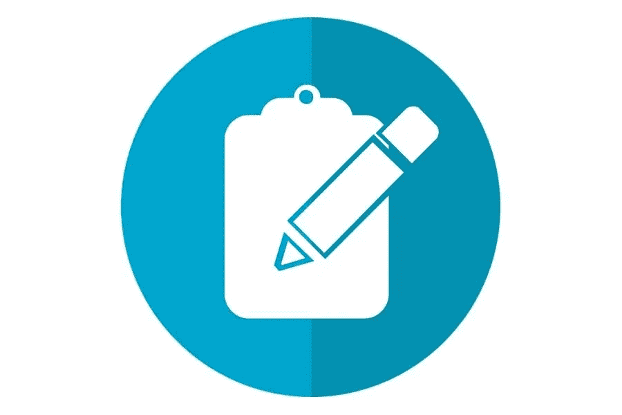

# 最佳 WordPress 调查免费插件

> 原文：<https://medium.com/visualmodo/best-wordpress-survey-free-plugins-fa660de7bd21?source=collection_archive---------1----------------------->

调查或调查表基本上是收集细节和更好地了解受众的最佳方式。调查是一种很好的营销方法，也是一个很好的吸引人的因素，它可以让你的观众看到他们感兴趣的内容。对于 WordPress 用户来说，使用调查插件可以很容易地创建调查。在 WordPress 调查插件的帮助下，您可以集成调查，甚至分析插件中的数据。

# 热门 WordPress 调查免费插件

# WP-民意测验

WP-polling 是一个开源的免费 WordPress 调查插件，非常适合创建基本的民意调查。您可以使用 CSS 和内置模板自定义和调整投票的外观。虽然 WP-polling 只提供了复选框和单选按钮来选择答案，但它允许您跟踪投票者和任何重复的投票。该插件允许您安排投票开始和截止日期，投票者可以在提交答案后立即查看投票结果。

使用 WP-Polls 创建民意测验既快速又简单。从您的 WordPress 仪表板中，选择“投票”菜单。您可以创建调查，然后使用小部件或代码在网站上显示调查结果。为什么使用 WP-polling？如果你想给你的观众发送一个简单的调查，WP-polling 可能是一个很好的 WordPress 调查插件选择。对于希望使用表格或详细调查来收集特定选民信息和回应的用户来说，这并不理想。

# TotalPoll Lite 免费调查 WordPress 插件

TotalPoll 是一个 WordPress 调查插件，允许您轻松创建完全可定制的调查，这些调查很容易整合到您的网站中。这个插件有很多功能，你可以完全控制投票的外观和内容。一个功能强大的 WordPress 投票插件，让您可以轻松创建和集成投票。它提供了多种选项和功能，使您能够完全控制投票，并且变得非常容易使用。

# 最佳 WordPress 调查免费插件:Hotjar

Hotjar 是一个可视化的拖放式 [WordPress](https://visualmodo.com/best-free-wordpress-redirection-plugins-to-download/) 调查插件，可以通过热图和自定义调查小部件等工具帮助您改善网站的用户体验。它流行的传入反馈功能允许网站访问者使用简单的工具如表情符号来评价他们的体验。除了深入调查。

Hotjar 的表单分析功能还允许您分析表单以提高完成率。您可以选择从您的表单中接收报告，准确告知用户何时离开您的页面。此外，哪些字段不完整或为空。从一组预先填充的问题中选择，或创建您自己的问题。

调查问题可能会出现在您网站的某些区域。在用户体验的特定时刻，比如当他们离开网站时。Hotjar 的另一个特点是使用热图和访问者记录来跟踪用户在网站上的行为。这些数据提供了关于什么在你的网站上起作用，什么不起作用的有价值的见解。您还可以使用用户友好的界面来查看调查见解、反馈等。

为什么使用 Hotjar？Hotjar 是一个强大的 WordPress 调查插件，它不仅具有多种调查类型；它也让你对你的网站性能有了有价值的见解。如果你需要收集详细的用户行为和反馈来改进你的在线业务或电子商务商店，Hotjar 是一个极好的选择。