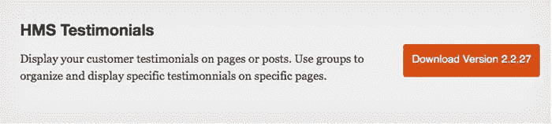

# 最佳 WordPress 推荐插件

> 原文：<https://medium.com/visualmodo/best-wordpress-testimonials-plugins-417f8fbd8efc?source=collection_archive---------0----------------------->

免费 WordPress 插件

免费下载链接查看新的最佳 WordPress 推荐插件列表，向你的访问者展示你的网站用户或客户对你的公司或服务的评价。

如果你的访问者不做你希望他们做的任何事情，那么你的网站获得大量的流量并不意味着什么。无论你的目标是建立你的简讯订阅列表，销售更多的产品或服务等，你有一个网站的原因！

然而，在现实中，说服你的访问者做这些事情往往是非常困难的——不仅仅是因为我们仍然时不时地有点怀疑！

拥有一个成功的网站依赖于与你的访问者建立信任——而社会证明，如推荐，通常可以帮助增加可信度，这反过来又鼓励采纳和接受。

# 热门 WordPress 推荐插件

WordPress 客户评价插件通常允许你以自定义帖子类型的形式将客户评价添加到你的网站上——并且给你多种方式来显示你的客户评价，如窗口小部件、完整页面、幻灯片等等。他们中的许多人还提供各种方式，不仅展示客户评价，还收集客户评价，例如在你的网站上添加表格供访问者填写，甚至通过社交媒体为你收集客户评价！

市面上有很多推荐插件，在下面的列表中，我将重点介绍以下插件:

1.  广受欢迎，评价很高，
2.  目前正在由开发人员更新和支持，并且
3.  有一些独特的特点，使他们与众不同！

希望你会发现这个列表非常有用，可以帮助你找到完美的推荐插件——如果我们碰巧错过了你最喜欢的插件，请在下面的评论中告诉我们！

# 简单的证明

*是一个易于使用的基本插件，仍然包含许多功能。也是最受欢迎的之一，下载量超过 8 万，评分 4.6 星！我不得不说，它是这个列表中我最喜欢的——我已经在我的几个网站上使用它很长时间了。*

*有了简易推荐，您可以将您的推荐显示为一个定制的小部件，或者使用各种短代码将它们添加到任何帖子或页面。您也可以使用“设置”菜单来生成带有自定义显示选项的短码。*

*这个插件最好的特性之一是能够控制推荐如何显示。有超过 30 种不同的显示风格供你选择，所以你可以自定义外观，而不必[学习 CSS](https://winningwp.com/css-for-beginners-where-to-learn-css-from-scratch/) 。如果你想进一步微调显示，设置菜单中还有一个字段可以输入自定义 CSS。*

*这个插件非常简单明了，使用起来也很简单，但是如果你遇到困难，它也有大量的文档。许多评论还指出，开发人员会迅速帮助解决任何问题。*

*还有一个[专业版](http://goldplugins.com/our-plugins/easy-testimonials-details/)，可以让你在你的网站前端收集一个表格，以及其他高级功能。*

*但是免费版已经有很多功能了。您可以:*

*   *在你的边栏、页面或帖子中显示随机推荐*
*   *从幻灯片或淡出等酷炫的过渡效果中进行选择*
*   *包括评级和图像与您的证明书，与 Schema.org 标记*
*   *将客户评价链接到自定义 URL(如产品页面)*

*…仅列举其中的四个！*

*[官网](https://wordpress.org/plugins/easy-testimonials/)*

# *推荐窗口小部件*

**

*[*推荐插件*](https://wordpress.org/plugins/testimonials-widget/) 是最受欢迎的推荐插件之一，当你查看所有包含的功能时，很容易明白为什么。*

*有了这个插件，你不仅仅局限于推荐，你还可以用它来显示投资组合项目和评论。每份证明都可以包括视频、图像和文本，支持类别和标签，并查看丰富片段的模式。创建完成后，插件允许你在主题文件中通过短代码、小部件或函数来显示这些内容。*

*…对于希望在作品集网站上展示一系列不同类型的客户评价的设计师/开发人员来说，这是理想的选择。*

*使这个插件与众不同的其他一些伟大的特性:*

*   *从旋转、渐变或幻灯片过渡中进行选择*
*   *按类别、标签或帖子 ID 过滤*
*   *响应幻灯片*

*推荐显示基本的样式和最少的选项来改变外观，所以如果你想要更多的显示选项，你至少要知道一点 CSS 来真正定制东西是如何显示的。*

*还有一个[高级版本](http://aihr.us/downloads/best-wordpress-testimonials-plugin-testimonials-premium/)可用，包括来自开发者的支持和更多的功能。注意:虽然免费版本不包括直接支持，但值得一提的是，有一个可用的知识库提供一定程度的社区支持。*

*[官网](https://wordpress.org/plugins/testimonials-widget/)*

# *证明基础知识*

**

*[*推荐基础知识*](https://wordpress.org/plugins/testimonial-basics/) 是一个简单易用的插件，无需复杂的选项和配置就能轻松添加推荐。有样式选项，包括九种不同的字体，因此您可以轻松地定制外观，而不必了解任何 CSS。许多评论都提到了它的配置和使用是多么的简单——如果你不想花太多时间去解决问题或者修改代码，这可能是一个很好的选择。*

*这些推荐支持五星评级系统和 Gravatar，因此您不必上传任何图片(当然，前提是推荐的作者有一个与其电子邮件地址相关联的 Gravatar)。*

*包括输入表格，或者是短代码或者是小部件，所以你可以直接在你的网站上收集顾客/客户的评价。你也可以用短代码或小工具展示你的评价。此外，这个插件也有法语、荷兰语、德语和西班牙语版本。*

*[官网](https://wordpress.org/plugins/testimonial-basics/)*

# *HMS 证明*

**

*[*HMS 荐证*](https://wordpress.org/plugins/hms-testimonials/) 略有不同，因为它绝对不包含开箱即用的样式。为了设计你的推荐，你必须了解 CSS。*

*不过，它确实有一些有趣的功能，包括一个拖放编辑器，供您创建自己的页面模板来显示您的评价。您还可以将自定义字段添加到您的证明中，以显示您想要的任何附加信息。*

*这是一个基本的、灵活的插件，非常适合那些了解代码但不想从头开始创建插件的人。开发者也非常关注用户群，并乐于接受建议，通常会根据用户的建议在插件中加入新的特性。*

*(注意:如果你正在寻找一个比这个更基本的轻量级推荐插件(例如，如果你是一个有经验的开发人员)，请查看 WooThemes 的[推荐)](https://wordpress.org/plugins/testimonials-by-woothemes/)*

*[官网](https://wordpress.org/plugins/hms-testimonials/)*

# *KUDOBUZZ 推荐窗口小部件*

**

*[*Kudobuzz 推荐*](https://wordpress.org/plugins/kudobux-testimonial-widget/) 不像名单上的其他插件那样受欢迎，下载量仅超过 2000 次，但它的评价很高，并且有一些有趣的功能，使它有别于名单上的其他插件。*

*除了添加你自己的评价(或“荣誉”)，Kudobuzz 还会自动收集你在脸书、Twitter、Google+和网络博客上的正面评价。*

*为了使用这个插件，你必须在[Kudobuzz.com](http://kudobuzz.com/)创建一个账户来使用这个插件。一旦你这样做了，你可以连接你的社交媒体帐户，它会开始跟踪你的提及。这是在社交媒体上保存称赞的一个非常好的简单方法。然后，您可以使用短码在帖子或页面上显示您的推荐。*

*这个插件看起来很基础，没有太多文档，但是功能很有用。希望随着时间的推移，他们会越来越多地开发它。*

*[官网](https://wordpress.org/plugins/kudobux-testimonial-widget/)*

# *你真的需要一个插件来显示推荐吗？*

*的确，你可以很容易地在你的网站上手动添加推荐。事实上，如果你碰巧既有编码技能，又只有几份简单的证明可以展示，我会建议你这么做——尤其是如果你认为你不会很快更新或添加它们的话。*

*所有的 [Visualmodo](https://visualmodo.com/) WordPress 主题已经给了你 2 个免费的高级 WordPress 插件，它们有更多的推荐风格选项。*

*然而，在很多情况下，使用推荐插件会给你一个很好的选择范围，不仅可以在你的网站上管理和显示推荐，还可以在第一时间收集它们——从而潜在地节省你大量的时间和精力…*

*如果你想在你的网站上大量使用推荐，我绝对推荐你试用一个或多个上面提到的 WordPress 推荐插件！*