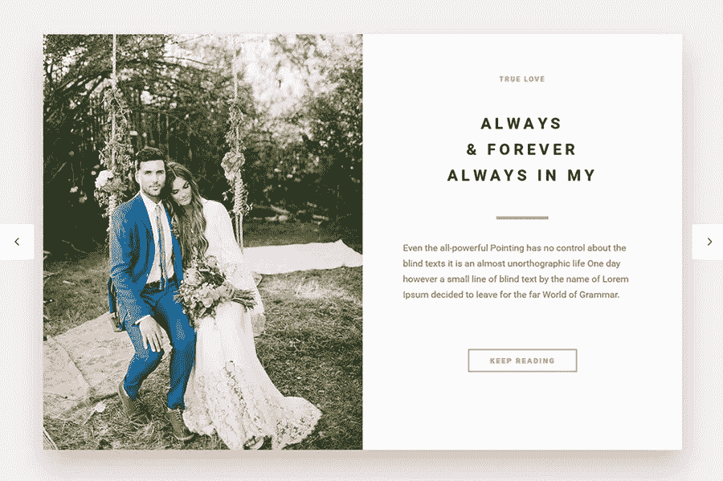

# 婚礼和新婚夫妇的最佳主题

> 原文：<https://medium.com/visualmodo/best-wordpress-theme-for-weddings-engagements-and-newlyweds-cf1617a489a5?source=collection_archive---------0----------------------->

在这篇文章中，我们将探索婚礼的主题应该是什么样的。此外，我们将展示最佳婚礼订婚模板。

希望婚礼是一生一次的经历。许多人希望借助一个专门的网站来庆祝这个节日。更重要的是，最佳婚礼主题可以通过帮助组织活动等婚礼任务来缓解压力。注册，照片，和晚餐。接受礼物，等等。

WordPress 拥有许多主题，这些主题充满了帮助你减轻计划重要日子的负担的功能。所以，给你更多的时间来真正享受整个体验——就应该这样！

# 最佳婚礼主题

理想的婚礼主题应该是简单的。响应并支持各种媒体元素。照片、视频等等。婚礼主题应该带有 RSVP 表格和留言簿。此外，婚礼主题还包括一个倒计时定时器。它有助于记录大事件的剩余天数。

[下载婚礼主题](https://visualmodo.com/docs/wedding-wordpress-theme-documentation/)

婚礼 WordPress 主题——一个专门为婚礼开发的响应性 WordPress 主题。它非常适合你的婚礼。它配有 RSVP 表格、倒计时和留言簿。

对大多数人来说，婚礼是一个非常特殊的日子。但是组织一场婚礼庆典会很有压力。帮助人们享受他们的梦想婚礼，成为他们最喜欢的婚礼策划人！以优雅的方式设计，婚礼是一个时尚的活动主题，为每一个婚礼策划人和活动策划人。它是挤满了一套美丽的婚礼模板，并有一个难忘的婚礼庆典。

精心打造，婚礼将确保您的网站访问者会找到他们白色婚礼的一切，包括专为他们设计的婚礼请柬。这个主题也有一个惊人的商店，非常适合出售各种婚礼用品。