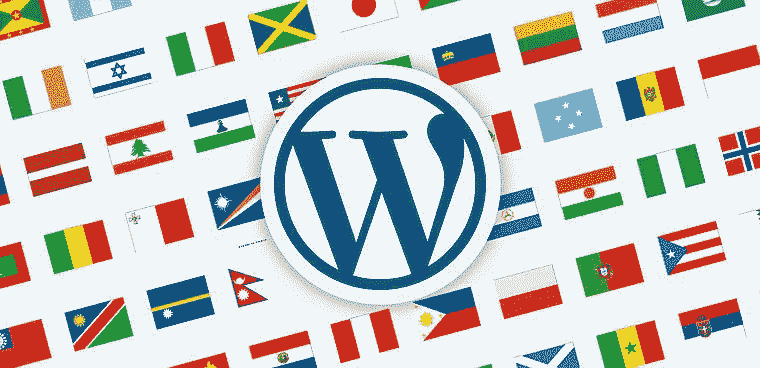
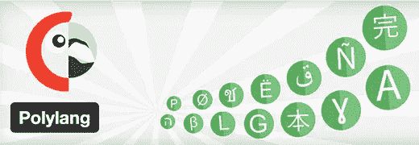
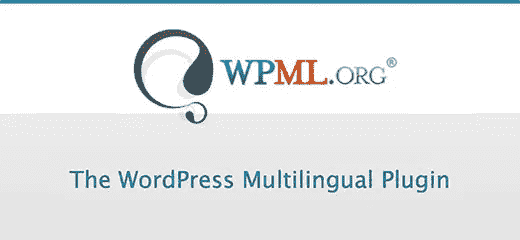
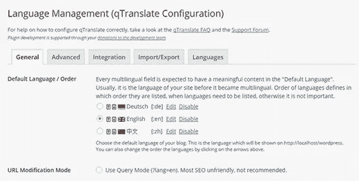
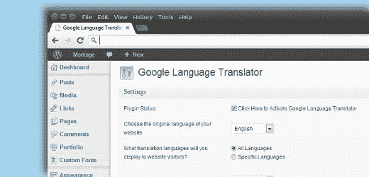
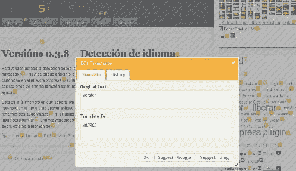
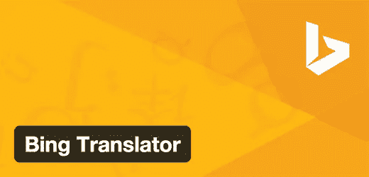
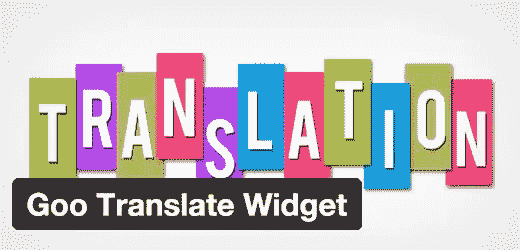

# 你网站的最佳 WordPress 翻译插件

> 原文：<https://medium.com/visualmodo/best-wordpress-translation-plugins-for-your-website-db80e6ce54f?source=collection_archive---------3----------------------->

# 你想翻译你的 WordPress 站点吗？有大量的 WordPress 翻译插件，允许你创建多语言内容或提供现有内容的机器翻译。在这篇文章中，我们将向你展示你的网站的 9 个最好的 WordPress 翻译插件。

# 我们(作为主题开发者)确保我们所有的主题都与列表中所有最好的插件完全兼容！

## 为 WordPress 选择翻译插件

大多数初学者不知道你可以用自己的语言安装 WordPress。你可以用它来创建你自己语言的内容，或者你可以[创建一个多语言网站](http://www.wpbeginner.com/beginners-guide/how-to-easily-create-a-multilingual-wordpress-site/)。

虽然 WordPress 有许多可用的翻译插件，但它们可以分为两大类。

首先，你有允许你在你的网站上创建多语言内容的插件。这些插件的主要好处是，你的翻译质量将明显优于任何机器生成的在线翻译工具。

第二种类型的 WordPress 翻译插件是使用在线翻译服务来翻译你的内容。这些插件并不要求你用多种语言写内容，但是翻译的质量并没有想象中的那么好。

说了这么多，我们来看看 WordPress 可用的最好的翻译插件。

## [1。Polylang](https://wordpress.org/plugins/polylang/)

Polylang 是一个免费的 WordPress 翻译插件。它允许您根据需要用多种语言创建多语言内容。

Polylang 允许你的用户从他们的个人资料中选择他们喜欢的语言，它会自动下载相应的 WordPress 语言包。

Polylang 完全支持 RTL 语言和大多数 WordPress 主题。

参见我们关于如何[轻松创建多语言 WordPress 网站的指南](http://www.wpbeginner.com/beginners-guide/how-to-easily-create-a-multilingual-wordpress-site/)以获得详细的指导。

## [2。WPML](https://wpml.org/)

[WPML](http://www.wpbeginner.com/refer/wpml/) 是 WordPress 最流行的多语言插件之一。这是一个付费插件，附带一年的高级支持。WPML 允许你创建多语言网站。

你可以把你所有的文章、页面、自定义文章类型和菜单翻译成你想要的任何语言。它还将您与专业翻译服务联系起来，因此您可以雇人翻译您的内容。

## [3。qTranslate X](https://wordpress.org/plugins/qtranslate-x/)

qTranslate X 是另一个强大的免费 WordPress 多语言插件。它在功能上类似于 Polylang 和 WPML。它提供了一种创建多语言内容的简单方法。

用户可以在编辑帖子时切换语言，以同时处理不同语言的内容。它有越来越多的第三方插件，而且大多数都是免费的。它们允许您将 qTranslate 与各种其他平台和插件集成在一起。

## [4。西里语](https://wordpress.org/plugins/xili-language/)

xili-language 是一个免费的强大的 WordPress 多语言网站插件。它不仅允许你创建多语言内容，还可以根据内容语言改变你的主题语言文件。

该插件附带了全面的工具来帮助您建立您的多语言网站。它已经支持大多数标准的 WordPress 兼容主题，并且它有一个插件使它可以和许多其他流行的插件一起工作。

## [5。谷歌语言翻译](https://wordpress.org/plugins/google-language-translator/)

将你的内容翻译成不同的语言很费时间，也需要付出很多努力。这就是为什么许多网站所有者选择像谷歌翻译这样的在线翻译工具。

谷歌语言翻译插件提供了一个简单的方法来添加谷歌翻译到你的 WordPress 网站。看看我们关于如何在 WordPress 中添加谷歌翻译的指南。

## [6。g 翻译—谷歌翻译](https://wordpress.org/plugins/gtranslate/)

Gtranslate 是 WordPress 的另一个免费谷歌翻译插件。它允许你添加一个由谷歌驱动的语言切换器来轻松翻译你的网页。它从顶部隐藏了建议更好的翻译弹出窗口和谷歌翻译栏。

Gtranslate 还可以选择在新窗口中打开翻译后的页面。这样，用户可以在原始内容和翻译内容之间来回切换。有多种样式的下拉菜单和标志供您选择。

## [7。Transposh WordPress 翻译](https://wordpress.org/plugins/transposh-translation-filter-for-wordpress/)

如果你正在寻找一种简单的方法来让你的用户翻译你网站上的内容，那么 Transposh 就是你的答案。它允许你将自动机器翻译和用户翻译结合起来。您的网站访问者可以简单地选择翻译页面上的任何文本，并添加他们自己的翻译。

## [8。必应翻译](https://wordpress.org/plugins/bing-translator/)

与谷歌类似，必应也提供自动翻译工具。Bing 翻译插件使用 Bing 的翻译工具自动翻译页面上的内容。由微软开放技术公司维护，这个插件已经有一段时间没有更新了，但它工作得很好。

## [9。咕翻译小工具](https://wordpress.org/plugins/goo-translate-widget/)

将谷歌翻译添加到你的 WordPress 站点的另一个简单方法是使用谷歌翻译插件。这个简单的插件为你的 WordPress 站点添加了一个强大的部件。

只需将小工具拖放到侧边栏，选择您的语言，然后保存小工具设置。

就这些，我们希望这个列表能帮助你为你的 WordPress 站点找到最好的翻译插件。

来源:https://visualmodo.com/