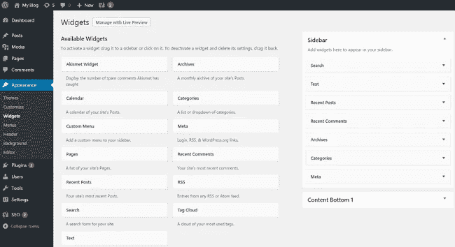
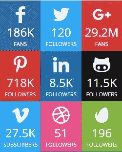
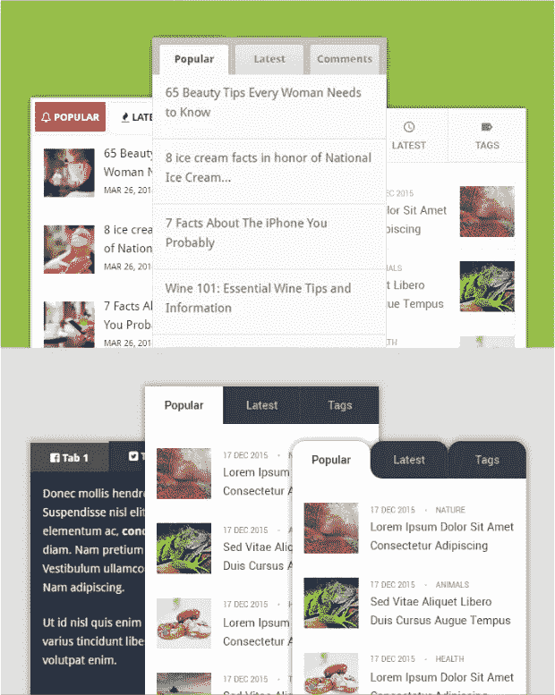
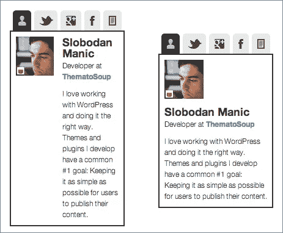
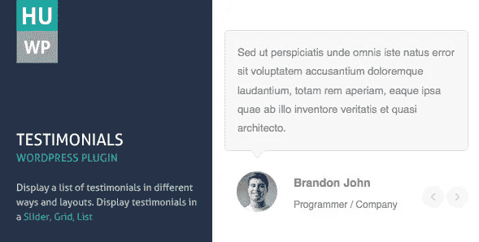
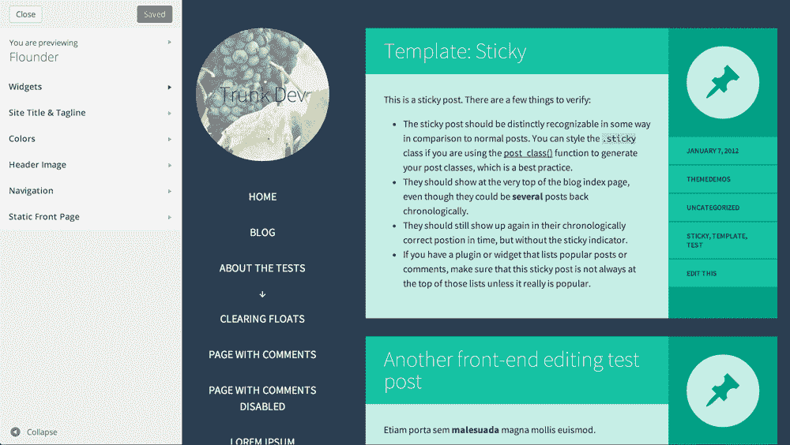

# 最佳侧边栏和页脚部件

> 原文：<https://medium.com/visualmodo/best-wordpress-widgets-for-sidebar-footer-32c98369c458?source=collection_archive---------0----------------------->

WordPress 允许你通过小工具轻松定制你的站点布局。有许多 WordPress 插件和主题，允许你添加不同种类的小部件，如热门帖子、日历、电子邮件订阅等。在这篇文章中，我们为你的网站精心挑选了最好的 WordPress 小部件。

# 最佳侧边栏部件

侧边栏是一个博客不可或缺的一部分。但是很多博主忽略了这一点。当我开始写博客的时候，我会在边栏上添加很多小工具。我觉得这很酷。但是我没有从侧边栏得到我想要的结果。那是因为我没有使用正确的部件。

合适的小工具可以帮助你让你的侧边栏为你工作。但问题是，从成千上万的 WordPress 小部件中找到合适的小部件并不容易。为了让事情变得简单，我将分享一个不同类型的 WordPress 侧边栏小部件列表。这个列表将帮助你找到并添加合适的插件到你的[博客。](https://visualmodo.com/)

在继续之前，我建议您检查一下现有的小部件。因为 WordPress 安装自带了一些默认的小部件。如果你使用的是高级主题，它可能还会添加一些小工具。在添加新的小部件之前，您应该检查是否有相同种类的小部件。只需进入[管理面板>外观>小工具。](https://visualmodo.com/)

现在让我们来看看你的 WordPress 博客必备的小部件。

**1。电子邮件订阅小工具**

侧边栏是添加选择加入表单的最佳位置之一。它很容易转化。它让博客看起来更专业，因为大多数专业博客作者都使用它。无论你是提供免费服务还是仅仅要求你的读者订阅，你都应该在侧边栏中添加一个选择加入的表单。这里有一些你可以用来在侧边栏中添加选择加入表单的插件。

*   茁壮成长的线索:茁壮成长的线索是所有在一个名单建设的解决方案。它拥有快速建立电子邮件列表的一切。我正在我的博客上使用这个插件。
*   OptinMonster:这是另一个流行的列表构建插件。它是由著名博主 Syed Balkhi 创建的。
*   WP 订阅:这是一个免费插件，由 MyThemeShop 创建。不提供赠品的时候是个不错的选择。

**社交媒体小工具**

社交媒体是联系读者的最佳方式。侧边栏中的社交媒体小工具意味着你的访问者只需点击一下就可以与你联系。然而，有几个社交网站。你需要弄清楚哪些网络适合你的博客。您可以在边栏中添加单个网络或一组网络 widget。

*   简单的社交分享按钮:这是一个有很多功能的社交分享插件。它有侧边栏部件显示追随者计数器。
*   君主社交分享插件:它主要是一个社交分享插件。但是它允许你在侧边栏中添加社交媒体小部件。这是社交媒体的完整解决方案。
*   SocialBox——社交档案展示:Social box 可以让你以一种吸引人的方式在侧边栏上展示你的社交媒体档案。它支持 YouTube 和 Vimeo 频道订阅的几个社交网络。
*   [社交媒体插件](https://wordpress.org/plugins/social-media-widget/):这是一个免费插件，可以在你的侧边栏上添加所有社交媒体资料的链接。它提供了大量不同大小和风格的图标。
*   [Metro 风格的社交小工具](https://wordpress.org/plugins/metro-style-social-widget/):顾名思义，它在侧边栏中显示 Metro 风格的社交网络图标。当您打算添加几个配置文件时，这是一个很好的解决方案。
*   YouTube 频道图库:显示一个 YouTube 视频和一个 YouTube 频道的缩略图图库。
*   脸书喜欢框部件:学习如何手动添加脸书喜欢框部件到 WordPress。
*   [Instagram Slider Widget](https://wordpress.org/plugins/instagram-slider-widget/) :如果你想在侧边栏显示你最新的 Instagram 图片，使用这个插件。

**帖子小工具(最近/热门)**

你可以在侧边栏上展示你最近发表的或受欢迎的帖子。这样访问者可以很容易地找到你最好的帖子或最近发表的帖子。默认情况下， [WordPress](https://visualmodo.com/) 有一个显示最近文章的小部件。然而，一些插件允许你显示带有缩略图的文章或按标签排列的文章。

*   这是一个高度可定制的小工具，可以让你在侧边栏上显示最受欢迎的帖子，
*   [最近的帖子小工具](http://wordpress.org/plugins/recent-posts-widget-extended/):允许你用缩略图显示最近的帖子。它是由 [Visualmodo 主题](https://visualmodo.com/theme/ink-wordpress-theme/)创建的。
*   WP 标签部件 Pro:这是一个奇妙的部件，可以让你显示标签排列的文章。您还可以显示标签或类别。它提供了 21 种预定义的布局、29 种新的分页样式和 6 种独特的 AJAX 加载器。

**4。创作小工具**

访问者总是想知道谁是博客的幕后黑手。这就是为什么 About page 是你博客中访问量最大的页面之一。我们将作者简介框添加到博客帖子或页脚。但是当你把它添加到侧边栏时，它会得到更多的关注。虽然您可以使用文本编辑器添加作者简介，但您可以考虑使用插件来使该框更具吸引力。

*   最棒的作者框:这是 [WordPress](https://visualmodo.com/) 最著名的作者框插件。它提供了一个小部件，允许你在侧边栏上添加一个作者框。您还可以在不同的选项卡上显示您的社交资料。
*   WP-Author Box:这是 Author Box 的另一个很酷的插件。它提供了 6 个预定义的皮肤。

最喜欢的作者框侧边栏部件。

**5。登录小工具**

如果你运行一个多作者的 WordPress 站点，你应该在侧边栏上添加一个登录窗口小部件，让你的作者更容易登录。一些令人印象深刻的 WordPress 插件允许你在侧边栏中添加简单而有吸引力的登录/注册表单。

*   短代码登录窗口小部件:这是一个简单的插件，允许用户从前端登录到客户端。
*   社交登录:这个插件允许你的访问者登录社交网络，如脸书、推特、贝宝、LinkedIn、谷歌等。
*   [选项卡式登录小部件](https://wordpress.org/plugins/tabbed-login/):这是一个漂亮的选项卡式登录小部件，允许用户登录、注册，并从侧边栏中找回忘记的密码。

**6。搜索小工具**

添加搜索小工具取决于您博客上的帖子数量。没有理由给一个新的博客添加一个搜索框部件。会让搜索的游客失望。如果你的博客上有相当数量的博文，你可以考虑添加一个搜索框。WordPress 有一个默认的搜索框小部件。但是它没有显示准确的结果。这里有一些可供选择的方法，你可以试试。

*   谷歌搜索框:它显示比默认搜索更多的相关结果。并且对服务器资源没有任何影响。
*   SearchWP:这是一个高级插件，可以显示比默认 WordPress 搜索更相关的结果。
*   Relevanssi —一个更好的搜索:这个[插件](https://visualmodo.com/)用一个显示相关结果的更好的搜索替换了默认搜索。

**7。推荐 WordPress Widget**

增加你的博客可信度的最简单的方法之一就是添加推荐。当你提供服务/产品时，必须有证明。这会增加你的转化率。您可以使用文本小部件轻松添加评价。但是如果你想要更多的功能，比如收集推荐，你需要使用一个插件。

*   [评价小工具](https://wordpress.org/plugins/testimonials-widget/):可以让你随机或选择性地在侧边栏显示评价。您可以通过短代码或小部件插入证明。
*   [简易推荐](https://wordpress.org/plugins/easy-testimonials/):这是一个易于使用的插件，可以将推荐添加到你的 WordPress 工具条中。
*   推荐 WordPress 插件:这是一个展示推荐的高级插件。它提供了响应式布局、按类别分组推荐、短代码/小部件、几种风格选项等。

**收视率/民意测验小工具**

评级-小工具是一个基于产品/评论的博客必备的小工具。即使你没有运行一个基于评论的博客，但是你在你的博客上写了很多评论；你可以在侧边栏展示你的评论。另一个重要的小部件是投票小部件。这是对访问者进行快速调查的最佳方式。

*   WP Rich Snippets:这个插件让你的评论更有吸引力，帮助你在谷歌获得星级。它还可以让你在侧边栏上展示评论。
*   评级-窗口小部件:星评系统:它有一个“最高评级”的窗口小部件，允许你把它放在你的工具条上。该部件将显示排名靠前的帖子、页面和评论。
*   TotalPoll Pro:它可以让你轻松地创建和添加投票到你的工具条。非常好用。
*   [Polldaddy 投票&评分](http://wordpress.org/plugins/polldaddy/):它允许你从 WordPress dashboard 创建和管理投票。

**其他**

您可以考虑将其他一些小部件添加到侧边栏中。但是要看你的需求。没有理由通过添加不必要的小工具来减慢你的博客速度。

*   [谷歌日历事件](https://wordpress.org/plugins/google-calendar-events/):它有一个小部件可以在侧边栏显示你的谷歌日历。它会在日历上漂亮地突出你的活动。
*   [谷歌地图小工具](http://wordpress.org/plugins/google-maps-widget/):它可以让你将谷歌地图添加到你的 WordPress 工具条中。
*   Alexa 排名窗口小部件:你可以使用这个插件在侧边栏显示 Alexa 排名窗口小部件。
*   DMCA 保护部件:它保护你的博客免受内容窃贼的侵害。

**结论**

这些是你可以在博客上使用的小工具。但是请记住，使用不必要的小工具可能会降低你的博客速度。现在我想听听你的意见。让我们知道你现在在你的博客上使用哪些小工具。然而，如果你觉得这篇文章[有用](https://visualmodo.com/)，请帮我在脸书、推特或 Google+上分享这篇文章