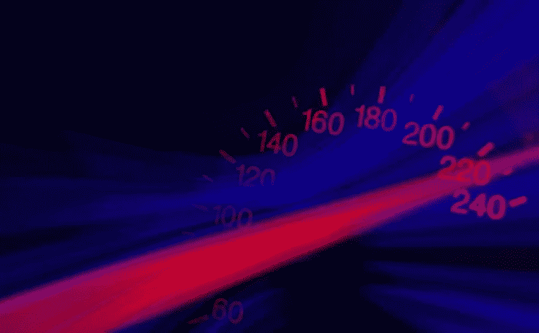

# 速度更快，流量和转化率更高

> 原文：<https://medium.com/visualmodo/better-speed-for-more-traffic-and-conversions-7e2e3a41c38?source=collection_archive---------0----------------------->

你的产品在网上没有吸引足够多的顾客吗？首先，你的网站缺乏访问者吗？如果答案是肯定的，你一定是忽略了你的网页的一个重要问题！访问你的网站所需的时间对你的访问量起着至关重要的作用。我们经常认为一个引人注目的网站足以吸引所有潜在的客户，但我们需要知道如何获得更高的速度以获得更多的流量。

它有助于有一个美丽的网站和令人兴奋的优惠。然而，一个缓慢的页面会阻止客户。如果你想吸引更多的潜在客户，他们应该能够快速访问你的页面。你的页面加载越快，你的流量就越大。这里有一些通过提高加载速度来获得更多流量和转化率的技巧。

# 选择最快的虚拟主机

经营一个网站是昂贵的。我们经常需要支付许多其他工具的订阅费用。相比之下，虚拟主机总是处于次要位置。毕竟，没有人愿意在速度上多花钱。

如果你选择共享网络主机，你所在的服务器会把你拉下来。你的网站将没有机会说服访问者转化为买家。我们生活在一个不耐烦的世界。你的访客会在几秒钟内离开并选择你的竞争对手。

然而，快速虚拟主机可以改变流量的游戏规则。看看这个最快的虚拟主机研究。它会帮助你找出哪个虚拟主机可以给你最好的结果。

# 更少的 HTTP 调用意味着更快的速度

组成网站的每个文件都有一个独特的 HTTP 调用。每个电话都需要时间才能接通，这会降低你的加载速度。减少调用次数可以提高加载速度。

拥有额外的插件意味着更多的 CSS 和 Javascript 拥有自己的 [HTTP 请求](https://visualmodo.com/easy-breezy-tips-to-start-up-your-website/)。你添加的插件越多，它们就越会“拖累”你的网站。试着把插件的数量减少到你能使用的最低水平。

您使用的主题也有自己的 CSS 和 Javascript 文件。这些将需要更多的时间来加载。尝试将所有 Javascript 文件压缩在一起。所有的 CSS 文件都是如此。试着使用一种更适合你的视觉效果的字体，而不是额外的图片。

# 尾随斜线也很重要！

当我们在网站的某些地方添加链接时，我们经常会忽略后面的斜线。你知道吗，缺少斜杠会增加到达一个站点的时间？

缺少尾随斜线会使服务器无故超时工作。斜线可以正确地指引游客到确切的地点。与其让服务器进行不必要的搜寻，不如把它引导到正确的地方。这里有一个例子:

(而不是)https://website.com

(去)https://website.com/

# 有效利用媒体

当你在你的网站上使用媒体时，确保有效地使用它。当我们使用图像时，我们不会考虑它们的质量和大小。文件越重，加载时间就越长。

有时我们用智能手机拍照，并在我们的网站上使用。最小化文件的质量和大小。使用文件压缩器减小文件大小，并使用最佳尺寸。

如果您想直接添加视频，请选择 mp4 类型。如果不需要声音，请使用不带音轨的视频。使用视频的最佳方式是通过另一种媒介嵌入。例如，把它上传到 YouTube，然后嵌入到你的网站上。

# CDN 用于全球网站以获得更快的速度

如果你的网站在不同的国家使用，考虑使用 CDN。因为内容分发网络在全世界有许多数据中心。他们复制你的网站。这些副本分布在不同的地理位置，以便该区域附近的用户更容易访问。点击此处了解更多关于 CDN 的信息。

# 文件的放置很重要

样式表是决定网页布局的一种形式。此外，所有关注设计和界面的样式表都应该放在最上面。这将确保即使加载时间较长，用户也不会长时间看到空白屏幕。

将 Javascript 文件放在底部。一旦内容出现，功能文件需要快速加载。即使有延迟，当用户习惯了这个页面后，这些功能就可以供他们使用了。

# 首先加载顶部的代码

另一种转移用户注意力的方法是首先加载页面顶部的内容。以一种在滚动前优先显示内容的方式对网站进行编码。你给访问者的印象是网站已经加载了。当他们看到最上面的内容时，其他的内容也会被加载。

# 缩小文件以获得更快的速度

尝试缩小文本、CSS 和 JS 文件。你需要尽可能减少空白和注释的数量，因为下载这些需要时间。你可以使用像这样的在线工具来缩小你的文件。即使花额外的时间来完成你的网站，也会吸引更多的流量到你的页面。

# 使用压缩插件或 GZip 工具

启用压缩也是有益的，因为它会压缩 CSS、JS 和文本文件。因此，这些压缩文件较小，易于下载。然后用户浏览器自动解压文件。想象一下，你所有的文件都放在一个手提箱里，以便于运输，你的用户浏览器为它们打开包装。通过这个方便的工具，你可以获得更快的速度。

# 有用的浏览器缓存

用户第一次访问网页时，缓存会在用户的浏览器中保存网站的部分内容。启用缓存后，下次访问者访问您的页面时，它会加载得更快。这大大提高了速度。确保浏览器缓存已启用。

# 关于如何获得更快速度的最终想法

总之，对你的网站采取深思熟虑的方法可以帮助你将流量转移到你的页面。即使这些看起来很小的变化，但总的来说，这些问题会降低你的加载速度。

做出改变，因为每一点小小的努力都可能极大地改变你的速度。更快的速度意味着更多的访问者，他们停留的时间越长，就越有可能购买你的产品。在你的网站上努力工作，从长远来看，这些改变会对你有所帮助。