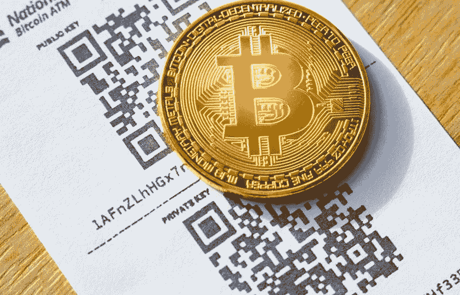

# 比特币初学者综合指南

> 原文：<https://medium.com/visualmodo/bitcoins-for-beginners-comprehensive-guide-23a32f0b95de?source=collection_archive---------0----------------------->

如果你想知道什么是比特币，你如何得到它，它如何能帮助你，而不是纠结于技术细节，这个指南是给你的。它将解释该系统如何工作，你如何利用它为你的利润，哪些骗局要避免。它还会引导你找到帮助你储存和使用首批数字货币的资源。如果你想了解更多细节，请查看我们的区块链比特币课程。

# 比特币是什么？

尽管我们声称[比特币](https://visualmodo.com/theme/cryptocurrency-wordpress-theme/)是一种相当新的数字货币形式，但它早在 2009 年就已经开始运作了。硬币最初是由化名为中本聪的人发明的，目前还不清楚谁是硬币的确切创始人。包括《纽约时报》、《新闻周刊》、《福布斯》和 Gizmodo 在内的各种新闻媒体都以不同的标题宣称不同的人是硬币的创始人。既然我们已经了解了比特币创造者的来历，那么让我们来了解一下比特币到底是做什么的，它与其他形式的[数字](https://shots.visualmodo.com/)在线货币兑换服务有什么不同？

首先，如果你曾经使用过数字在线货币兑换，你必须知道这些中间人收取的交易费。

数字货币兑换服务的一个显著特征是它们的交易费和其他费用。比特币区别于其他数字货币交易服务的最重要方面是，它不收取任何交易费用。

比特币是一种开源的点对点支付服务，免除了任何形式的中间人交易费用。你可以利用这种加密货币在网上购买任何东西，许多商家开始接受这种新形式的数字货币。许多网络，如购买亚马逊产品的钱包、WordPress 易贝、Zappos、微软、戴尔、Shopify 等，已经接受比特币作为一种支付形式。

比特币系统的另一个最重要的因素是，使用这种加密货币可以让用户完全匿名地处理支付。

# 区块链

虽然比特币似乎是一种令人惊叹的数字货币形式，具有惊人的优势，但它到底是如何工作的？比特币是美国财政部认定的一种分散货币形式。比特币不基于中央机构或银行，而是通过其整个社区的网络(分散网络)来进行。

考虑到比特币是一种数字货币，可以在不同的比特币货币兑换网络购买。这些网络允许用户买卖他们选择的货币形式的比特币，包括美元、欧元、印度卢比等。

这些新买的比特币现在存储在你的数字钱包里，可以通过移动或桌面设备访问。你也可以通过简单的点击按钮来发送或接收其他用户的比特币。比特币也可以用来在目前接受比特币的商店进行网上购物。这是对比特币工作原理的简单解释。

现在，如果没有中央机构或银行的参与，这些比特币究竟是如何产生、管理和发行的？为了理解比特币网络是如何管理的，我们现在必须引入一组新的人，他们被称为网络上的“矿工”。矿工是一群个人，他们把自己的计算能力借给社区，并保持网络交易的完整性。这些矿工验证网络上的交易，并因他们的努力而获得新生成的比特币。

然后，一个透明的公开维护的分类账会随着比特币网络上的交易而更新。比特币通常被称为“加密货币”的一种形式，是此类数字货币中最大的形式。

# 法律

公平地说，比特币在物理网格之外运行，不涉及任何中央机构或银行，它仍然合法吗？答案是，这取决于用户的位置。

比特币的合法性主要取决于你的[利益](https://visualmodo.com/blog/)所在地以及相应的目的。鉴于比特币是一种去中心化的数字货币，在许多国家使用比特币是非法的，一些政府允许使用比特币。例如，美国现在已经宣布它是一种商品。印度储备银行的印度副行长表示，他们没有计划在印度将比特币合法化。孟加拉国政府表示，“根据该国严格的反洗钱法，任何被发现使用虚拟货币的人都可能被监禁”。其他一些国家对比特币的使用尤其中立。日本已经开始接受比特币作为支付方式。

因此，在使用比特币之前，仔细检查当地政府关于比特币的法律是有道理的。

# 优势

比特币最好的一点是它是去中心化的，这意味着你可以结算国际交易，而不用纠结汇率和额外费用。比特币不受政府干预和操纵，因此不存在美联储 System‍加息的问题。它也是透明的，所以你知道你的钱发生了什么。你可以立即开始接受比特币，而不需要将金钱和精力投入到细节中，例如建立一个商家账户或购买信用卡处理硬件。比特币不能伪造，你的客户也不能要求退款。

难怪用户称比特币为“货币 2.0”，或者比尔·盖茨称其为“技术杰作”。

# 比特币的使用

现在你已经很好地理解了比特币到底是什么，它是如何工作的，那么世界各地的人们是如何利用比特币的呢？

人们使用比特币的主要方式之一是在不同用户之间交换。人们正在利用比特币在朋友之间分享和交换金钱，以避免交易和信用卡费用。

其他一些比特币用户正在利用货币兑换网络进行网上购物，包括购买披萨、服装、游戏、电子产品、配件等等。

虽然有一方的个人充分利用比特币货币兑换系统，但也有小企业使用这项服务。同样，出于免除交易费用和即时转账的原因，许多小企业现在都在使用比特币货币兑换服务。

Expedia 最近也开始接受比特币作为酒店和旅游预订的支付方式。[查看 Reddit 上的比特币群](https://www.reddit.com/r/Bitcoin/)