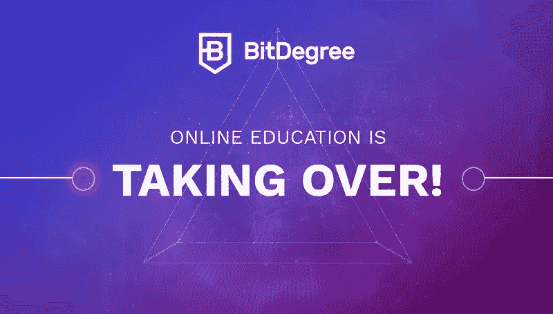

# BitDegree:在线教育的革命

> 原文：<https://medium.com/visualmodo/bitdegree-the-revolution-of-online-education-52cbc526e479?source=collection_archive---------0----------------------->

在线教育彻底改变了学生获取不同领域知识的方式，不再受地理位置、预算、种族或先前资格的限制。无论你是想成为一名网络开发人员、作家还是商人，在众多的职业选择中，你都可以在网上找到你想要的所有知识。这就是为什么全球有数百万学生加入了各种电子学习教育平台，如 Udemy、Coursera、EdX 等。这些电子教育平台的新成员是 Bitdegree，它将彻底改变在线教育本身。

# 在线教育的革命

BitDegree 是一个创新的教育平台，通过基于区块链的奖励系统提供在线课程。该系统跟踪课程进度，并向学生发放数字代币，这些代币可以兑换课程折扣。这种对学习的透明跟踪和激励使 [BitDegree](https://www.bitdegree.org/) 从其他电子学习平台中脱颖而出。

# 在 BitDegree 上你能学到什么

在 BitDegree 上，点击几下就可以开始学习。该平台目前正在提供编码、区块链、商业和设计等类别的各种课程。

课程中教授的所有主题都与当前和未来的行业要求相关，包括互动课程、来自全球各地的合格讲师、游戏化的学习体验以及前面提到的基于区块链的透明成绩跟踪系统。这些课程的重点是让你在完成所有包含的主题后为获得一份工作做好准备——这是大学学习模式中所缺乏的。

尽管 BitDegree 上的所有课程都有价值，但鉴于目前的市场需求，如果你想刺激你的职业生涯，开发和设计课程是最好的选择。像编程、网页设计、游戏制作和图形创作这样的技能会让你无论在哪里都能找到一份工作，或者成为一名在线自由职业者。

平台上并不是所有课程都是免费的。然而，如果这对你的学习造成了障碍，BitDegree 为其课程(TBA)提供奖学金，并提供[优惠券折扣](https://www.bitdegree.org/udemy-coupon-code)以免费/廉价注册课程。

# 结论

BitDegree 从一个崇高的使命开始，将学习传播到世界的各个角落，没有基于地点或支付能力的歧视。它的课程将带你从一个新手成为这方面的专家，只要你努力完成课程。奖励系统会让你保持动力，完成课程后，你就可以在工作中检验你的技能了。