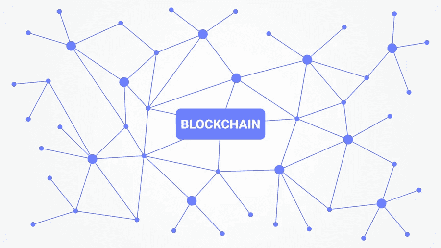
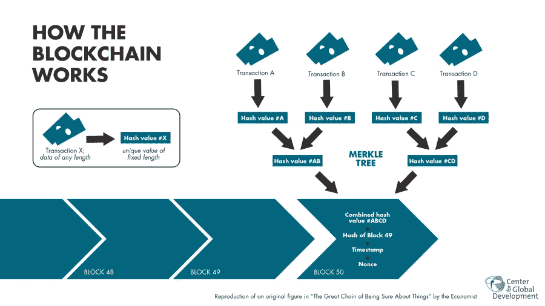

# 区块链:你需要知道的一切

> 原文：<https://medium.com/visualmodo/blockchain-everything-you-need-to-know-f0152c43651b?source=collection_archive---------1----------------------->

技术的进步总是一浪高过一浪。如果你回想一下，机械能的使用改变了游戏规则，然后出现了电，人们开始想出如何利用这种新形式的能源。在本帖中，我们将探索和解释你需要知道的关于区块链技术的一切及其对你的好处。

随着时间的流逝，电的新用途被引入，最终计算机诞生了。在计算机开始出名后，互联网出现了。互联网改变了世界，让世界变得更小。

科技世界的最新浪潮是区块链，在看到它的大规模增长后，每个人都在寻找新的和创新的方式来使用它。

# 什么是区块链？

如果你在谷歌上简单搜索什么是[区块链](https://visualmodo.com/theme/cryptocurrency-wordpress-theme/)，你会发现许多不同的类比。最能解释区块链的一个类比可能是数字民主。这是一种几乎防篡改的技术，因为信息没有单一的所有者或主拷贝可以被更改或篡改。

在数据的变化可以被验证之前，它需要通过共识来完成。由于数据驻留在多个设备上，因此很难更改主版本。

用经济学术语来解释就是，人们和公司可以进行货币交易，而不必付给中间人一分钱。交易是即时的，鉴于区块链的安全性如此独特，伪造交易几乎是不可能的。

它为每个数据块或交易创建一个永久的数字分类帐，一旦分类帐中的某些内容发生变化，它将永远保持不变。它不能改变或逆转。

对于所有在区块链研究科技和写论文的人来说，请访问 Edubirdie 获得专业写作帮助。它可能与这方面的论文、学位论文、大学论文和其他写作工作有关。那么实际上这看起来如何呢？

假设你家附近所有的热狗摊都使用区块链技术进行交易。每个热狗摊都会有一个虚拟的账本。在任何交易被记入分类账之前，关于每个热狗摊的价格、位置和所有者的某些规则。

彼得走进莎莉的热狗摊，花 2 美元买了一个热狗。彼得会付他的两块钱，交易会自动出现在每个人的账上。

交易只会按照规则进行。例如，如果交易价格为 500 美元，则交易无效。

实际上，在区块链发生的事情是，交易并没有加到网络中每个人的账上。在交易结束之前，网络中的每个人都需要验证交易。如果区块链的规则之一不起作用，则交易不能添加。

## 区块链有什么好处？

区块链技术正在快速发展，其[应用](https://visualmodo.com/the-concept-of-sql-programming-and-some-best-practices/)也在增长。公共服务中的区块链也是正在探索的领域。它如此受欢迎的原因是因为它的好处。

区块链技术最令人惊奇的特征之一就是它的透明性。网络中的每个人都可以访问分类账和规定交易何时被验证的规则手册。

你可以随时看到每笔交易的每一个细节。这也意味着有更大的安全感，因为每个人都有一个他们用来验证交易的分类帐副本。你在公司阶梯上的位置并不重要，因为每个人都有相同的投票权。

鉴于区块链的交易完全是数字化的，不依赖于信息传输的线性路径，交易是即时的。没有中间人需要验证任何东西，因为验证是自动进入代码的。

最后，没有一个中央权威机构，这意味着所有为交易支付的钱都流向卖方。没有额外的资金流向当局。这一切都增加了区块链的速度和效率。

# 谁会从区块链获益最多？

区块链的奇妙之处在于它去掉了中间人，本质上交易只发生在买方和卖方之间。他们的交流和交易是直接的，因此可以说没有人必须参与交易。

# 最后

区块链是自互联网以来的下一个最好的东西，如果你仍然不完全确定它是如何工作的。所以，你需要更深入的探索。对我们其他人来说。不过，我们可以期待的一件事是，交易成本会少很多。更多关于我们喜欢的东西。区块链技术仍处于测试阶段，一旦你获得全面许可。因此，我们将面临一些有趣的变化。

## 作者简介:

> Connie Elser 是科学、工程和技术领域的学术作家。她是一个真正的技术爱好者，定期发布博客和播客，阐述其在教育领域的重要性。闲暇时，她会阅读科幻小说，尝试玩游戏，还会去海滩散步。