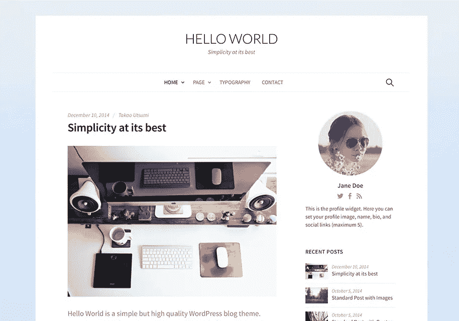
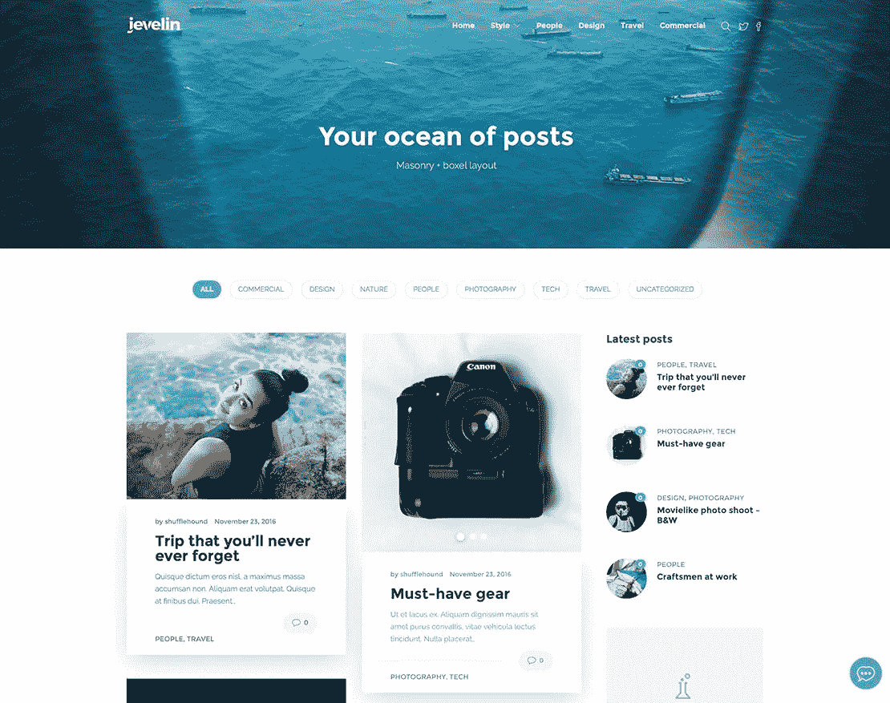

# 博客从简单的步骤开始

> 原文：<https://medium.com/visualmodo/blog-start-in-simple-steps-82ef10c7249d?source=collection_archive---------0----------------------->

按照一步一步的指示，学习如何在不到一个小时的时间内开始写博客。我们用这个过程创建了一个成功的博客 start，被很多网站引用。

# 博客从五个简单步骤开始:

1.  选择博客平台、域名和托管选项。
2.  使用简单的主题设计你的博客。
3.  修改你的博客以获得你想要的外观和感觉。
4.  为你的博客选择最好的插件。
5.  撰写引人注目的内容，为读者增加价值。

# 如何开始一个博客:一步一步的指示

所以你正在考虑开一个博客，但是你不知道从哪里开始，对吗？你猜怎么着——我们也没有。我们一无所知。当我们几年前创建这个博客时，我们不知道如何开始一个博客或者如何成为一个博客作者。见鬼，我们几乎不会拼写 HTML，更不用说写博客了。

但好消息是:这比你想象的要容易。在我们上升到 400 万读者的过程中，我们学到了很多东西。现在，你可以从我们的痛苦和折磨中吸取教训，从而避开创建博客所涉及的许多繁琐工作。

下面是我们如何开始我们的博客，一步一步，然后是教学视频，以及其他基本原理和见解:

1.  **域名和托管**。当我们开始我们的博客时，我们做的第一件事是去一个主机并注册我们的域名。我们甚至不需要先建立一个 WordPress 页面，这是我们使用的平台，因为主机会为你做所有的事情。基本价格，适用于 99%的人(然后，我们做了一个简单、免费的“一键”安装 WordPress，就像 Bluehost 一样。当我们有问题时，我们可以免费与“实时聊天”聊天。他们给我们指出了正确的方向，让我们开始自己的博客变得超级简单。
2.  **主题**。一个好的主题给你你想要的博客的外观和感觉，让你的博客看起来完全是你想要的*的样子。如果你不是程序员(我们当然不是)，那么主题会让设计工作变得容易一百万倍。此外，一旦你购买了一个主题，因为它节省了你的时间，所以并不昂贵，你将终生拥有它。一个主题有两部分:框架*(骨骼)和子主题*(美丽):***

*   ***框架*。市场上有几个 WordPress 主题框架，我强烈推荐你看一下 [Ink](https://visualmodo.com/theme/ink-wordpress-theme/) blog WordPress 主题，一旦它完全可定制，易于使用，并且通过 1-click demo import，你可以在几分钟内拥有一个设备齐全且随时可用的博客网站。**

1.  **修改你的博客。一旦我们有了自己的域名、主机、WordPress 和主题，我们就花了很多时间来调整主题，以获得我们想要的外观和感觉(例如，让我们的愿景成为现实)。然后，我们花了更多的时间修补主题，争论它，并对它进行更多的调整。一旦我们创建了自己的博客，我们就建立了一个免费的 [Feedburner](https://feedburner.google.com/) 账户，这样人们就可以通过电子邮件和 RSS 订阅来订阅我们的网站。然后我们建立了一个免费的[谷歌分析](http://www.google.com/analytics/)账户来追踪我们的统计数据。Feedburner 和 Google Analytics 都很容易注册，我们今天仍然在使用它们。**
2.  ****插件**。我们在我们的网站上只使用了几个插件:“Google Analytics for WordPress”和非常简单的脸书和 Twitter 分享按钮插件(因为人类天生就喜欢分享价值，所以让你的帖子易于与他人分享很重要)。一旦你开始写博客，它们只需要几秒钟就可以安装完毕(实际上只需要几秒钟，只需要点击一下按钮)。如果你真的想玩一些很酷的插件，看看 WP 初学者的[最佳 WordPress 插件](http://www.wpbeginner.com/category/plugins/)。**
3.  ****写出引人注目的内容**。最后，通过 WordPress，我们开始为我们的页面编写和上传内容:关于页面、联系页面、从这里开始页面、书籍页面、旅游页面、档案页面等。接下来，我们用网上找到的免费图片和常规文字处理程序中的文字设计了我们的标志。然后我们在页眉放一张自己的照片(这很重要，因为人们认同的是人，而不是标识)。最后，我们开始撰写新的博客文章并定期发布(至少每周一次)，同时附上来自 [Unsplash](https://unsplash.com/) 、 [Pexels](https://www.pexels.com/) 和[国会图书馆](https://www.loc.gov/pictures/)的免费照片。剩下的就是历史了。**

# **博客开始:这样做的原因。**

****

**在阅读了约书亚·贝克尔的《我认为你应该写博客的 15 个理由》之后，我们受到了研究和写这篇文章的启发，在这本书里，他讨论了你应该开始写博客的 15 大理由*。*为什么*是这里的关键词。换句话说，他谈到了写博客的目的，而不仅仅是如何开始写博客。这是所有其他关于博客的博客似乎都忽略的；他们错过了博客开始背后的*目的——*为什么*为什么*。***

# **博客开始:不做的理由。**

**所以现在你有 15 个理由*为什么*你应该开一个博客，我们已经向你展示了*如何*根据我们的个人经验一步一步地创建一个博客。但是在给了你那些可以节省你数百小时浪费时间的详细说明之后，我们也想给你一些你应该*而不是*开博客的好理由。(请记住，这些原因只是我们的观点，我们不会假装将它们作为某种经验主义博客格言的集合。)**

1.  ****钱**。你不应该为了赚钱而开博客。我们需要先解决这个问题。如果你的主要目标是取代你的全职博客收入，那就忘了它吧。事情不是这样的。你认为吉米·亨德里克斯拿起他的第一把吉他是为了“增加收入”吗？不，他没有。更确切地说，他这样做是因为热爱它，因为他得到了快乐和满足感，而收入是在那之后，实际上是很久以后才得到的。**
2.  ****恶名**。不要计划马上“在网上出名”。不是每个网站都像我们的网站发展得那么快，但这完全没问题。事实是我们有点幸运。我们得到了一个很棒的域名，我们拼凑了一个人们真正喜欢的标志和网站设计，我们写得相当好，我们的内容以一种独特的方式与人们联系在一起。不过，我们创建这个网站并不是为了“出名”。那太荒谬了。我们的恶名和迅速“成名”出乎我们的意料，是一点点运气和大量艰苦热情工作的结果。**
3.  ****交通**。并不是所有的流量都是好流量(正如我们在这里解释的)，所以不要担心马上获得成千上万的读者。**

**有趣的是，所有这些事情*都可能*发生。你*可以*通过建立博客获得全职收入。我们这样做，但如果这些是你开始写博客的唯一原因，你会很痛苦，因为它看起来像一份工作，如果它感觉像一份工作，你就不会对它有热情，所以你要么(a)讨厌它，(b)彻底失败，要么讨厌它*和*彻底失败。**

**相反，写作是因为你对它充满热情…**

# **为你的博客起点提供 20 条建议**

**我们收到大量的电子邮件，询问关于博客开始、如何写博客、博客主题以及创建有意义的内容的建议——甚至是一些关于我们穿平角裤还是三角裤的问题。这些是我们倾向于给出的答案和建议。**

1.  **找到你的定位。你不需要有一个利基市场，但这很有帮助。在学习如何成为一名博客写手时，问问自己对什么有热情是很重要的。跑步？做饭？为人父母？你找到你的激情了吗？如果是这样，不管是什么，写下来。如果没有，那么你必须首先[找到你的激情](http://calnewport.com/blog/2014/08/24/the-nuanced-road-to-passion-a-career-case-study/)。(注意:我们一般建议人们不要开一个关于极简主义或旧石器饮食或任何其他过度饱和话题的博客。但是当我们这样说的时候，我们真正的意思是:除非你有独特的观点，否则不要创建关于某件事的博客。如果你喜欢简单的生活，并且有独特的观点，那么尽一切办法去做吧。尽情享受吧。)**
2.  ****定义你的理想读者**。一旦你找到了自己的位置，你需要知道谁会阅读你的博客。例如，我们在博客上谈论有目的地生活。因此，我们理想的读者是那些对探索极简主义感兴趣的人，这样他们就可以为更有意义的生活扫清道路。如果你想写你的新生婴儿成长的故事，那太好了:你的理想读者可能是你的朋友和家人。如果你想写修复老爷车，那也很酷。为你的读者量身定做你的文章(无论是你的家人、当地社区还是其他任何会阅读你博客的人)。**
3.  ****添加数值**。你的博客必须给读者的生活增加价值。这是让高质量的读者访问你的网站的唯一方法(并让他们回来)。增值是获得某人长期认同的唯一途径。在企业界领导和管理人们十年之后，我们都学到了这一点。**
4.  ****做原创**。是的，有其他的博客和你想写的一样。问题:那么为什么你的博客与众不同呢？答:因为*你*。*你*让*你的*博客与众不同。这是关于*你的*视角，*你的*创造力，你*增加的价值。***
5.  ****有趣**。写[史诗](https://fizzle.co/sparkline/write-epic-shit?tt)，[牛逼](http://inoveryourhead.net/the-short-and-sweet-guide-to-being-fucking-awesome/)内容。尤其是你想让别人分享的时候。**
6.  **做你自己。有趣的一部分是讲述你的故事。每个人都是独一无二的，而你的故事是一个重要的故事。然而，讲故事的重要部分是去掉那些使故事索然无味的多余细节。一个伟大的讲故事的人去掉了 99%真实发生的事情——吸收性的细节——把有趣的 1%留给读者。**
7.  ****要诚实**。如果你想让人们阅读你的博客，你的博客需要真实——需要让人感觉真实。你可以是你的博客，也可以是你的博客。也就是说，你真的体现了你所写的东西吗？否则，人们会看穿你。“做你想在世界上看到的改变，”这是甘地的名言。也许博客作者应该建立他们想为世界写的博客。**
8.  ****透明度**。透明和诚实是不同的。你不必为了诚实而分享你生活的每一个细节。永远要诚实，当它给你写的东西增加价值时要透明。(你永远不会在我们的网站上看到我们使用洗手间的照片，因为那根本不相关。)**
9.  ****时间**。一旦你学会了如何开博客，你就会知道写博客需要很多时间，尤其是如果你像我们一样神经质的话(我们花了 10 多个小时测试这个网站的字体)。看到标题里那些黑色的推特和脸书图标了吗？我们在这些上面花了几个小时，决定什么是适合我们的)。也就是说，一旦你设置好了你的设计，不要调整太多。相反，把时间花在写作上。**
10.  ****视野**。我们的网站设计看起来不错的原因是因为我们有一个很棒的[主持人](https://www.bluehost.com/track/spyr/themins-blog)，我们有一个很棒的主题，最重要的是，我们有一个我们希望我们的博客看起来怎么样的愿景。一旦我们有了愿景，我们就会努力实现它。(注意:在开始写博客之前，我们都没有任何设计经验。)如果你不知道自己想要的博客是什么样子，就很难创建一个漂亮的博客。**
11.  ****找到你的声音**。随着时间的推移，优秀的作家发现了他们的声音，他们的作品往往会形成某种审美，一种吸引读者的审美。找到你的声音让你的写作感觉更生动，更真实，更迫切。更多阅读材料，请看约书亚关于[找到你的声音](http://www.theminimalists.com/voice/)的文章。**
12.  ****我们代替了你**。尽可能使用第一人称复数。陈述*我们*和*我们的*比*你*和*你的*更有力，尤其是在谈论消极行为或倾向时。第一个人表现得远没有那么指责。这样想吧:我们是对等写作——我们不是神。**
13.  ****什么时候发帖**。问题:发表博文的最佳日期和时间是什么时候？回答:其实没什么关系。我们不坚持特定的时间表。几个星期后，我们张贴一篇文章；有时候我们会贴三张。是的，坚持写作很重要，但你不必在细节上陷得太深。**
14.  **社交媒体。是的，我们建议使用 [Twitter](https://twitter.com/theminimalists) 、[脸书](https://facebook.com/theminimalists)和 [Instagram](https://instagram.com/theminimalists) 来帮助联系你的观众和其他博主，但不要太沉迷于此。首先关注写作，然后是社交媒体。**
15.  ****忽略负面的批评和愚蠢**。当然，我们会收到很多来自无知的人的负面评论和愚蠢的问题，他们并不是我们真正的读者(例如，像“你们不是真正的极简主义者”这样的负面评论和像“你们是同性恋吗？”).我们称这些人为海鸥:它们飞进来，在你的网站上拉屎，然后飞走。但是我们不在乎他们，因为我们没有为他们开博客。删除他们的评论，继续前进。**
16.  ****研究**。花时间研究你写的东西。我们之所以能够在论文中使用这么多有用的相关链接，是因为我们花时间研究我们的主题。**
17.  ****保持简单**。这就是极简主义可以应用于任何博客的开始，不管它是什么类型。没有必要在你的网站上到处放置多余的广告或小工具。坚持最基本的，去掉任何你不需要的。去掉任何没有附加值的东西。**
18.  ****图片**。在你的博客上放一张你自己的照片。人们认同其他人。如果两个来自俄亥俄州的傻瓜不怕把他们的照片放在他们的网站上，那你就没什么好担心的。**
19.  ****评论**。如果你打算在你的网站上发表评论，那么读一读斯科特·斯特拉顿的《杀死你博客的五个单词》。**
20.  ****过自己的生活**。你写的是你的生活(或者至少是你生活的某些方面)，所以你仍然需要过你的生活。有些事情我们总是放在写作之前:锻炼、健康、人际关系、经历、个人成长、贡献。**

**既然你已经学会了如何开始写博客，以及为什么你应该开始写博客来源:[https://visualmodo.com/](https://visualmodo.com/)**