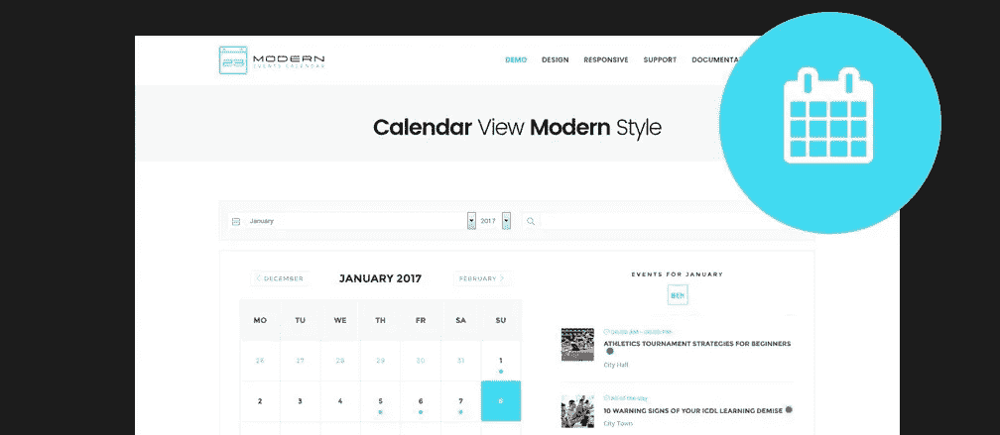

# 预订 WordPress:如何添加预约系统

> 原文：<https://medium.com/visualmodo/booking-wordpress-how-to-add-appointment-system-7e2e0009e97f?source=collection_archive---------0----------------------->

你想让你的客户直接从你的 WordPress 网站预约吗？许多企业需要一个预约 WordPress 表单，让客户可以轻松地在线预约。在这篇文章中，我们将向你展示最好的 WordPress 约会和预订插件。

想建立一个在线预约系统吗？管理服务预约可能会很麻烦。通过建立一个预约系统，你可以让你的客户在你的网站上方便地安排预约，而不需要你的参与。

在这篇文章中，我们将向你展示如何使用 WordPress 进行预约系统。

# 预约

有了这么多不同的预约插件，用 WordPress 制作一个预约系统是很容易的。为了获得最佳效果，您可以选择 BirchPress 或 WP-Forms 来安排约会。

如果你的网站需要一个完整的预约插件，BirchPress 是最好的选择。它让你直接从你的 WordPress 仪表盘管理你的约会。

如果您想将您的预约与您最喜欢的独立预约平台整合，您可以选择 [WP-Forms](https://wpforms.com/) 。WP-Forms 是一个完整的在线表单生成器。通过其 Zapier 集成，您可以将您的预约表单与任何支持 Zapier 的 web 应用程序连接起来。

这里有一个关于如何用 [WP-Forms](https://visualmodo.com/wpforms-wordpress-plugin/) 制作客户预订表格和用谷歌日历管理你的约会的教程。

在我们的教程中，我们将使用 BirchPress 和 WordPress 一起制作一个预约系统。

# 预约系统入门

要用 WordPress 建立一个预约网站，你必须购买一个域名和虚拟主机。

域名是你的网站在互联网上的地址，像 Google.com 和 IsItWP.com，虚拟主机是你的网站内容文件在线存储的地方。

# 步骤 1:安装和配置 BirchPress

你需要做的第一件事是安装并激活 BirchPress 插件。激活后，导航到**预约设置**进入插件设置，开始配置您的预订系统。

在设置页面中，您可以找到几个不同的部分:

*   **常规**:自定义常规选项，包括时区、货币、默认日历视图等。
*   表单生成器:在这里，你可以定制你的预约表单。
*   **通知**:设置通知服务提供商和您的客户。当预约被预订、重新安排或取消时，会发送电子邮件。
*   **支付**:在支付选项卡中，您可以设置您的支付设置。BirchPress 允许您通过 PayPal 收款。对于更多的支付网关，你需要安装 WooCommerce 集成。
*   **WooCommerce** :在此区域启用 WooCommerce 集成。
*   **定制代码**:给你的 BirchPress 插件添加定制代码。

# 本地化

如果你在多个地点提供服务，那么你可以从你的 WordPress admin 管理所有地点的约会。你所要做的就是在 BirchPress 中添加位置，并允许用户在预约时选择正确的位置。

要添加地点，请转到**约会地点**。然后点击**添加位置**。

然后，您可以详细说明您的位置，包括电话号码、地址、邮政编码等。

# 变量

接下来，您需要添加服务提供商或您的员工。如果你是一个单独的提供商，那么你只需要把自己添加为服务提供商。

如果你想管理整个公司的预约，比如说你的税务咨询业务，那么你需要将每个顾问添加到你的预约系统中。

在您的预订系统中添加提供商很容易。导航到**约会提供者**并指定提供者的详细信息。

您可以在编辑器中指定每个提供程序的名称和描述。然后在“服务”框中指定每个提供商可以执行的服务。向下滚动页面时，您会看到几个元框，如下所示:

*   **附加信息**:指定提供商的电子邮件地址。
*   **日历集成** : BirchPress 可以与你已经有的日历兼容，包括 Google、iCal、iPhone、Android 和 Outlook。您可以自动导入和同步您的约会。
*   **休息日**:在日历中指定你的休息日
*   **工作日程**:选择一个城市，为每个供应商添加一个日程。

# 添加表单

要在 BirchPress 中添加服务，请前往**预约服务**并指定您的详细信息。在右侧，您可以指定您将执行该服务的地点以及可以处理该服务的提供商。

然后，向下滚动页面，根据需要调整您的服务设置。

# 出版

现在，您已经设置了有关服务的所有细节，是时候发布您的预约表单了。

预订表单可以通过短代码嵌入到页面帖子和小部件中。一旦发布，您的客户可以轻松地检查您的可用性，并轻松地在线预约。

要发布预订表单，请在 WordPress 中创建一个新页面。然后将下面的短代码添加到编辑器中想要嵌入表单的地方:**【BP scheduler _ booking _ form】**

或者，你可以直接从你的 WordPress 仪表盘添加一个约会，方法是进入**约会新约会**。

下面是一个示例预订表单:

您也可以查看日历，通过访问**约会日历**查看和管理您的预订。

# 结论

我们希望这个指南能帮助你预约 WordPress 系统。更多插件，你可以查看我们的最佳预约指南[。](https://visualmodo.com/theme/hotel-wordpress-theme/)