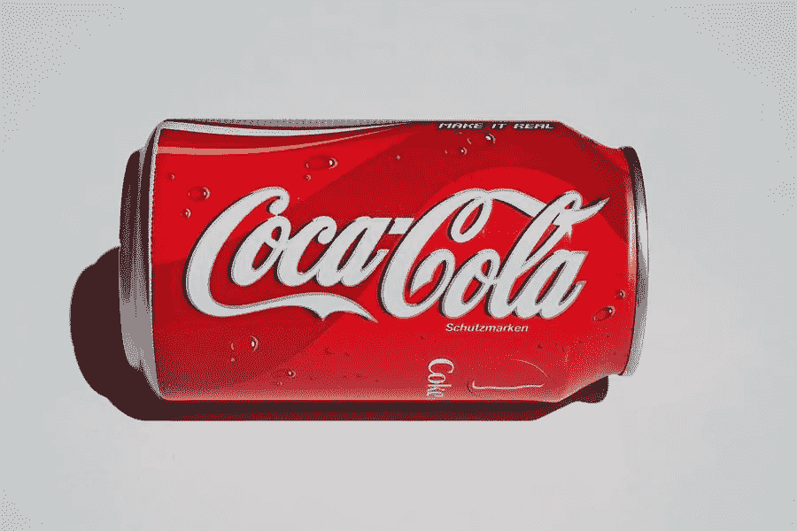

# 品牌优化策略

> 原文：<https://medium.com/visualmodo/branding-optimization-strategy-f7004ac9597d?source=collection_archive---------0----------------------->

你有没有想过星巴克或亚马逊这样的公司是如何变得如此成功的？或者苹果是如何在一个小车库开始运营后成为全球巨头的？答案是强大的品牌提升，在这篇文章中，我们将分享一些建议和策略。

随着消费者购买之旅的不断发展，拥有强大的产品已经不足以成为购买的理由。根据尼尔森的调查，近 75%的全球消费者表示，品牌原产地是一个关键的购买驱动因素。创建一个能与你的潜在客户和客户产生共鸣的品牌，是让你的业务更上一层楼的不二法门。但是在你能够发展你的品牌之前，有几个关于你的公司的问题你必须问自己。

# 品牌提升策略

品牌发展是创建和加强您的专业服务品牌的过程。当我们帮助公司发展他们的品牌时，我们把这个过程分成三个阶段。首先，让你的品牌战略正确，并与你的业务目标相一致。其次，开发传播品牌所需的所有工具，比如你的标志、标语和[网站](https://visualmodo.com/wordpress-themes/)。最后，是强化你新开发或更新的品牌的阶段。

# 保持专注战略，提高品牌知名度

说到品牌，最重要的是保持一致。养成某种风格并坚持下去！设计一个标志，并坚持下去！表达你的使命并坚持下去！如果你始终如一地向观众展示你的品牌，人们最终会记住并认可你的品牌。

# 社会化媒体

Instagram 是一个拥有权力的社交媒体平台。据说一张图片胜过千言万语，Instagram 让你通过发布的图片和叙述的文字来宣传这个故事。对于朋友和家人来说，这是一个保持联系的好工具，对于品牌接触消费者来说也是一样。

Azazie 卖伴娘和新娘婚纱。为了做到这一点，它变得非常专注于发展其社交社区，尤其是在 Instagram 上。因此，这是一个很好的品牌提升策略。

原因是，在这个平台上，该公司可以要求新新娘分享他们特殊日子的图像——以及他们对阿扎兹礼服的体验。毫不奇怪，Azazie 的 Instagram 页面充满了美丽的照片，这些照片激发了其他准新娘想象自己穿着它的礼服。

# 品牌名称用法

确保你的品牌名称会为你的受众所熟悉。这意味着你应该使用那个品牌名称！因此，您可以像我们在 Visualmodo 中一样，在您的产品中使用您的品牌名称。确保在你的简讯和(脸书)帖子中使用你的品牌名称。所以，人们应该经常听到和读到你的品牌名称！

# 信息品牌提升策略

你的下一步是一个信息品牌改进策略，将你的品牌定位转化为信息传递给你的各种目标受众。您的目标受众通常包括潜在客户、潜在员工、推荐源或其他影响者以及潜在的合作机会，仅举几个常见的例子。

虽然你的核心品牌定位对所有受众来说必须是相同的，但每个受众都会对它的不同方面感兴趣。给每个观众的信息将强调最相关的点。每一个听众也会有必须准备好的特定关注点，并且每一个都需要不同类型的证据来支持你的信息。您的信息策略应该满足所有这些需求。这是让你的品牌与你的目标受众相关的重要一步。

# 内容营销品牌提升策略

我们可以称这一步为“发展你的营销策略”但是我们没有。相反，我们呼吁内容营销品牌改进战略。

为什么？内容营销特别适合互联网时代的专业服务公司。它做所有传统营销做的事情，但它做得更有效率。它使用有价值的教育内容来吸引、培养和培养潜在客户。

请记住，你的品牌优势是由声誉和知名度共同驱动的。仅仅提高知名度，而不加强你的声誉，是很难成功的。这就是为什么传统的“提高意识”广告或赞助经常产生令人失望的结果。另一方面，内容营销同时提高了知名度和美誉度。这也是让你的品牌与你的目标受众相关的完美方式。结案了。