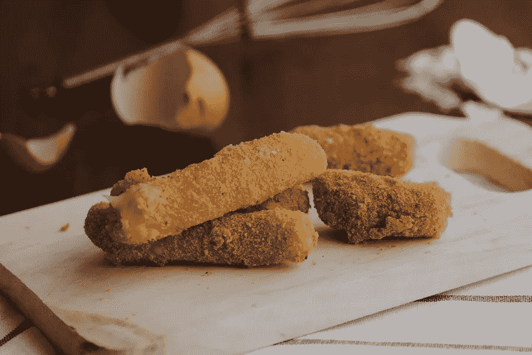

# 面包屑 WordPress 使用指南

> 原文：<https://medium.com/visualmodo/breadcrumbs-wordpress-usage-guide-c77df6b67bca?source=collection_archive---------1----------------------->

你想在你的 WordPress 站点中显示面包屑导航链接吗？面包屑导航是一个二级导航系统，告诉用户他们在网站上相对于主页的位置。在本文中，我们将向你展示如何在 WordPress 中显示面包屑导航链接。

你可能会认为在你的网站上添加这样一个完整的动机系统会很困难，但是实际上，使用一个插件是非常简单的。事实上，如果你使用的是 Yoast SEO 插件，你会有一个好的开始，因为面包屑功能已经内置在 Yoast 中了！而且，通过 Yoast 添加面包屑绝对是首选方法之一。除了 Yoast SEO，插件 [Breadcrumb NavXT](https://wordpress.org/plugins/breadcrumb-navxt/) 是另一个非常棒的选项，它高度可定制，并且与我们自己的[主题](https://visualmodo.com/wordpress-themes/)也很好地配合。

# Yoast 插件使用

要使用 Yoast SEO 向你的 WordPress 网站添加面包屑，你需要处理三个简单的步骤:安装并激活 Yoast SEO 插件。将面包屑代码片段添加到你的 WordPress 主题中。在插件设置中启用/配置 Yoast 面包屑

要安装 Yoast SEO 插件，进入你的 WordPress 仪表盘，导航到插件>添加新插件。然后在 WordPress 知识库中搜索“yoast”。当你看到 Yoast SEO 插件时，点击安装并激活插件。

# 子主题的面包屑代码段

接下来，我们需要给你的 WordPress 主题文件添加一小段代码。所以，如果你还没有，创建一个子主题是一个好主意。对于这个例子，我将向你展示如何将代码片段添加到默认的 twenty 19 WordPress 主题中。您可以将代码添加到任何主题文件/模板中，但在大多数情况下，您会希望将其添加到您的 single.php 文件(显示在所有帖子上)、page.php 文件(显示在所有页面上)或 header.php 文件(显示在整个网站上)。

对于这个例子，我将把面包屑代码添加到我的子主题的 header.php 文件中。一旦您从父主题中复制了 header.php 文件，请在您选择的代码编辑器中打开以编辑该文件。然后在 header.php 文件的最底部，添加以下由 Yoast 提供的 PHP 代码片段[来激活功能:这将直接在所有页面的标题下显示面包屑，这是面包屑的常见位置。](https://kb.yoast.com/kb/implement-wordpress-seo-breadcrumbs/)

# Yoast 插件面包屑

一旦代码片段被添加到你的 [WordPress](https://visualmodo.com/blog/) 子主题中，你剩下要做的就是激活 Yoast SEO 插件设置中的面包屑。为此，进入你的 WordPress 仪表盘，导航到 SEO >搜索外观，然后点击标签。在设置下，确保通过将选项切换到“启用”来启用面包屑。然后，您可以根据需要配置面包屑设置。您可能还想为您的帖子选择一个显示在面包屑中的分类。对于这个例子，我将设置我的文章在面包屑中显示类别。现在让我们来看看我在 219 主题中创建的一个帖子上的面包屑是什么样子的。

这个特殊的帖子示例有一个类别(“WordPress”)和一个父类别(“Web Design”)，向您展示我在 breadcrumbs 设置中选择的 breadcrumbs 的类别分类。

您可能需要使用一些外部 CSS 来调整面包屑的样式。为此，您可以使用 PHP 代码中包含的 CSS ID“bread crumbs”。打开您的子主题的 style.css 文件(或者您可以在附加 css 下的主题定制器中添加它)。

# 面包屑导航文本用法

如果你出于某种原因不想安装 Yoast SEO，或者你正在寻找另一个简单的选项，Breadcrumb NavXT 插件是一个极好的选择。要安装插件，请转到你的 WordPress 仪表盘，导航到插件>添加新插件。然后在 WordPress [知识库](https://awards.visualmodo.com/)中搜索“breadcrumb navxt”。看到插件后，点击安装并激活它。

要调用面包屑以便它们显示在您的网站上，您可以使用小部件页面中提供的内置 Breadcrumb NavXT 小部件。这将允许您将小部件拖动到由您的主题提供的各个小部件区域中。要做到这一点，进入你的 WordPress 仪表盘，导航到外观>部件。然后将小部件拖到您选择的小部件区域，并更新小部件设置。类似于 Yoast Breadcrumb 示例，您也可以通过向您的子主题添加必要的代码来[调用您站点的 breadcrumb trail](https://mtekk.us/archives/guides/calling-the-breadcrumb-trail/) 。

# 使用插件设置面包屑

Breadcrumb NavXT 插件有一些强大的选项来配置你的面包屑。您可以为不同的分类法定制面包屑的整个模板等等。你可以通过导航到设置> Breadcrumb NavXT 从你的 WordPress 仪表盘访问这些设置。

# 定制

如果您想要样式化 breadcrumbs，您可以将代码中包含的名为“breadcrumbs”的类作为目标。只需将以下 css 添加到您的子主题的 style.css 文件或主题定制器附加 CSS 中。

# 结论

面包屑是网站可用性和 SEO 的重要组成部分。所以如果你正在考虑给你的 WordPress 站点添加面包屑，我建议你从本文提到的插件提供的方法开始(Yoast SEO 和 Breadcrumb NavXT)。如果你已经在利用他们的 SEO 插件，那么使用 Yoast breadcrumbs 是最有意义的，因为它已经由你支配了。然而，Breadcrumb NavXT 也是一个高度可定制的选项。当然，你可能需要访问你的主题文件，但是总的来说，这个过程很简单。如果有的话，我希望这有助于减轻在你自己的 WordPress 站点上获得面包屑的痛苦。