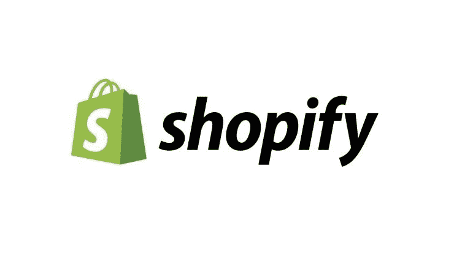
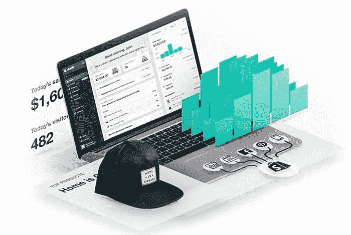

# 用最好的 Shopify 主题打造美丽

> 原文：<https://medium.com/visualmodo/build-it-beautiful-with-the-best-shopify-themes-16c1e5cfd43d?source=collection_archive---------0----------------------->

如果你想在 Shopify 上赚钱，那么你必须花一些钱为你的页面获得一个好的主题。Shopify 是公认的顶级电子商务平台之一，你可以在这个网站上销售你的任何产品。Shopify 的通用性和可定制性令人惊讶。在许多情况下，你可以通过多种方式来满足自己的需求。通过 Shopify，您可以轻松设置您的在线商店并处理订单，这样您就可以轻松快捷地将产品发送给客户。

# 需要一个好的购物主题

Shopify 可能有很多功能可以帮助你建立在线商店。但是，它并不完美，你必须使用一个好的主题，这样你才能让你的网店更上一层楼。是什么让你的主题比其他[主题](https://www.onlinedimes.com/best-shopify-themes/)更好？有不同的特点，你必须寻找，这样你就可以帮助自己得到最好的转换，强烈推荐 Shopify 主题。

# 在您的 Shopify 主题中寻找特征

美学上的吸引力并不是帮助你的主题脱颖而出的唯一因素。除了引人注目的主题，功能和用户界面同样重要。如果你希望你的网上商店成功，那么你必须考虑所有这些方面。你可以完全控制你的主题和风格。所以，尽可能做到最好，这样你的在线商店就可以尽可能容易地运行，而且也很有效。

# 选择 Shopify 主题时需要考虑的事项

在去 Shopify [主题](https://visualmodo.com/)前，你需要考虑以下几点

*   **开发商**

开发者的声誉很重要，如果你从一个高评价的开发者那里得到你的主题，那么你可以期待频繁的更新，更多的特性和高质量的支持。

*   **最想要的功能**

有很多你可能在所有的主题中找不到的特征。你可以在首页放一个幻灯片，不同的菜单风格，收集电子邮件来增加你的邮件列表，或者用一种美观的方式来显示你的图片。

*   **预算**

现在，你愿意在你的主题上花费多少预算？有一些主题你可以花几百美元买到，也有一些相对便宜一些的。你将使用你的商店的主题，最终你将从中赚钱。因此，追求最高质量的主题绝对是值得的。

*   **主题的适宜性**

你必须看看你选择的主题在桌面和安卓平台上看起来是否都不错，在各种设备上看起来也不错。这取决于主题的编码，你肯定想为你的[商店](https://visualmodo.com/)得到一个编码良好的主题。

*   **装载时间**

装载时间也很重要，为了给顾客带来良好的购物体验，装载时间应该更短。