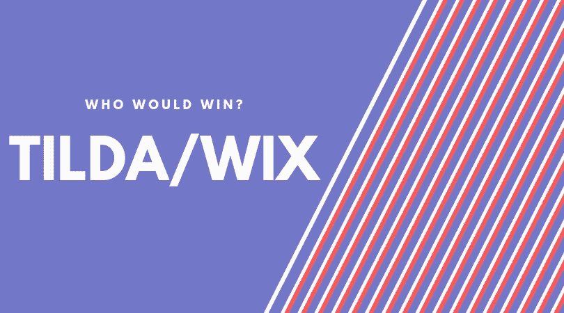

# 商业竞争:蒂尔达 Vs .维克斯，谁会赢

> 原文：<https://medium.com/visualmodo/business-rivalries-tilda-vs-wix-and-who-would-win-6edc1ef81ef?source=collection_archive---------0----------------------->

功能和服务非常相似的平台不断参与商业竞争，消费者的主要问题是“谁会赢？”。有很多服务允许客户从头开始创建网站。然而，在过多的服务中，选择总是 Tilda 还是 Wix。两者在功能性的基本标准上各有利弊。下面我们分析每一种服务，并确定哪一种是最好的。

# 蒂尔达对维克斯，谁会赢？

# 一般专业化

Tilda 发布系统的主要亮点——创建大型网站的便利性。它有网站的新闻格式，这是一个有很多文字和插图的长页面。用户提到使用 Tilda 后，[安全性](https://www.getapp.com/website-ecommerce-software/a/wix/compare/tilda-publishing/)要好得多。

Wix 是一个具有可视化编辑器的几乎通用的设计器。由于其灵活的设计定制能力和丰富的应用商店，它是同类产品中最强大的产品之一。有一个限制:和其他所见即所得系统一样，由于显而易见的原因，制作大型[站点](https://visualmodo.com/wordpress-themes/)并不方便。

# 职能领域

蒂尔达有一个美丽迷人的界面。这些站点是由现成的适应性模块构建而成的，非常灵活。还有“Zero Block”——一个编辑器，用于创建和添加自己设计的块到网站上。尽管有丰富的各种设置，Tilda 在普通用户手中显示出非常平均的结果。然而，[蒂尔达不接受](https://www.capterra.com/p/154337/Tilda-Publishing/)添加 PDF 和 Word 文档，这是缺点之一。

Wix 作为一个标志制造商具有强大的优势:现代和各种各样的模板，大量的小工具，别致的应用程序商店，图像编辑器和组织酒店业务的功能，定期折扣等。

该方法的编辑过程很简单；有特效、动画、内置图像编辑器、将视频插入背景的能力、添加 HTML 代码、图像库和剪贴画。此外，还有直接从 [EssayPro 写作服务](https://essaypro.com/)或任何其他服务添加内容的选项。

商店中的应用程序提供了额外的网站动态。他们为搜索引擎优化网站，装饰网站，增加社交网络、营销和商店工具、表单、论坛等功能。

# 模板设计

蒂尔达的图案质量高于平均水平，Wix 在创造性和多样性方面显然达不到。总共有 50 多块，都是按照相同的原则创建的——带有图片、按钮、标题、标签等的矩形块。

另外，我们注意到 Wix [模板](https://awards.visualmodo.com/)的一个简单特征:它们是利基市场中最好的。多样性、主题选择、质量——所有这些都是最重要的。移动模板需要单独编辑。设计师和单纯的创意人员会对定制网站设计的深度和灵活性感到高兴。

# 支持的网站类型

Wix 集成了最流行的内容类型，如名片、登录页面、商店、博客，甚至论坛。它不适合长时间阅读。Carmichael 提到 Wix 有超过 [500 个模板](https://www.websitebuilderexpert.com/website-builders/wix/wix-review-a/)，允许你创建任何合适的网站。

Tilda 应该被用来为商店、酒店评论等创建大型网站。如果你曾经看过一个设计良好的 PDF 文件，里面有对某个东西的描述(一本旅行社的小册子)，你很容易想象自己在浏览一会儿。

# 关税比较

Wix pricing 的 4 种资费中最有意思的是 99 美元/年的组合。它提供的机会足够任何类型的网站发展，除了一个网站。该系统没有任何隐藏的费用，昂贵的额外服务和其他类似的事情。

在蒂尔达，你可以选择两种资费方案——个人(120 美元/年)和商务(240 美元/年)。如果你按月付款，价格会上涨 50%。没有折扣，促销，促销代码和其他东西提供。

两个系统都有非常好的界面。蒂尔达并不反对 Wix。尤其是考虑到其较高的成本。从关键参数来看，Wix 看起来比 Tilda 更有利可图，也更有趣:功能、模板质量、便利性、成本。对于创建除了长站点之外的东西，Tilda 不太适合，因为它成本很高，而且面对 Wix 有一个强大的竞争对手。一切都是关于定制工作，而不是理论上的可能性。

# 作者简介:

> Mary Hampton 是一个热衷于网络营销、在线推广和网页设计的作家。她有网络营销和战略发展的工作经验。她为开发、设计和内容获取制定了长期项目大纲。目前，她在一家专业写作服务机构工作，因此对内容评估有很深的了解。在[推特上关注她写得最好的作品。](https://twitter.com/MaryHam88743151)