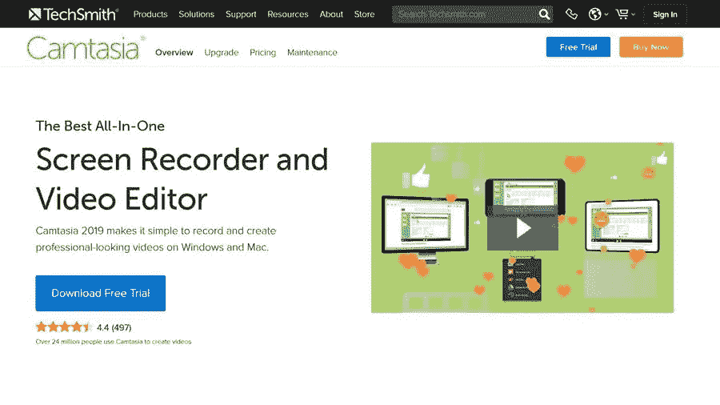

# Camtasia 视频编辑器和屏幕录制器入门指南

> 原文：<https://medium.com/visualmodo/camtasia-video-editor-and-screen-recorder-start-guide-f176215bfa0?source=collection_archive---------0----------------------->

如果你想让在线课程或教程成为你商业模式的一部分，那么你就需要有能力制作引人入胜的视频。幸运的是，现在有很多工具可以让制作视频教程和课程变得前所未有的容易，这些视频教程和课程不仅看起来很棒，而且对你的学生来说也很有吸引力。在本文的教程中，我们将分享和展示 Camtasia 视频编辑器和屏幕录制软件的特性。此外，我们将使用该程序添加一个入门教程。

但是，当然，这可能是一个问题。有大量的选择，它势不可挡，甚至很难知道从哪里开始。如果你正在努力寻找一个既能满足你的需求，又不需要你去电影学院学习如何使用它的工具，那么我推荐 Camtasia 作为你的第一选择。在这篇 Camtasia 评论的其余部分，我将带您了解它的一些关键特性以及创建视频教程和课程的利与弊。

# 什么是卡姆塔西亚？

首先:Camtasia 是你安装在电脑上的软件。而不是在网上使用，它本质上是两种产品合二为一:

*   **屏幕录制软件:** Camtasia 拥有您从计算机屏幕上捕捉视频和音频所需的一切。您的观众可以看到您在屏幕上看到的一切，并听到您谈论的内容，基本上是创建教程所需的基本功能。但是卡姆塔西亚并不止于此。
*   **视频编辑软件:** Camtasia 也是功能强大但易于使用的视频编辑软件——这也是我推荐它的主要原因。您不仅可以录制和编辑您在计算机上捕获的内容，还可以编辑您从任何其他地方捕获的内容，例如，从智能手机的摄像机。Camtasia 的视频编辑功能确实令人印象深刻，也是它从同类软件中脱颖而出的重要原因。使用 Camtasia，您可以:
*   导入视频和音频文件
*   拆分剪辑或一起删除剪辑
*   添加音乐、照片和旁白
*   从数百个图标中选择插入到您的视频中
*   添加动画
*   在回放过程中包含问题
*   插入弹出提示
*   利用语音识别工具轻松添加字幕

在创建视频教程或课程时，Camtasia 比大多数其他屏幕录制软件都有一个很大的优势:Camtasia 让您能够包括测验，您还可以将您的成品导出为 SCORM 包，以便它可以在大多数学习管理系统中跟踪。

# 从 Camtasia 视频编辑器开始

安装只是一个标准的向导，无论你是在 PC 还是 Mac 上。你将被要求登录到你的 TechSmith 帐户，一旦你这样做了，你会发现你自己正盯着一个强大的仪表板，它已经自动加载了一个示例项目，你可以随意摆弄来感受一下这个应用程序。

屏幕的左侧是 Camtasia 的主导航。您可以在边栏中与工具和效果进行交互。他们的选项直接出现在标签旁边。在它们上面，你会发现这个软件的主要特征:屏幕截图的录制按钮。

# Camtasia 视频编辑器录制

Camtasia 的主要任务是以某种方式记录你的屏幕。当您按下仪表板左上方的 **Record** 按钮时，会出现一个新的覆盖图，上面有您需要捕捉的几乎任何东西的所有选项。

你可以选择屏幕的大小来捕捉(默认宽度或自定义剪裁)，特定的窗口或应用程序，或者只是整个屏幕。您也可以在多个显示器之间进行选择。以及 Camtasia 是否从您的网络摄像头、麦克风或系统音频中录音。你也可以玩大量的选项和偏好。

花几分钟时间，你将调整一切，从帧速率到是否记录鼠标点击的声音。当这一切都处理好了(默认设置足够好，可以在学习时使用)，只需按下红色的大记录按钮。你就是生命！

# 用 Camtasia 编辑视频和音频

实际上用 Camtasia 编辑视频和音频很简单。在屏幕的底部，你有一个时间轴，里面有各种各样的音轨。每个轨道代表您应用到录音的一段音频、视频或效果。

Camtasia 的大部分编辑都是拖放式的。您可以使用时间线顶部的绿色和红色标志来调整您想要突出显示的任何部分，然后您可以剪切、复制、粘贴、删除或对该部分应用效果(我们将在下面介绍)。你也可以用鼠标抓住任何轨迹的末端，通过简单的拖动来截断它。

此外，添加[新内容](https://visualmodo.com/reach-new-audiences-content-marketing/)也很容易。您可以简单地点击时间线并粘贴您复制的一些剪辑，或者您可以从您的**媒体**或**库**标签中拖动它来自动插入。只要用你的光标来放置它。你可以随时随意移动它们。

现在这些基本的控制都在控制之下，让我们看看 Camtasia 到底能做什么。

# Camtasia 还能做什么的简要概述

侧边栏标签上的标签实际上是不言自明的。然而，当你开始的时候，使用它们的细节可能不是很明显。因此，让我们来看看您可以用 Camtasia 做些什么。

**媒体**和**库**标签可能看起来相似，但它们不是一回事。**媒体**是你导入到*这个特定项目*中的所有屏幕录像和其他媒体的集合。与其他任何工作没有重叠，除非你特别说明。**另一方面，库**是一个全球性的资产集合，你可以将它加入到任何你想要的项目中。这包含了您可能会反复使用的所有媒体。

# 释文

这些是你用来在录音上做笔记的。箭头、语音气泡、模糊和突出显示、手写或绘画。他们都在这里。经常使用 SnagIt 的人会认为这些是编辑器中的主要工具。

# 过渡

当您将多个片段拼接在一起或剪切较长片段的部分时，您需要在它们之间进行转场。硬剪有时会奏效，但淡出会让职业形象大不相同。并且对观众来说不太刺耳。

Camtasia 提供了几十种过渡供您使用。只需点击并拖动过渡到你想要的地方，Camtasia 处理剩下的。

# 行为

类似于**动画**，行为是关于用文本创建效果的。您可以调整在窗口中看到的任何选项的属性。然后，您可以将其作为覆盖图插入视频时间轴中。实际的视频不会用**行为**进行调整，只会调整您设置的文本。

# 动画片

鉴于**行为**动画和添加的效果叠加到视频上，而**动画**选项卡为您提供了操纵录制本身的选项。您可以分屏，将镜头移动到不同的位置以便插入说明，放大 iMovie 帮助推广的本·伯恩斯效果，等等

# 光标效果

对于教程创建者来说非常必要的是，**光标效果**标签可以让你确保你的浏览者跟随。因为 Camtasia 是智能的，你所要做的就是把你想要应用到光标上的效果拖到屏幕底部的视频轨道上。它将自动应用于整个录像中的光标。你不用手动做任何事情，除了选择你想要的效果。

在包含效果的框中，您还可以选择右键单击和左键单击的效果，让观众也能看到。

# 声音叙述

语音旁白不同于添加音轨。观看视频播放时，如果您想要在视频上添加解释(或另一个注释),可以使用此选项。

完成录制后，Camtasia 视频编辑器会提示您将其保存为音频文件。此时，您可以将其添加到您的媒体库或媒体收藏中以供使用。但是因为媒体是为这个特别的项目服务的，你可能会叙述一些具体的事情，媒体可能会是你的下一步。

# 音频效果

音频效果非常简单。像上面的光标效果一样，您可以在仪表板底部的轨道中选取一段音频，然后拖移您想要应用到该选择的效果。也许你有需要淡出而不是结束的介绍音乐。或者，您可以压缩峰值，消除背景杂音，甚至调整音频播放速度。

# Camtasia 视频编辑器视觉效果

同样，有些东西可能会被误认为是动画或行为(甚至是过渡)，视觉效果让您可以控制视频的特定显示。

您可以添加帧，使您的视频看起来像是在笔记本电脑上播放。给整个屏幕添加绿色调，或者从镜头中移除所有颜色痕迹(例如，对于绿色截图)。这些效果对于它们所做的事情来说往往是静态的，或者应用于一个部分。整个轨道，而不仅仅是像过渡或动画那样的瞬间插入。

# 交互性

例如，如果您的视频将被用作网上研讨会，您可能会对“交互性”标签感兴趣。如果你使用 ScreenCast.com 或者一个支持的智能播放器，你可以在这个过程中加入一些小测验来回答你的观众的问题。您可以设置测验在视频中的位置、有哪些问题、如何计算回答等。不幸的是，这在 YouTube 或 Vimeo 这样的大平台上不起作用，但对于特殊情况，如果加以利用，这可能是一个致命的特性。

# Camtasia 视频编辑器上的字幕

字幕可能是视频制作过程中最重要的功能，它可以让你完全控制字幕的使用。可访问性现在是一个巨大的优先事项，提供标题和字幕的视频是受欢迎的，也是必要的。

您可以根据需要选择任何字幕的长度、持续时间和位置。它可以是你粘贴进去的一个完整长度的脚本。或者您可以简单地添加文本来解释或阐明音频的详细内容。不管怎样，给你的视频添加标题或字幕是 Camtasia 最容易做到的。如果你放错了文本，你只需要把它拖到底部的时间轴上，它就固定了。

最后，Camtasia 视频编辑器还包括文本大小和颜色的各种选项。您可以随意设置它们，但是如果您使用的组合不符合 ADA，字幕窗口会提醒您。仅这一点就使得使用 Camtasia 作为字幕值回它的那部分许可费。