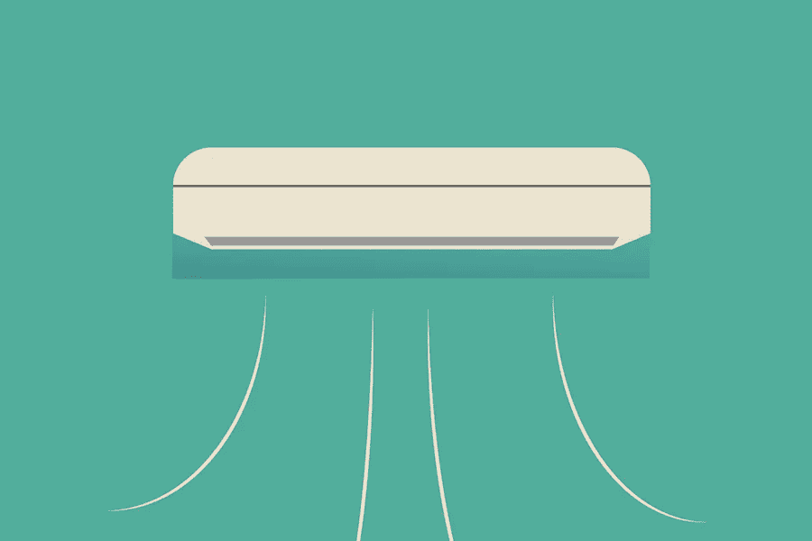

# 选择租赁冷却器

> 原文：<https://medium.com/visualmodo/choosing-a-rental-chiller-a8a1fbebaa1c?source=collection_archive---------0----------------------->

本文将帮助您为所有租赁冷却需求选择最佳冷却器。冷却过程是任何工程过程的一个重要方面。通过适当的冷却技术，您可以获得更好的质量并提高机器的耐用性。这就是为什么您需要根据自己的冷却需求选择合适的冷却器。然而，根据您的选择做出正确的选择可能非常困难。这是因为市场上充斥着几家供应商。因此，选择合适的冷却器可能很困难，尤其是对初次接触者而言。然而，如果你是新来的，不知道从哪里开始，继续阅读。

# 选择租赁冷却器:基础知识

记住，有很多设计。此外，每种设计都可以用于不同的应用。

# 便携式与中央冷却器

冷却器分为两大类。它们包括:

*   便携式冷却器
*   中央冷却器

了解这一分类将有助于您根据自己的冷却需求选择最佳的[租赁](https://visualmodo.com/what-is-included-when-you-rent-a-limo/)制冷机。请记住，每种类型的冷却器都有其优点和明显的特点。

# 便携式冷水机组

便携式冷水机组比中央冷水机组略小，可以很容易地从一个地方移动到另一个地方。因此，它们不能永久安装在某个位置。这意味着您可以在不同的设置中使用它们。

虽然租赁的便携式冷却器可以冷却一台机器，但它的中央对应物可用于冷却更大的建筑。这意味着便携式冷却器非常适合只有少数机器的情况。另一方面，中央冷却器可用于冷却生产线中的多台机器。还需要注意的是，中央冷却器可以在相同的温度下冷却整个地板。另一方面，如果您的机器需要精确的温度，您必须选择便携式冷却器。

在购买冷却器之前，需要考虑以下因素:

# 建坪

购买冷却器时，空间是一个重要的考虑因素。所以，看看处理空间。那个空间有多大？它能容纳您想要购买的冷却器的尺寸吗？请记住，任何加工车间都不应堆满设备。这会产生安全风险。当然，便携式制冷器放置在机器附近。这提供了有效的冷却。然而，它们会占用本可以用来放置其他设备的空间。所以，在购买冷却器之前，要考虑可用空间。

# 噪声级

另一个需要考虑的重要因素是噪音水平。记住，不同的机器有不同的噪音水平。由于便携式冷却器位于便携式机器旁边，噪音水平往往会更高。因此，如果这是您的工业设施中的一个问题，考虑寻找一个明确的冷却器，可以保持噪音水平低。或者，你可以选择可以在户外的设备。

# 表演

性能是选择制冷机的另一个关键因素。通常，便携式冷却器具有精确的性能。重要的是要注意，中央冷却器只能在一个温度下运行。然而，它们的便携式对应物可以在不同的温度下工作。因此，它们很容易定制，而且非常多变，这使得它们成为那些追求性能的人的热门选择。因此，如果性能和温度控制的准确性是你在寻找一个冷却器，那么让便携式单位顶端你的购物清单。

# 选择租赁冷水机组的成本

购买电子元件时，成本是一个重要的方面。但不应该是最终的决定者。当然，便携式冷却器比中央冷却器成本更高。然而，不要让这影响你的决定。当然，你可能想花更少的钱去买一台冷却器。但是购买中央冷却器也有局限性。这是因为便携式冷却器是灵活的，可以在不同的温度下工作。这意味着，如果你打算改变，你不需要购买额外的设备。因此，如果灵活性是你正在寻找的，忽略成本，选择便携式冷却器。

# 中央冷却器

中央冷却器是永久性的。这意味着一旦它们被打开，我们就不能改变位置。取决于你想把它们安装在哪里，中央冷却器在本质上是永久性的。他们可以在室内或室外设置。它们用于冷却大面积区域——通常是整层楼或整栋建筑。中央冷却器的另一个特点是它们在单一温度下运行。这意味着它们为整层楼或整栋建筑带来均匀的凉爽。

中央冷却器是冷却大量机器的理想选择，适用于多台机器需要冷却的情况。以下是在租赁中央冷水机组时需要考虑的事项:

# 建坪

中央冷却器占用更少的空间。这使得它们非常适合空间有限的环境。此外，他们很少出现在工作场所。相反，他们在外面。或者，它们可以被添加到设备空间中。这导致了最高的工作效率。

# 噪音水平选择租赁冷却器

通常情况下，中央冷却器不会占用地面空间。因此，你不会听到这些冷却器的噪音。所以，如果噪音是你工作区域的一个问题，考虑使用中央冷却器。它们加在外面，结果消除了噪音的可能性。

# 表演

与便携式冷却器不同，中央冷却器可以一次冷却大片区域和生产线。这使得它们非常适合需要均匀冷却的环境。它们不太适合需要细节和精确冷却的空间。所以，在购买冷却器之前，考虑一下设置。您希望冷却器的冷却温度是多少？您的机器有哪些单独的冷却需求？

# 费用

与便携式冷却器不同，中央冷却器成本较低。所以，在购买之前先比较价格。此外，考虑所有必要的因素。

# 选择租赁冷水机组的底线

冷却是任何工程过程的一个重要方面。然而，当涉及到生产质量、效率和相关机器的耐用性时，您选择的冷却器起着关键作用。这就是为什么你需要做出正确的选择。以上是你需要购买最好的冷却器来满足你所有冷却需求的建议。