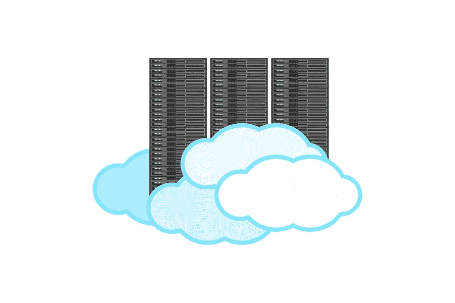

# 为你的 WordPress 博客寻找最佳主机的建议

> 原文：<https://medium.com/visualmodo/choosing-host-for-your-wordpress-blog-recommendations-c0ff93e9aedd?source=collection_archive---------0----------------------->

在这篇文章中，你将了解到在为你的 WordPress 博客选择最佳主机公司时你需要考虑和检查的一切。因此，您可以在安全快速的环境中编写内容。

# 博客 WordPress 主机:全面解释

虚拟主机是一种提供在线存储空间的服务，可以将你网站的页面、文件、图片等保存在服务器上。web host 使其他人可以通过万维网(WWW)查看它。WordPress Hosting 是满足 WordPress 需求的服务，允许你在它的服务器上安装 WordPress 软件。几乎所有好的虚拟主机公司都与 WordPress 兼容。

# WordPress 为什么需要托管？

WordPress 只是一个软件，也被称为内容管理系统(CMS)和博客平台。要运行 WordPress 博客，你需要在主机上安装它。你可以使用 WordPress 自己的服务器(WordPress.com)。或者你可以在虚拟主机服务器上安装 WordPress，这就是所谓的自托管 WordPress。我总是更喜欢 WordPress.orgI，因为它比 WordPress.com 提供更多的控制。

此外，几乎所有的专业博客都使用和推荐 WordPress.org。所以你主要需要虚拟主机来拥有一个在线服务器，在那里你可以安装 WordPress 并保存你网站的文件。WordPress 的伟大之处在于，它非常容易安装。所有流行的网络主机都提供一键式 WordPress 安装。甚至有些主机像 [Bluehost](https://www.bluehost.com/?utm_source=%28direct%29&utm_medium=affiliate&utm_campaign=affiliate-link_claudiocamposp_notype) 都预装了 WordPress。

# WordPress 主机的类型

选择正确类型的 WordPress 主机将为你节省很多麻烦和金钱。所以了解不同类型的 WordPress 主机是很重要的。让我们来看看每种类型的博客 WordPress 主机。

1.  共享主机
2.  管理
3.  [VPS](https://visualmodo.com/vps-server-wordpress-installation/)
4.  专注的

还有一种托管:免费 WordPress 托管。我们不建议这样做。他们不可靠。他们可能会在没有注意到你的情况下停止服务。使用免费的 WordPress 比使用免费的 WordPress 虚拟主机要好。

# 初学者选择主机:最佳选择

对于任何打算创建新的 WordPress 博客的新博主或网站管理员来说，共享主机是最好的选择。大多数博客或网站管理员都是从共享 WordPress 主机开始他们的旅程的。我用 HostGator 共享主机创建了我的第一个博客。

如果你打算开一个新博客，我会建议你选择共享托管，原因如下:共享托管很便宜。它只需要您每月 5 到 10 美元。它不会像最初那样影响你的网站的性能，你会得到更少的流量。首先，非技术头脑可以从共享托管开始。大多数共享托管公司都附带了易于使用的 cPanel、一键式 WordPress 安装等。其次，大多数受欢迎的公司都提供现场技术支持，让您的生活更轻松。最后，大多数主机提供不同类型的主机计划。您可以升级您的托管计划，没有任何麻烦。

然而，有一个问题。大多数共享 WordPress 博客的主机公司提供无限的磁盘空间、无限的带宽、无限的域名等。但是没有这样的事情。这只是一种营销策略。

# 每月 WordPress 博客主持人计划还是长期计划？

你会注意到，几乎每个 WordPress 托管公司在选择长期计划时都会提供巨大的折扣。如果您对您的网站是认真的，那么您可能会保留它一个多月。我们总是建议选择每月 WordPress 托管计划，因为它们的费用几乎是原来的两倍。如果您选择 12 个月或 24 个月的计划，那就更好了。