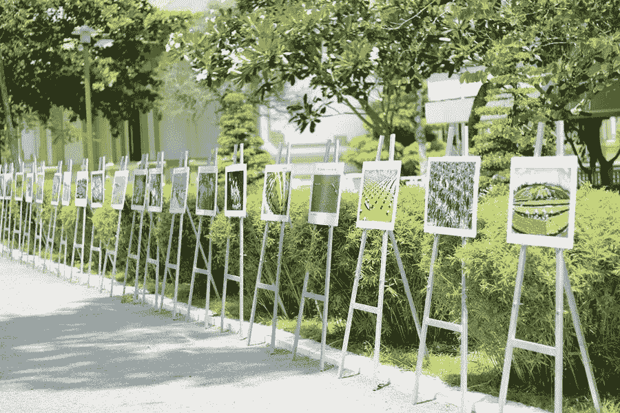

# 清理 WordPress 媒体库指南

> 原文：<https://medium.com/visualmodo/clean-up-wordpress-media-library-guide-5529de9cd4fd?source=collection_archive---------0----------------------->

在这篇文章中，我们将讨论清理你的 WordPress 媒体库的各种方法。然后，我们将介绍图像清理插件，可以使这个过程更容易。媒体文件通常是添加到任何网站所必需的。然而，你的 WordPress 媒体库很容易充满未使用的文件，这会降低你的网站速度，并使媒体管理变得困难。

# 如何清理 WordPress 媒体库指南

然而，管理您的媒体库不一定是一项繁琐的任务。通过定期清理并适当优化你的图片，你可以确保你的网站(及其媒体内容)以最佳状态运行。

# 消除重复图像

虽然你可能已经上传了同一张图片的多个版本，但是重复的图片通常是由 WordPress 自动创建的多种图片格式(例如缩略图、中等大小和大尺寸)造成的。这会很快填满你的可用存储空间，同时也会降低你网站的运行速度。

幸运的是，这是你可以轻松制止的事情。要做到这一点，在你的 WordPress 仪表盘中进入设置>媒体:为了防止创建多种图像尺寸，只需将每个框中的值改为 0。然后，点击保存更改:没有合适的尺寸，WordPress 将不再能够保存同一张图片的多个尺寸。

# 删除不用的文件和图像来清理 WordPress 媒体

卸载存储空间并保持网站最佳运行状态的最简单方法之一是删除所有未使用的文件和图像。从 WordPress 仪表盘，进入媒体>库。要删除单个图像，单击它，然后选择屏幕底部的永久删除选项:屏幕上将出现一个弹出窗口。单击“确定”将从媒体库中删除该文件。

您还可以批量删除文件和图像，这是管理未使用文件的一种更快捷的方式。在媒体库页面中，单击顶部的批量选择。点击所有你想删除的文件，然后选择删除选择。将出现一个弹出窗口，就像上面一样。单击“确定”永久删除这些图像:随着时间的推移，“收集”不必要的文件并不罕见。这就是为什么你应该至少每隔一个月重复这个过程(尽管，越频繁越好)。

# 介质清洁器

媒体清理器是一个简单的插件，用于清理 WordPress 媒体。然而，它使得移除未使用的媒体文件变得简单。一旦安装，插件将添加所有不在你的网站上的文件。比如在[的帖子](https://visualmodo.com/adding-wordpress-images/)，页面，或者图库到临时垃圾桶。然后，您可以查看这些文件，以确定您想要删除它们并永久删除它们。

# 媒体重复数据删除

让混乱的媒体库变得井然有序，并下载媒体重复数据删除。这个插件帮助你从你的 WordPress 媒体库中找到并消除重复的文件，并防止将来重复。安装并运行后，媒体重复数据消除器会做两件主要事情:

*   它复制了您的媒体文件列表。这个列表可以帮助插件识别多余的文件，这样你就可以很容易地删除所有文件，只留下一个副本。
*   它阻止重复的文件。媒体重复数据删除会在文件上传时对其进行扫描，以查看文件是否已经在您的库中。如果它确定你上传的是一个副本，它会把你指向现有的文件。不再有意外的重复！