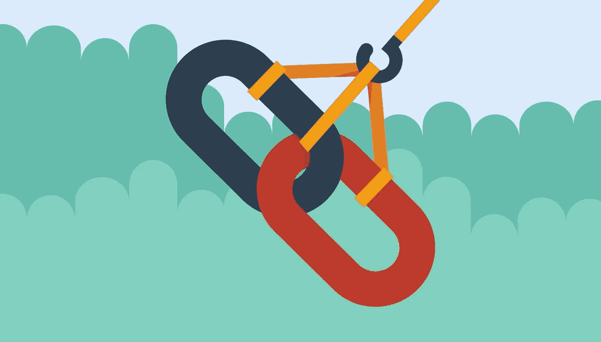

# 清理你的不良反向链接

> 原文：<https://medium.com/visualmodo/clean-up-your-bad-backlinks-c57152e6973e?source=collection_archive---------5----------------------->

那些错误地雇佣一些可疑的搜索引擎优化公司为他们的网站购买不良反向链接的网站可能会失去几乎所有的排名。在这篇文章中，我们将超越站点优化，解释更多关于你的网站的不良反向链接以及如何清理它们。

虽然购买不良链接可能会给你带来短期收益，但最终会适得其反；你有被谷歌企鹅处罚的风险。不自然的链接表明你的网站可能没有足够有趣的质量或内容来获得正确的反向链接。在这篇文章的最后，我们将提到一种不用购买任何东西就能获得很好的反向链接的方法。

# 如何找到不好的反向链接

好的和坏的反向链接的主要区别是他们所在的网站的质量。有时不好的反向链接很容易被发现，有时你必须检查网站本身，看看是否和为什么反向链接会对你的网站产生负面影响。

这里有几个类别。

# 从一个网站的链接，只是为搜索引擎优化链接设置

如果一个网站有一大堆缺乏连贯性的文章，那么这个网站很可能仅仅是为了链接其他网站而建立的。如果网站是一个 WordPress 网站，大多数时候会使用默认的 WordPress 主题，比如[211](http://twentyelevendemo.wordpress.com/)。这些网站通常不会从其他网站链接，或者是一个奇怪的链接网络的一部分，旨在链接这些糟糕的网站。

# 其他网站评论的链接

在 yoast.com，我们每天都会收到几十封这样的邮件。机器人填充了你网站的评论表格，告诉你“很棒的文章，喜欢这个信息，希望你能尽快就这个话题做更多的阐述”。个性化评论，甚至包括作者姓名。不幸的是，垃圾机器人一周比一周聪明。我们回顾了一个由一位老人运营的网站，他回复了所有这些评论，感谢他们的善意话语。别被骗了。垃圾评论链接对你的反向链接不利。

# 链接与过度优化的锚文本

一般来说，人们可以假设大多数网站的反向链接都是使用网站名称作为锚文本(链接文本)来链接的。URL 本身也经常被使用。如果你的网站有大量的网站使用精确的关键词链接到你的网站，就像我们提到的可疑公司倾向于做的那样，那看起来非常可疑。如果我们的主要反向链接将 Yoast SEO Premium 作为锚，这将给谷歌敲响警钟。链接到我们网站的最常用的锚应该是自然链接配置文件中的“Yoast”。当然，这是事实。

# 糟糕的重复文本中的链接

通常，为链接而建立的网站会有一些毫无意义的内容，或者是从相关网站上搜集来的。一些黑帽公司为每个主题创建网站，使其看起来像是相关的高质量网站上的链接。在大多数情况下，谷歌熊猫最终会点击这些网站，导致你的网站的另一个低质量的反向链接。在大多数情况下，重复的内容是低质量的标志，这也是谷歌熊猫更新的目的。

# 链接来自俄罗斯，而你的当地观众在美国

由于链接到你的网站很可能与你的业务相关，你会明白，一个来自俄罗斯或荷兰网站(就此而言)的链接指向你在堪萨斯城的当地咨询公司网站看起来一点也不自然。

当然，有越来越多的具体迹象表明，反向链接是低质量的。Alan Bleiweiss 在他的文章[中列出了更多关于如何清理不良反向链接并与链接供应商建立信任的内容](http://www.searchenginejournal.com/how-to-clean-up-bad-links-and-establish-trust/57561/) (2013 年，仍然有效，IMO)。

# 如何删除反向链接

现在我们对你的网站不想要的链接有了一个大致的概念，让我们去掉它们。一般来说，我们有很多方法可以禁用这些链接，这样它们就不会影响你的谷歌排名:

1.  这个简单:**找到网站所有者的联系方式，让他删除链接**。不要要求对方网站把链接撤下来，而是礼貌地这样问。这通常会更好:)然而，你也很可能会面对那些要求你支付链接删除费用或者根本不回复的站长。在这种情况下，你应该否认不需要的链接，不能删除。
2.  **检查你的网站上哪些低质量的页面被不良的反向链接链接，去掉这些页面(** [**404/410**](https://www.seroundtable.com/404-links-google-15427.html) **)而不是链接**。这可能不是你想要的，因为大多数页面对你的网站都有价值。除此之外，太多的 404 也向谷歌发出了错误的信息。除了去除页面，你还应该否认这些不良的反向链接。
3.  **脱域从头再来**。激烈，但如果你的网站不值得投资清理这些不良反向链接，这可能是一个有效的方法。我不会这么做，除非谷歌已经因为企鹅、熊猫和更多的东西明确惩罚了你。
4.  **如果你有太多的反向链接想要删除** **，或者网站管理员没有回应你删除链接的请求，你也可以*取消*这些链接**。这基本上是在告诉谷歌，在评估你的网站时，你不希望这些链接被考虑进去。

现在有一件事我必须警告你:**你可能会失去流量**。在此之后，指向你的网站的链接会减少，因此通过这些链接访问你的网站的人会减少。在否认的情况下，链接仍然会在那里，但是反向链接的突然减少(不管是好是坏)会触发谷歌的一些东西，告诉它你的网站不那么有趣了。当这些链接消失时，这就是谷歌收到的信号。最终会解决的，但是一开始流量可能会下降。老实说，不知道有多少和多久。

当然，这是一个漫长的过程。这需要很多步骤，因此需要时间。然而，有一种方法可以加快这个过程。

# 让我们加快坏的反向链接清理过程

如果你的网站遭受负面搜索引擎优化(竞争对手为你的网站购买不良反向链接)，或者你在过去通过那个可疑的搜索引擎优化公司购买了不良反向链接，清理你的反向链接档案是一件相当麻烦的事情。我们试图解释这一点。

# 这就是 LinkResearchTools 发挥作用的地方

在清理不良反向链接方面，LinkResearchTools (LRT)提供了物超所值的服务。他们已经不止一次地帮助过我们，我们的一个客户错误地购买了不好的反向链接。

特别是当谷歌搜索控制台通过他们的[手动垃圾邮件操作](https://support.google.com/webmasters/answer/2604824?hl=en)告诉你有不良反向链接时，你希望这些链接尽快被清理掉。不管这些反向链接的原因是什么！但是，请记住，你需要一个工具来显示尽可能多的链接，这样你就有机会看到谷歌知道的所有链接。

LRT 为他们的链接工具提供月度订阅，例如，帮助你:

*   管理你的反向链接，找到真正危害你网站的链接。LRT 会告诉你哪些链接应该尽快删除或否认；
*   通过这种方式清理你的反向链接，摆脱手动操作和/或谷歌算法的惩罚；
*   将你的反向链接与竞争对手进行比较，寻找新的反向链接机会；
*   寻找可能的链接伙伴，并通知您网站的新链接。

649 美元，LinkResearchTools 提供了他们的超级英雄计划，其中将包括他们的链接排毒增强，链接警报，竞争链接排毒和许多其他工具。你可以用这个计划分析多达 600，000 个链接，但也有机会升级到适合任何域名规模的计划，甚至数百万。

在 LRT 的哲学中，链接审计是关于“要么全部要么什么都没有”，他们将支持你找到正确的计划，这样你就可以给你的域名一个完整的审计。他们通过合并和重新抓取多达 25 个不同链接数据源的链接数据来做到这一点。

[注册 LinkResearchTools (LRT)计划](http://www.linkresearchtools.com/products-overview/)

*注意，这不是代销商链接！我们信任 LinkResearchTools，并根据自己的经验推荐它们。*

# 清理你的网站！

迫不及待地开始对你的网站进行春季大扫除？继续前进，给你的网站一个良好的清理:

*   阅读我们关于[清理网站结构的建议](https://yoast.com/how-to-clean-site-structure/)
*   整理你的[旧帖子和页面](https://yoast.com/website-maintenance-clean-up-old-posts/)
*   享受七五折优惠，让 **Sucuri** [检查并监控您网站的安全性](http://sucuri.net/partnerships/yoast)。
*   让 **LinkResearchTools** [清理并监控你的不良反向链接](http://www.linkdetox.com/one)。

来源:[https://visualmodo.com/](https://visualmodo.com/)