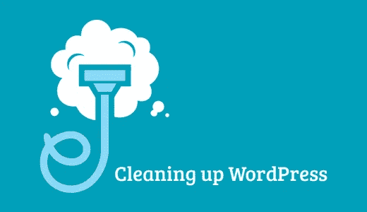
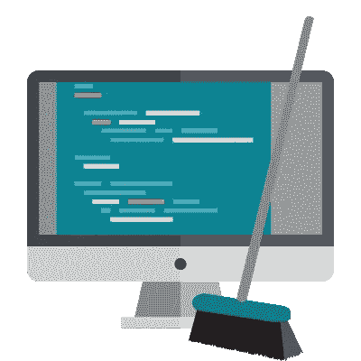

# 清理

> 原文：<https://medium.com/visualmodo/cleaning-up-53e22ef9ce74?source=collection_archive---------0----------------------->

## 你的 WordPress 网站

现在看看清理你的 WordPress 的一些好建议:WordPress (WP)最大的优势之一是你可以选择的插件太多，以及你可以决定使用的主题数量(包括免费的和高级的)。然而，问题是，随着时间的推移，事情可能会发生变化。你添加的插件越多，你的网站需要的资源就越多。此外，并不是所有的主题都得到了很好的优化，对于某些主题，你可能要花更长的时间才能注意到这一点。

# 清理你的 WordPress 网站

除此之外，在你的 WordPress 网站上发布图片和视频是任何人都可以做的事情，甚至是对图片优化一无所知的人。反过来，你优化网站、增加网站价值或者只是让网站更实用的努力可能会适得其反。对此，一些人的反应是建立一个新的网站，这个网站既昂贵又忽视了你到目前为止在当前网站上投入的所有工作。幸运的是，用正确的态度，即使是最糟糕的情况也可以[挽回。考虑到这一点，这里有几个清理你的 WP 网站的小技巧。](https://visualmodo.com/wordpress-maintenance-tips/)

# 1.删除所有不活动的插件

在介绍中，我们提到你可能没有使用你所有的插件。幸运的是，你不必为了做出选择而绞尽脑汁。当你进入管理站点并点击插件时，你会看到一个名为非活动的子类别，所有当前没有使用的插件都放在那里。不用说，移除所有这些是完全安全的。如果你仍然有做更多的冲动，你可以去你正在使用的[插件](https://visualmodo.com/)那里做一个评估，看看这里是否有一些你目前没有使用的插件或者仅仅是没有足够使用的插件。但是，请记住，这个动作并不安全，您的个人估计可能会有点偏差。

# 2.更新你的 WordPress

为了保持你的 WordPress 网站的功能，你必须做的另一件事是——定期更新。请记住，您必须在开始之前保护您的所有数据，这就是为什么您应该首先备份它。一旦你解决了这个问题，你就可以通过点击来更新你的网站了。然而，这只有在较新版本的 WP (2.7 及更高版本)中才有可能。至于旧版本，您需要手动完成这项工作。另一方面，这也不是一件复杂的事情。之后，您可以继续启用您的所有插件。清除所有浏览器 cookies 也是非常明智的。跳过此步骤可能会导致登录时出现一些问题。

# 3.旧帖子可能也要被删除

接下来你需要重新审视的是如何处理你网站上所有的旧帖子。有时候，更新一篇旧博文可能是个好主意。如果这是一篇预言未来会成真的文章，那就更是如此。最常见的是，你可以返回到有问题的帖子，添加一些关键词，做一些深度链接，以吸引一些新的观众到这个页面，或者简单地更新和重复使用有问题的帖子。把帖子加长一点可能也是个好主意，因为如今，【3000 字以上的博客帖子风靡一时。然而，并不是所有的帖子都是可用的或可重用的。他们中的一些人已经超越了他们的目标。不用说，这些是你可能想要永久删除的帖子。

# 4.寻求一些专业帮助

当然，清理你的 WordPress 网站并不一定是你必须自己做的事情。事实上，将这项任务外包给 web 开发可能会给你带来更好的结果。通过这种方式，你可以保持网站的完整性，确保你的品牌形象完好无损，事实上，如果你能把你的想法传达给你的网站开发者，你甚至可以看到一些改进。最后，你得到的是一个为 UX(用户体验)优化的网站，可靠性更高。

# 5.图像优化

我们在简介中提到的下一件事是图像优化。这里，有两个问题需要记住。首先，优化不当的媒体会让你的网站慢下来。第二，喝太多也同样不好。当然，人类是视觉生物，他们接收视觉信息的速度比口头或文本信息快 60，000 倍。然而，这并不意味着你可以在任何地方添加照片。首先，你希望你所有的图片都托管在 WordPress.com 云中。其次，您希望图像的格式是 JPEG 或 PNG。最后，您希望所有的图像都经过压缩和优化。所有这些都可以通过[一套合适的插件](https://premium.wpmudev.org/blog/10-best-image-optimization-plugins-to-speed-up-your-wordpress-site/)毫不费力地完成。

# 6.修复断开的链接

最重要的是，你必须修复你网站上所有损坏的链接。首先，你需要一些像样的诊断。换句话说，你需要一个断链检查器。这个工具不仅会提醒你，如果你的网站上目前有任何断开的链接，而且会及时通知你，如果任何链接变坏了。当然，手动清理这些链接也是可能的，然而，根据你的域名大小，这可能是一个令人难以置信的努力，因为这将需要你手动搜索你曾经[发表过的每一篇内容](https://visualmodo.com/)。

# 最后

在一天结束的时候，学习如何清理你的 WordPress 网站是很重要的，因为这是你经常需要的。不管你有多努力，链接会断，插件会过时，不可回收的内容会越积越多。幸运的是，一旦你掌握了这一招，或者找到了一个可靠的合作伙伴来为你处理，这将成为你能够轻松做到的事情。