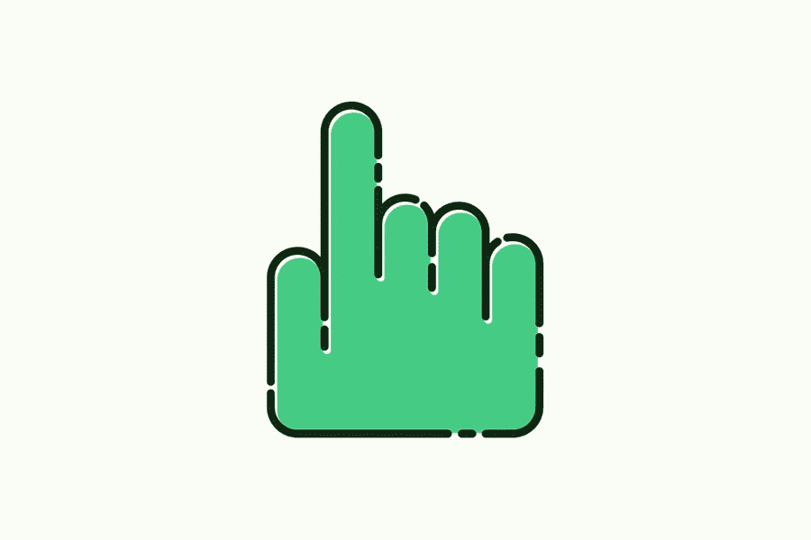

# 点击漏斗联盟指南如何在 2020 年用点击漏斗赚钱

> 原文：<https://medium.com/visualmodo/clickfunnels-affiliate-guide-how-to-make-money-with-clickfunnels-in-2020-4704d6ba2a64?source=collection_archive---------0----------------------->

网络营销世界充斥着关于人们作为点击漏斗联盟成员赚了多少钱的新闻。人们对这个有利可图的联盟计划欣喜若狂。一次又一次被列为三大付费联盟计划之一，加入它有很多好处。该公司给其附属公司的销售佣金很慷慨，包括激励、奖励等附带福利。专业分支机构透露，他们通过这个项目每年可以赚到数千美元。你愿意加入他们的行列吗？如果你想在 2020 年从 ClickFunnels 联盟计划中赚钱，请继续阅读。所以，这份指南可以帮助最无知的网络营销者成为点击漏斗专家。

# 点击漏斗联盟指南

任何有现代网络营销经验的人都会知道点击漏斗是什么。这个令人难以置信的软件提供了一个完整的解决方案，以建立在互联网业务在线。

创始人拉塞尔·布伦森(Russel Brunson)和托德·迪克森(Todd Dickerson)于 2014 年首次创造了这款产品，此后一直受到消费者的喜爱。通过帮助企业建立不同层次的销售漏斗，它让企业能够控制整个购买过程。

你是不是技术专家并不重要。你甚至不需要雇一个人来使用这个软件。Clickfunnels 创建了一站式解决方案，简化了互联网营销的所有方面，如创建网页、寻找网站主机、管理内容等。点击此链接了解更多信息。

# 成为点击漏斗联盟有什么好处吗？

你从成为代销商中获得的佣金是难以置信的。你不仅可以从每笔销售中获得 30%的经常性佣金，甚至还可以从与点击漏斗相关的产品销售中获得 30%的额外收入！

首先，点击漏斗向其附属机构提供各种激励。其次，你有机会从 One 漏斗挑战中赚取 100%的佣金。但是，他们最引人注目的激励是他们的梦想汽车大赛。加入这个项目会让你自动注册。

你的梦想之车终于可以是你的了，因为这个比赛为它的租赁提供每月奖励！给他们找 100 个付费买家，你每个月能得到 500 美元，再找 100 个就能得到 1000 美元！

接受专业培训，成为全职付费 clickfunnels 会员。

# 作为一个专业的点击漏斗联盟赚钱

你听说过粘性饼干吗？这是一种 Clickfunnels 奖励，它会根据点击你提供的链接的顾客所做的每一笔购买给你佣金。你还认为你没有错过吗？

作为一个专业的 Clickfunnels 会员，解锁令人兴奋的奖励并每周赚取数千美元。所以，使用这些 2020 年成千上万的盈利联盟正在使用的有效策略。

# 成为销售渠道专家

接受专业人员的培训后，你将获得关于销售渠道的深入知识。销售渠道是网站流量成为付费客户的过程。

这是一个内容作家的完美之路。所以，你可以用 Clickfunnels 关键词来写 SEO 文章，来提升销量。你的文章越有说服力，你带来的注册人数就越多。确保你的文章将读者链接到他们的注册页面。

# 社交媒体点击漏斗推广指南

使用众多可用的社交媒体网站创建一个社交媒体帐户。使用社交媒体营销策略来吸引点击漏斗的注意力。此外，张贴有助于推广软件的内容。此外，张贴小册子或书面推销。擅长口头推销的人应该制作视频，或者更好。所以，做直播推广。所以，记住你必须吸引观众。社交媒体帮助你与潜在客户建立直接互动。利用这个机会建立信任，把他们引向网站。

推广点击漏斗的各个方面，并与你的追随者互动，以了解他们的销售需求。一旦他们决定成为付费客户，引导他们的过程。向客户提供您的链接，以享受粘性饼干。

# 创建自己的点击漏斗网站或博客

创建一个网站或博客来在线推广该软件。一个全面的培训计划将教你如何制作自己的点击漏斗网站。你必须购买一个域名，并获得一个虚拟主机服务。你甚至可以使用点击漏斗来建立你的网站。

吸引付费用户的售后推销和博客内容。制作有助于解决他们销售渠道面临的问题的内容。结果，你知道吗，60%的消费者是在看了一个关于产品的视频后购买的？使用 youtube 视频博客推广点击漏斗的最佳方式是[制作操作视频](https://visualmodo.com/how-to-create-branding-for-your-website/)。制作一些视频，介绍客户如何使用软件来满足他们的销售漏斗需求。

# 制作附属产品或服务

头脑风暴生产一个产品，一个附属产品或服务。例如，你可以写一本关于点击漏斗的书。即使你免费分发这本书，它也会吸引更多的客户，给你带来佣金。

另外，想出一个与软件相关的服务。你可以成为一名免费的 Clickfunnels 顾问。你可以将此与社交媒体结合起来，在网上推广你的服务。即使你提供免费服务，也要确保只给付费客户。

关键是要想出创造性的方法来推销产品。谁知道呢，你的产品或服务甚至可能会给你带来额外的收入以及点击漏斗佣金！

# 点击漏斗指南:伸出手找到离线客户端

你可以联系当地的企业，用点击漏斗把他们联系起来。瞄准那些有问题或者根本没有网站或在线服务的企业。

企业总是希望扩展到网上，但发现很难建立自己的网站。你可以成为一名顾问，帮助他们购买。所以，新企业总是需要在线营销的帮助。他们可以从使用这个有用的软件中获得回报。瞄准初创企业和新业务，推广他们可以用来创造销售渠道的软件。此外，直接、面对面的推销会更有效。如果你愿意做额外的工作，你可以通过点击渠道佣金赚很多钱。

# 永远记住使用共享漏斗

Share Funnels 是一个 Clickfunnel 功能，可将您的客户带到注册页面。您用帐户创建的每个漏斗都有自己的共享漏斗链接。所以，这个分享漏斗可以帮助你从每个关注你的链接的付费用户那里赚取佣金。

如果他们已经在使用点击漏斗，您的漏斗会被添加到他们的帐户中。但是，如果他们是新的，他们将被引导到点击漏斗注册页面。他们将被纳入为期 14 天的试用注册。你将从每一个转化为付费用户的注册中获得佣金。所以，在你的网站、博客、视频博客、社交媒体页面等上使用你的分享漏斗链接。它将确保你吸引的每一个付费客户都给你带来佣金。

# 点击漏斗指南底线

总之，Clickfunnels 不仅为在线业务提供了一个优秀的解决方案，而且确保成千上万的分支机构从中获得佣金和激励。最后，成为代销商是在线营销者赚钱的最佳方式之一。不要浪费更多的时间，今天就接受培训，成为专业会员！