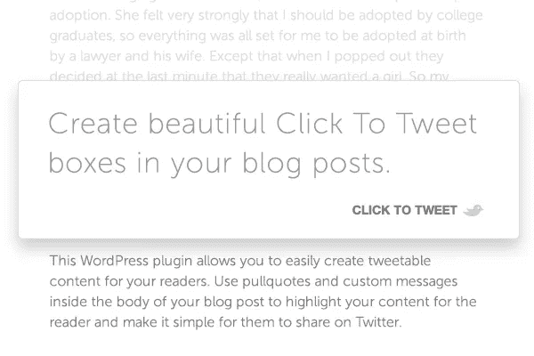

# ClickToTweet:在 Twitter 上分享内容更简单

> 原文：<https://medium.com/visualmodo/clicktotweet-share-contents-in-twitter-simpler-f11423fa5059?source=collection_archive---------0----------------------->

想让你的忠实读者、网站访问者和/或员工通过他们的 Twitter 频道轻松分享你的内容吗？你来对地方了。创建一个 tweetable 链接比学习你必须嵌入到内容中的定制代码要容易得多。就像拥有合适的免费工具和资源一样简单。ClickToTweet 就是这样做的。

这是一项与 Twitter 相关的服务，名为 ClickToTweet，它创建了一个可点击的链接，用户可以通过点击来分享 Twitter 上的任何内容。最近，他们发布了 Chrome 扩展，这使得这项服务更加简单。

# ClickToTweet:为什么？

这是一个网络应用程序，有助于机构和数字营销人员与他人分享链接，以获得更多推文。通过 ClickToTweet，我可以创建一个单独的链接，当点击它时，用户将进入他们的 Twitter 帐户，他们可以快速地在 Twitter 上分享它。点击上面的链接将带你到这里(你可以点击尝试，也可以分享，因为这篇文章值得分享)

嗯，这是一个值得书签的服务，而且[有了新的 chrome 扩展](https://chrome.google.com/webstore/detail/click-to-tweet/neebdcgbdckgmfmfdjnebejemlbnadan/)，创建一个可在推特上发布的链接绝对是轻而易举的事情。ClicktoTweet 服务提供了一个仪表板，您可以在其中创建这样的链接，还可以查看以前创建的可推链接的性能。还有一个 [WordPress](https://wordpress.org/plugins/click-to-tweet/) 的插件。

要创建一个新的 tweetable 链接，只需使用 message you want tweet box 编写您的 tweet，然后点击 Generate New Link。如果您在邮件中添加了网页链接，您可以选择跟踪点击统计，也可以从撰写区域缩短 URL。

# 点击 Tweet 用法

ClickToTweet 有许多实际的使用案例，但是我使用这个服务的一个方法就是利用它的好处。

当用户加入我的任何免费课程时，我通常会创建一个链接供他们分享。这产生了连锁反应，也帮助我获得了新用户。这里的关键是你输入的信息，以确保你的 tweet 副本是值得分享的。

当我发送关于一篇新博客文章的电子邮件简讯时，我经常鼓励我的读者在 Twitter 上分享它。我通过使用这种[可点击的](https://awards.visualmodo.com/)链接让他们更容易，到目前为止，我已经看到了这种做法的显著效果。有了 ClickToTweet chrome 扩展，现在创建这样的推特链接实际上更容易了。雇用有影响力的营销人员来发布品牌内容的机构也可以使用这项服务，给他们一个没有任何错误的链接。很简单！

# 最后的想法

总的来说，这是一个有趣而有用的基于 Twitter 的服务，应该放在你的书签里。他们也有专业版，但是推荐给代理商。对于博客作者和有影响力的人来说，基本版提供了你可能需要的所有有用的特性。在您的集客营销活动中，您认为您可以在哪里最好地利用点击推文 CTA？在下面和我们分享你的想法吧！