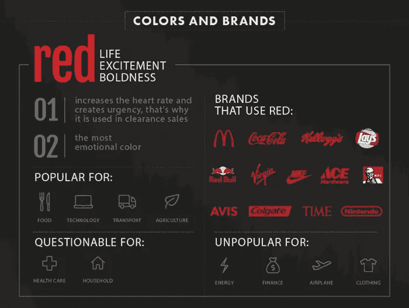

# 色彩心理学信息图:色彩有多重要？

> 原文：<https://medium.com/visualmodo/color-psychology-infographic-how-much-does-color-matter-e3a711269b47?source=collection_archive---------0----------------------->

你知道颜色是推动转化的一个重要因素吗，公司利用颜色心理学来改善他们的品牌信息，或者红色可以增加某人的心率？

DesignAdvisor 的人制作了一张新的信息图，通过简明地解释一些与色彩心理学最相关的事实以及它们如何帮助网站所有者推动转化，将这些和许多其他事实摆在了前面。

# 颜色有多重要？

他们的研究表明，颜色印象在一个人的产品评估中占 60%,最终影响购买或不购买的决定。这种知识有着巨大的力量，许多公司已经将它用于自己的优势，并增加了收入。

例如，作为营销实验的一部分，亨氏番茄酱将其产品和品牌颜色从红色改为绿色。这导致了他们历史上最大的[销售额增长，在七个月的时间里销售额超过了 2300 万美元。](https://visualmodo.com/)

除了与色彩心理学相关的事实和数据之外，这张信息图还强调了一些在选择颜色时要记住的重要因素。例如，使用蓝色一直与传递宁静和信任的信息联系在一起，这导致医疗保健和金融等对信任要求很高的行业的许多公司选择蓝色作为他们的标志和设计方案。

# 色彩心理学信息图

颜色还可以用在更具体的地方，比如让用户点击行动号召按钮。设计顾问[建议](https://visualmodo.com/blog/)使用对比强烈的颜色，比如橙色，这已经被证明可以吸引用户的注意力。一家名为 Extra Storage Space 的在线企业，在将他们的行动号召按钮从蓝色改为橙色后，点击率增加了近 8%!

这张信息图包含了关于颜色及其在商业中的用途的很酷的例子和知识，可以作为初学者和老手的极好的参考指南。[检查一下](https://designadvisor.net/blog/psychology-of-colors-infographic/)出来！

 [## 色彩心理学信息图——色彩有多重要？

### 您是否知道颜色是推动转化率的一个重要因素，公司利用颜色心理学来改善…

visualmodo.com](https://visualmodo.com/color-psychology-infographic/) 