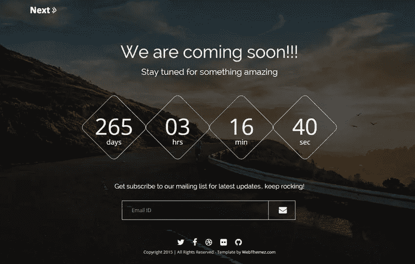
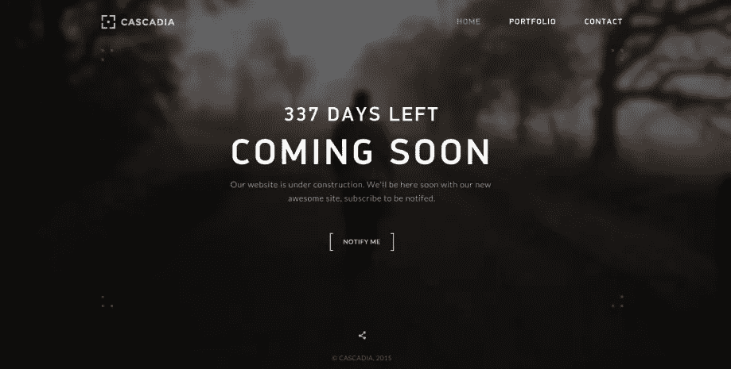

# 即将推出的页面:为什么每个网站都应该从一个开始

> 原文：<https://medium.com/visualmodo/coming-soon-page-why-every-website-should-starts-with-one-6c4ac6485731?source=collection_archive---------0----------------------->

你刚刚开始了一个新的 WordPress 网站，你应该做的第一件事是什么？好吧，我要告诉你为什么 ***你应该做的第一件事****是安装一个即将发布的插件并尽快获得一个即将发布的页面！*

*我将向您展示即将推出的页面的所有好处。我将一步一步地解释如何起床和出发，在你即将到来的页面上放什么，为什么你应该收集电子邮件，以及在启动你真正的网站之前如何处理这些电子邮件。*

# *为什么你需要一个即将到来的网页*

**

*太多的人仍然花费数周(或数月……)的时间试图设计完美的网站，并为网页复制争论不休，只为了在蟋蟀的叫声中推出他们全新的、漂亮的网站。*

*我不希望你成为他们中的一员。*

*这就是为什么我敦促人们尽快在他们的网站上建立一个“即将发布”的页面。你看，一个网站需要时间来建立势头。社交追随者、搜索流量和电子邮件列表都像滚雪球一样增长——为了获得维持一个成功网站所需的临界质量，你必须从小事做起。*

*但是如果你的网站完全空白或者正在建设中，你就没有办法利用那些对你的工作感兴趣的人。*

*决定你的网站是否成功发布的最大因素是你是否建立了一个期待它发布的人的名单。像脸书和推特这样的社交媒体是可以的，但是电子邮件列表要好得多。(稍后我会解释原因)*

*电子邮件不是唯一重要的事情，另一个重要的部分是人们是否能在谷歌或其他搜索引擎上找到你的网站。众所周知，谷歌在向新网站发送流量方面变化无常。不幸的是，垃圾邮件是在互联网上做生意的现实，谷歌有一个团队昼夜不停地工作，试图阻止低质量的垃圾网站堵塞搜索结果。*

*他们想要奖励像你正在建设的这样的高质量网站——毕竟，帮助搜索者找到最好的网站是谷歌成为家喻户晓的名字的原因。*

*建立一个即将到来的页面将有助于你的网站被谷歌收录。我不只是这么说，就连谷歌网站管理员团队的马特·卡茨也建议将即将推出的网页作为一件“好事”。*

*如果你的网站有默认的 WordPress 主题和默认的 Hello World 帖子，谷歌可能会跳过对你网站的索引，直到你得到一些真正的内容。*

*建立一个即将到来的网页可以让你发布真实有用的内容给你的网站访问者，也可以让你隐藏真实网站的建设过程。正如穆特·卡茨解释的那样，谷歌喜欢并推荐这种方法。*

> *如果说我学到了什么的话，那就是在搜索引擎优化方面按照谷歌的建议去做。
> 约翰·特纳——SeedProd.com*

*最后，正如我所说的，建立一个即将到来的网页可以隐藏建设你真正网站的具体细节。大多数网站需要几个月的时间来建立。*

*你真的希望人们来到你的新域，看到一个半建成的网站吗？我不这么认为！*

*这不是很专业，大多数人在看到一个处于建设混乱状态的网站后不会再回来。*

*最好是发布一个即将到来的页面，隐藏工作进度，在部件准备好的时候发布。*

*因此，正如你所看到的，在你的新 WordPress 网站上放置一个即将到来的页面有利于获得流量，甚至对于谷歌的 SEO 来说是必要的。*

> ***我认为即将推出的页面会非常智能… …我认为这对用户和搜索引擎来说都是好事。** 马特·卡茨——谷歌站长*

# *如何让人们兴奋地报名加入你的等候名单*

*所以你看到拥有一个即将到来的页面是多么重要，但是你如何让人们给你他们的电子邮件地址，为什么电子邮件如此重要？*

*电子邮件非常重要，因为社交媒体用户会受到源源不断的通知和消息的轰炸，而你的消息会逐渐消失在背景中。这是最好的情况。*

*脸书已经极大地限制了有多少你的粉丝会真正看到你的帖子，没有办法知道下一次改变什么时候会减少这些频道的价值。*

*Twitter 是一条持续不断的信息河流，大多数人都忘记了他们在这条内容流中看到了什么。*

*电子邮件是私人的，可以让你和访问者建立关系。*

*但是要让人们交出他们的电子邮件地址，你必须给他们一个令人信服的理由，让他们相信你的网站是值得期待的。*

*不幸的是，这是大多数人遇到麻烦的地方——如果你的访问者注册了你的列表，向他们承诺一些东西和提供他们实际上想要的东西是有很大区别的。*

*然而，有几样东西似乎是每个市场的顾客都喜欢的——折扣、案例研究和指南。*

*因此，与其要求人们订阅网站上的新帖子或更新，不如尝试向他们提供以下内容之一:*

# *高级折扣*

*每个人都喜欢得到一笔好交易，但他们也喜欢成为一个团体的一部分。假设你要在你的网站上卖东西，在网站上线之前，承诺给在等待名单上的任何人一个独特的、一次性的折扣。*

*即使人们不确定他们是否想买你提供的东西，他们也会加入你的名单，这样他们就不会错过一个特殊的机会，你也有机会在网站[上线](http://theme.visualmodo.com/marvel/)之前让他们相信你的工作是有价值的。*

# *个案研究*

*推销你的产品或服务的最好方法之一就是展示它过去是如何帮助人们的。但是你不必等到你网站的完整版本上线后才展示你过去是如何帮助别人的。*

*读者喜欢关于像他们这样的人的具体故事。因此，无论你是销售软件、培训还是社区，一个展示你的解决方案如何在过去帮助人们的案例研究将鼓励人们订阅你的等待名单，但过滤掉随机的浏览器，这样你就有了一个潜在的[客户的强大列表](https://visualmodo.com/)。*

**

# *迷你课程或电子书指南*

*最后但同样重要的是，提供电子邮件迷你课程或电子书指南是一个很好的方式，既可以让人们加入你的等候名单，也可以向他们介绍你的工作，并在你的网站推出之前展示你可以提供的价值。*

*专注于真正帮助你的观众，让你的内容专注于教学。当你的观众已经接触到你的几百个单词的教学时，他们会很兴奋地看到下一封宣布你的新项目终于上线的电子邮件。*

*但是现在我们已经把你的“即将到来”页面变成了你的等待列表的一个迷你漏斗，我们需要访问者把你的提议展示给。*

# *在你的网站发布之前，吸引观众的最好方法是*

*所以，现在我已经告诉你，你需要一个“即将推出”的页面，用于销售线索和 [SEO](https://visualmodo.com/) ，你需要建立一个电子邮件列表，以使你的网站在第一天就成功推出…*

*…神奇的问题当然是:**怎么做？***

***嗯，简而言之就是流量。***

*而稍微长一点的答案是“广告或者曝光。”*

*现在，你们中的一些人会想利用脸书广告来吸引你的潜在客户——如果你能负担得起的话，那就太好了。但对于许多网站所有者来说，在看到网站将获得某种吸引力的证据之前，运行大量广告要么成本过高，要么他们不想在新项目上冒险。*

*这很好，因为 bootstrapper 的曝光方法实际上很有趣。如果付费广告目前不在你的计划或预算之内，那么让你对新项目感到兴奋的最好方法就是进行一次老式的媒体之旅。*

*但是，不要把目标锁定在电视、报纸或杂志上，你要去寻找客座博文的机会、播客采访、访问论坛和其他你的目标受众常去的在线社区，甚至直接接触你所在行业的人和有影响力的人，以帮助宣传。*

*现在，为了让这个策略得到更多的关注，你需要有一些经验或专业知识，你可以和那些出版商的读者分享。*

*这不一定是你如何在大学宿舍里创建一家全球创业公司的白手起家的故事——正如我们讨论的那样，人们对个人故事和具体的案例研究更感兴趣。*

*但是需要一点努力来完善你的音调。*

*当有疑问时，寻找过去的经验，你可以提供你学到的对你的目标受众有帮助的好教训，或者你认为他们会涉及的困难经历。*

*然后开始在 Twitter 上与有影响力的人、博客作者、社区版主和播客聊天，然后发送一封友好的电子邮件介绍你自己，并提出在他们的平台上露面的想法。*

*试着把你的推销和他们最近写的或出版的东西联系起来，或者你知道的关于他们品牌的其他东西。
说到底，这种推广是一种数字游戏，但如果你做足功课，真正了解你的目标，或者把你的注意力限制在你个人熟悉的网站上，你会有更好的结果——毕竟，没有人想感觉被利用。*

***尊重他们的时间和他们的读者，努力为出版商、他们的读者和你的名单创造一个真正的双赢局面。**因为，毕竟，你要确保在你的播客或内容的最后提到你的迷你课程、案例研究或折扣清单。*

*有很多聪明的营销人员在推出他们的产品或网站之前，使用这种策略将成千上万感兴趣的潜在客户添加到他们的等待名单中。*

*是的，这需要一点时间，但是如果你手头有点紧的话，建立一个很好的等候名单是非常有效的。*

# *发布前发送的电子邮件*

*所以你有一个即将到来的页面，伟大的线索磁铁和交通。你现在怎么处理这些线索？*

*嗯，你应该做的第一件事是，在有人注册你的名单后，立即发送一封欢迎电子邮件,告诉他们会发生什么。*

*所有的电子邮件营销提供商服务，如 MailChimp，Convert it 和 Drip 提供在某人加入你的名单后发送电子邮件的能力。这是一封欢迎邮件的例子。*

***欢迎邮件示例***

```
*-------------------------------
Hey There,Thanks for subscribing to SeedProd!I'll be emailing you updates every few weeks on the progress of our new
site and I'll be sending out a discount code as we get closer to launch.In the meantime don't forget the more you share the bigger discount
you get when we do launch!Thanks,
John Turner
SeedProd.com
-------------------------------*
```

*在示例欢迎电子邮件中，我们欢迎访问者加入我们的列表，并告诉他们我们邮件发送的频率。此外，这封电子邮件使用折扣代码作为销售线索磁铁。如果您没有使用折扣代码，那么您需要在这封电子邮件中发送您的案例研究、电子书或指南。*

*那么下一步是什么？有人加入你的名单后，你不想进入无线电静默。你需要通过电子邮件向该主管发送更新信息，这样他们就不会每隔几周就忘记你一次。*

*人们喜欢幕后的更新，他们不会加入你的名单，除非他们对你的未来感兴趣。所以让他们知道你的进展。*

*一旦你准备好启动你的新网站，你会想要发送一系列的电子邮件来建立[兴奋度](https://visualmodo.com/)。显然，你在这些邮件中放什么取决于你的市场和受众，但这里有一个这些邮件的顺序和时间的例子。*

**

***网站发布前 3 天的电子邮件示例** (该电子邮件的目标应该是为即将到来的发布进行挑逗和制造刺激)*

```
*-------------------------------
Hey There,We're almost ready for launch! Here's a video to show you what we have been working on.Also there's still time to share our site and get a bigger discount
when we launch. Thanks,
John Turner
SeedProd.com
-------------------------------*
```

***发布日电子邮件示例** (这封电子邮件的目标是兑现你的承诺——网站、产品或你正在发布的任何东西。行动号召应该是访问并使用激励措施(如果有的话)。此外，始终确保有一个鼓励人们采取行动的最后期限。)*

```
*-------------------------------
Hey There,We're live! Click here to visit our new site and 
don't forget to use your discount code. CODEBut hurry this code expires in 48 hours.Thanks,
John Turner
SeedProd.com
-------------------------------*
```

***发布邮件示例** (这封邮件的目的是提醒人们截止日期，并感谢他们与你一起踏上旅程。)*

```
*-------------------------------
Hey There,Wow, what an incredible response we have had and I 
want to personally than you for being part of our launch. If you haven't already make to to use you discount 
code, it expires a t midnight tonight!Thanks,
John Turner
SeedProd.com
-------------------------------*
```

*当然，你可以根据你的网站类型来添加或删除电子邮件，但是你会明白我们要做的事情的要点。我们试图让用户采取行动。*

# *如何在 WordPress 中设置一个即将到来的页面*

*好了，我已经给了你建立一个成功的[网站发布所需要的所有信息。你可能会想，“哇，要设置的东西太多了，我该如何在 WordPress 中设置它”。其实比你想象的容易！](https://visualmodo.com/)*

*为 WordPress 建立一个即将到来的页面的最好方法是使用我们的即将到来的页面插件。你可以在几分钟内拥有一个很棒的即将到来的页面，能够收集电子邮件并隐藏你的 WordPress 站点。考虑到它提供的所有好处，这真的很容易。*

# *结论*

*我希望你喜欢这篇关于如何为 WordPress 建立一个[即将到来的页面](http://theme.visualmodo.com/marvel/)以及为什么它很重要的指南。*

***总而言之**，你的 WordPress 网站需要一个即将推出的页面，这样你就可以:*

1.  *收集电子邮件线索*
2.  *获得排名和搜索引擎优化的优势*
3.  *隐藏正在施工过程中的螺母和螺栓*
4.  *你会很酷的😉你已经很酷了，因为你用了 WordPress，所以至少更酷…*

*这些年来，我已经看到这种方法推出了无数成功的网站，如果你遵循我在这里列出的建议，我相信你的下一个网站推出也会非常成功。*

*再次感谢您抽出时间阅读。如果你有任何问题或想分享你的经验，请在下面留下评论。*