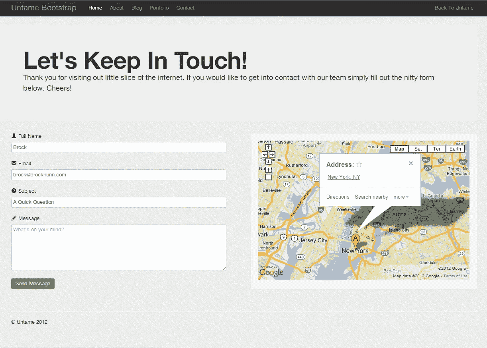
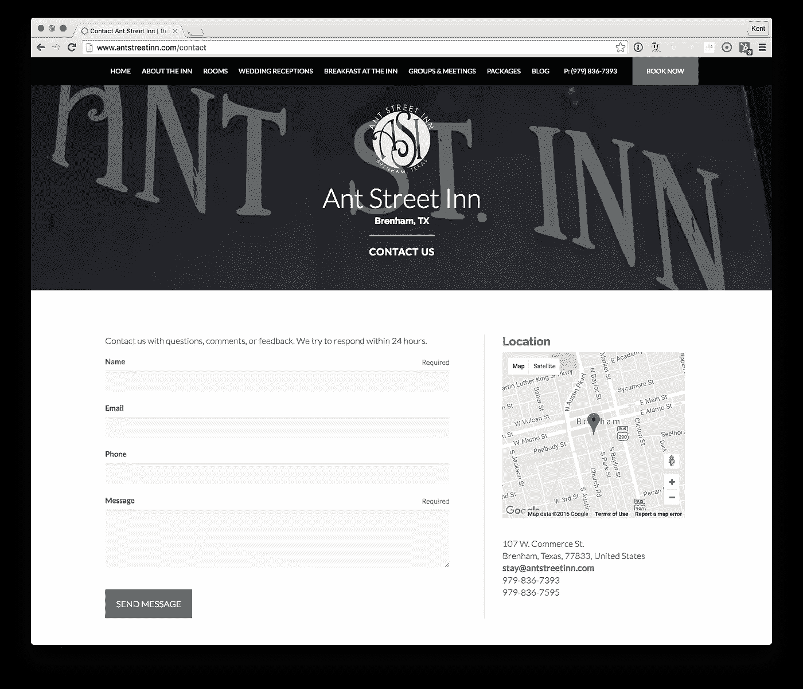

# 常见的联系人页面错误以及如何避免

> 原文：<https://medium.com/visualmodo/common-contact-page-mistakes-and-how-to-avoid-it-874d9097d2ea?source=collection_archive---------0----------------------->

查看设计和创作中最常见的联系人页面错误以及如何避免。

如果你的商业网站的目标是联系(潜在)客户，你应该避免一些联系页面错误。这里我们就提一下我们觉得最烦的错误。在这方面，我们并不独特。

# 常见联系人页面错误

在我之前关于联系页面的文章中，我已经提到过这个页面上正确的内容可以改善用户体验和 SEO。在这篇文章的评论中，西蒙问道:“你认为网站联系页面上最常见的 5 个错误是什么？”我认为最常见的错误是我的个人清单，所以我决定把这篇文章献给我认为最令人讨厌的*🙂让我们从第一点开始吧。*

# *只是一种形式*

*如果你的联系页面只有一个表格，那么你就没有为所有的访问者提供服务。自然，总会有人不理解这种形式。提供一个备选方案，比如电子邮件地址或电话号码。以下是人们可能不喜欢/不理解[你的表格](https://visualmodo.com/)的一些原因:*

*   *你的表格太长了。人们会迷路或者根本不会花时间去填写你想知道的所有事情。保持表格简洁明了。*
*   *您的表单没有响应。这破坏了你的联系人页面上的移动体验。标签可能会丢失，因为移动浏览器会关注表单字段。*
*   *你的形式可能会被打破。也许你错过了你最喜欢的联系人插件的更新，这只是其中一个原因。*

# *为你的联系页面起一个有趣的名字*

*当你不得不在一个网站上做内部搜索，只是为了找到他们的联系页面时，你难道不讨厌吗？在我看来，有两种选择:*

1.  *将菜单项“联系人”添加到主菜单和/或页脚菜单中。*
2.  *在*example.com/contact/.*添加您的联系页面*

*我不会看其他地方。你可以直接搜索或者回到谷歌，找到下一家愿意回答我问题的公司。最好是，您希望指向您联系人页面的链接位于文件夹上方。但我不得不说，页脚链接也很常见，既可以作为额外链接，也可以作为主链接。*

*就像 URL 中的链接一样，我希望该页面的标题是“联系”或类似于“联系我们”或“取得联系”的变体。不要使用“让我们谈生意”或任何奇怪的句子，这不会涵盖网页的直接目标。它会让人们困惑，即使在谷歌已经是这样了。明确表示这是他们可以联系到你的页面。*

# *过时的信息*

*来吧人们。像你所有的其他网页一样，你的联系页需要时不时的关爱。搬办公室？调整你的网站。新的销售代表？更改个人资料图片和电子邮件地址。确保你的信息始终准确无误。*

*不要对此掉以轻心，我认为过时的信息是我们有时选择忽略的联系人页面错误之一。“总有一天我会明白的”。“它在我的待办事项列表上”。不，有变化就更新。如果你的地址变了，在这个过程中让[谷歌](https://support.google.com/business/answer/3039617?hl=en)知道。*

# *确保人们可以私下联系你*

**

*这意味着“在 [WordPress](https://visualmodo.com/) Slack 上联系我”、“在 Twitter 上跟我说话”，甚至“在下面发表评论”都是不够的。是的，使用评论表单作为联系表单的联系页面确实存在。想和你说话的人可能只是想和你说话。确保他们可以。*

*在联系人页面上显示社交资料的链接明智吗？我认为，只有当你希望人们在 Twitter 上与你联系，并且你监控这些社交资料中的问题时，这才有意义。如果你在联系页面上提到了 Instagram，并且没有至少每隔一天查看一次 Instagram，那么这很可能不是联系你的首选方式。在这种情况下，该链接不应该出现在您的联系人页面上。最好的情况是:私下联系你有两种选择(表格和电子邮件地址或电话号码是一个好的开始)，所以如果其中一个失败了，访问者可以使用另一个。*

# *根本没有联系页面*

*要是我能从我遇到的每个缺少(清晰的)联系页面的网站上得到一分钱就好了……我以前说过，现在我再说一遍:每个网站都应该有一个联系页面。大多数网站的建立是为了与访问者互动，让他们购买产品或提供信息。但他们总能给你额外的问题或有趣的商机。确保清楚他们的联系方式。*

*这可能是这里列出的所有联系页面错误中最明显的，但是我觉得有必要提一下。*

# *你还能想到其他的联系页面错误吗？*

*毫无疑问。如果你改天问我同样的问题，我可能会想出更多。以上这些是我觉得最讨厌的，但是关于:*

*   *没有发送表单的明确确认。所以我再发一次。以防万一。*
*   *蹩脚的验证码。恐怖啊！还需要我多说吗？*
*   *充斥着令人分心事物的联系人页面。我只是想联系你！*

# *现在轮到你了*

*请在[评论](https://visualmodo.com/)中畅所欲言。让我知道联系页面最让你恼火的是什么！*