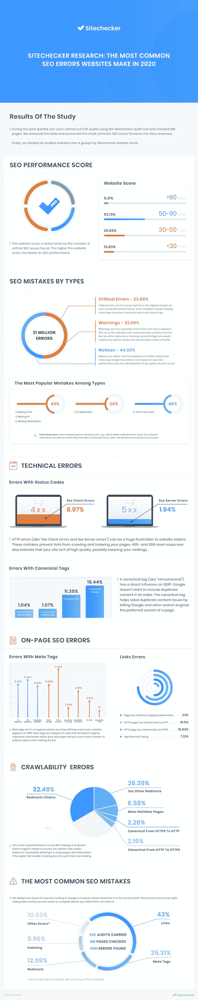

# 你现在需要修复的常见 SEO 错误

> 原文：<https://medium.com/visualmodo/common-seo-mistakes-you-need-to-fix-now-fba851f94b7e?source=collection_archive---------0----------------------->

搜索引擎优化不仅仅是你需要执行的一系列操作，这样你的内容在搜索结果中的排名会更高。随着谷歌的每次更新以及社会和经济的动荡，我们寻找信息的方式也在改变。此外，大量的教程和过时的实践会导致负面的性能结果。因此，我们创建了一个常见的 SEO 错误列表，你应该留意并在发现任何错误时尽快修复。

# SEO 报告和错误

管理网站性能和处理潜在问题的最好方法是通过定期的 SEO 报告。这不是一次性的工作，你应该每隔一段时间分析你的内容，以确保一切都是好的。虽然您可以手动开发报告，但最好选择白标 SEO 报告工具，因为它们提供了当前的性能统计数据、需要修复的错误列表以及处理每个问题的方法。

如今，网站分析软件可以提供各种各样的数据，这些数据可能很难理解，对你的目标没有帮助。另一方面，一份精心制作的白标报告给你留下了可操作的数据和处理最终 SEO 错误的方法。

如果你有必要的预算，你也可以为他们的 WordPress SEO 服务雇佣专业人员。这些企业在行业中有多年的经验，这意味着他们可以很容易地审核您的 SEO 工作，确定您应该改进哪些领域，并创建有助于改进这些领域的策略。虽然这项服务会需要你自掏腰包，但付费其实还是划算的。和专业人士一起工作会节省你的时间和精力，因为你不必执行那些你不确定是否有效的策略。

# 技术错误

您的网站或服务器上的任何更新都可能导致技术性 SEO 错误，这对跳出率、索引和 SERP 潜力有直接影响。技术错误最常见的例子包括状态代码和规范标签错误。

每当用户点击被移动或删除页面的链接时，屏幕上会出现 404 状态代码错误。不太常见的是，服务器端有一个问题会导致 5xx HTTP 状态代码错误。因此，在更新您的内容或将您的页面重定向到另一个 URL 时要注意，因为搜索引擎爬虫和人类访问者都会对存在此类问题的网站失去兴趣。

有许多方法可以键入您的主页 URL 从到我的网站[的任何内容。](http://www.mywebsite.com.)即使这些 URL 指向同一个页面，但谷歌和其他搜索引擎会将其视为不同的页面，这让他们认为你有很多重复的内容。将 rel canonical 标签放在主页或任何其他页面的单个实例中，会告诉网站爬虫您首选的页面版本。这样你就不会陷入被标记为大量重复内容的网站的麻烦。

# 常见 SEO 错误修复:可抓取性错误

当谈到影响搜索引擎优化性能的可抓取性错误时。最常见的问题是由重定向链和 3xx 状态代码引起的。这也传达了一条消息，即您定向到备用地址的资源有问题。

当有太多重定向指令时，重定向链会导致爬虫停止寻找内容。在源和目标 URL 之间。此外，3xx 状态代码意味着 URL 重定向问题，导致您的页面被从搜索引擎结果页面中摘录。

另一个值得一提的可抓取性错误是内容中使用的 URL 存在“nofollow”标记。这些标签告诉搜索引擎不要跟踪这些链接，这将它们排除在索引之外。删除“nofollow”标签可以解决这个问题。有一个有趣的 Sitechecker 信息图，显示了每种错误类型对整体 SEO 性能的影响。

# 页面错误

就页面搜索引擎优化错误而言，你可能会遇到。除了可能导致的[常见内容大小](https://visualmodo.com/4-benefits-of-using-keyword-research-tools-for-your-seo/)和文件类型错误。减缓加载速度和其他性能问题，主要问题是由元标签和链接策略差。

标题标签告诉观众你的内容的重点是什么。元描述为页面提供了更详细的解释，这样用户就能一瞥等待他们的是什么。糟糕的标题标签或元描述，以及它们的缺失，是你应该立刻改正的严重错误。

内部链接会引导你的网站进入不同的页面，让访问者在你的域名上花更多的时间。内部链接最常见的问题出现在当您要删除链接的页面时。或者 URL 由于某种原因发生了变化。

外部链接很重要，因为它们会引导你进入权威网站，有助于你的信息的真实性。在你的内容中有一个不再活跃的外部链接并不罕见。因为作者删除了该页面或该网站不再活跃。此外，确保更新外部链接，尤其是如果他们导致统计。

# 常见的 SEO 错误修复:结论

为了保持较高的 SEO 排名，这些是你应该注意的一些错误。使用搜索引擎优化工具有助于促进这项任务，并允许您定期无缝分析您的网站。牢记网站性能基准，这样你就能了解哪些技术对你有好处。