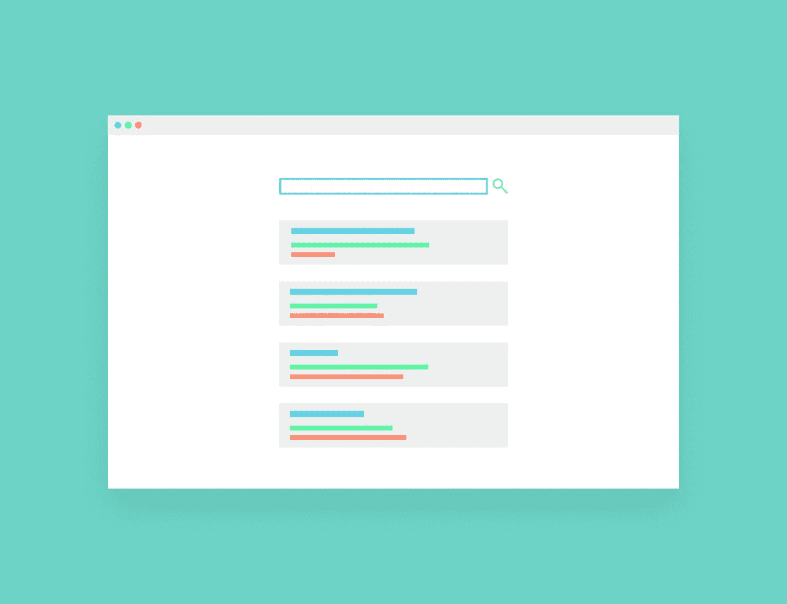

# 谷歌索引的抓取优化技术

> 原文：<https://medium.com/visualmodo/crawl-optimization-techniques-for-google-index-b643b9cb6425?source=collection_archive---------1----------------------->

你知道所有关于搜索引擎优化。一个结构良好的网站的重要性，相关的关键字，适当的标签，技术标准，以及大量的内容。但是你可能不太考虑谷歌抓取优化。

Googlebot 优化和搜索引擎优化不是一回事，因为它更深一层。搜索引擎优化更侧重于优化用户查询的过程。Googlebot 优化关注的是 Google 的爬虫如何访问你的站点。

当然，有很多重叠。然而，我想做这个重要的区分，因为它会以一些基本的方式影响你的网站。总之，网站爬行有效性是确保其可搜索性的重要的第一步。

# 爬行深度的概念

爬行深度是搜索引擎在网站内索引页面的程度。大多数网站包含多个页面，而页面又可以包含子页面。页面和子页面以类似于文件夹和子文件夹(或目录和子目录)在计算机存储中增长更深的方式增长更深。

一般来说，特定页面在网站层次结构中出现的位置越靠下，它在搜索引擎结果页(SERP)中排名靠前的机会就越小。默认情况下，网站主页的爬网深度为 0。同一网站中从主页直接链接(单击一次)的页面的爬网深度为 1；从爬网深度为 1 的页面中直接链接的页面的爬网深度为 2，依此类推。

爬虫(也称为蜘蛛或机器人)是一种访问网站并读取其页面和其他信息以便为搜索引擎索引创建条目的程序。

# 抓取效率+。XML 站点地图

你的站点应该有一个或多个 XML 站点地图。那些 XML 站点地图告诉 Google 哪些 URL 存在于你的站点上。一个好的 XML 站点地图还会指出你最后一次更新特定 URL 的时间。大多数搜索引擎会比其他搜索引擎更频繁地抓取 XML 站点地图中的 URL。

在 Google 搜索控制台中，XML 站点地图给了你额外的好处。对于每一个网站地图，谷歌都会显示错误和警告。您可以通过为不同类型的 URL 创建不同的 XML 站点地图来使用它。这意味着你可以看到什么类型的网址在你的网站上有最多的问题。

# 爬网效率常见错误

# 1.太多 301 重定向使用

我最近在一个刚刚完成域名迁移的网站上咨询。这个网站很大，所以我用我们的一个工具对网站进行了全面的搜索，看看我们应该修复什么。很明显，我们有一个大问题。这个网站上的一大群 URL 总是被链接到没有尾随斜线的地方。如果你转到这样一个没有斜杠的 URL，你会被 301 重定向。你被重定向到版本*,结尾是*。

如果这是你网站上一两个 URL 的问题，那真的没关系。这实际上是主页的一个问题。如果你的网站上有 250，000 个 URL，这就成了一个更大的问题。Googlebot 不用爬 25 万个网址而是 50 万个。这并不十分有效。

这就是为什么当你改变 URL 时，你应该总是尝试更新你的站点内的链接。如果你不这样做，随着时间的推移，你会得到越来越多的 301 重定向。这将减缓你的抓取*和*你的用户。大多数系统需要一秒钟来提供重定向服务。这又增加了一秒钟的页面加载时间。

# 2.404 和更多问题

当谷歌*抓取你的网站时，它会遇到错误。当它打开时，通常会从一堆纸中选择下一页。如果在抓取过程中你的网站有很多错误，Googlebot 会变慢。它这样做是因为它害怕*因为爬行太快而导致*错误。为了防止 Googlebot 变慢，你需要修复尽可能多的错误。*

谷歌在其网站管理员工具中向你报告所有这些错误，Bing 和 Yandex 也是如此。我们以前报道过谷歌搜索控制台(GSC)和必应网站管理员工具的错误。如果你有我们的 Yoast SEO 高级插件，你可以用它从 GSC 导入并修复错误。你可以直接从你的 WordPress 管理员那里做。

在 GSC，你不是第一个拥有 3000 个实际网址和 20000 个错误的客户。不要让你的网站成为那样的网站。定期修复这些错误，至少每个月一次。

# 3.隐藏的问题

如果你的网站在谷歌眼中更权威，有趣的事情就会发生。即使很明显一个链接没有意义，谷歌也会抓取它。给谷歌一个虚拟的无限螺旋楼梯，它会一直走下去。我想分享一个我在《卫报》遇到的搞笑例子。

在《卫报》,我们曾经拥有所有主要类别的每日档案。由于《卫报》发布了大量内容，这些日常档案就有了意义。你可以点击从今天回到昨天等等。等等。等等。甚至远在守护者出现之前。如果你愿意，你可以到 0 年 12 月 25 日。我们已经看到谷歌索引回溯到 1600 年。差不多有 15 万次点击。

这就是我们所说的“蜘蛛陷阱”。像这样的陷阱会让搜索引擎爬行效率极低。修复它们几乎总能在有机搜索中带来更好的结果。你的网站越大，就越难发现这样的问题。即使是有经验的 SEO 也是如此。

# 识别爬网错误并修复

如果你对此感兴趣，并想测试你自己的网站，你将需要一些工具。在我们的网站评论中，我们使用了大量的尖叫青蛙。这是大多数 SEO 的瑞士军刀。我认识的其他一些 SEO 信誓旦旦的 Xenu，也挺好的(而且免费)。请注意:这些不是“简单”的工具。它们是强大的工具，如果使用不当，甚至可以关闭一个网站，所以要小心。

一个好的第一步是开始抓取一个网站，并过滤 HTML 页面。然后按 HTTP 状态代码降序排序。您将在列表顶部看到 500–400–300 种类型的回答。你将能够看到你的网站做得有多差，与 URL 的总数相比。请参见下面的示例:

# 最后的话

我很想知道你是否遇到过类似的爬行效率问题，以及你是如何解决的。如果这篇文章能帮助你解决一些问题，那就更好了，在下面告诉我们吧！