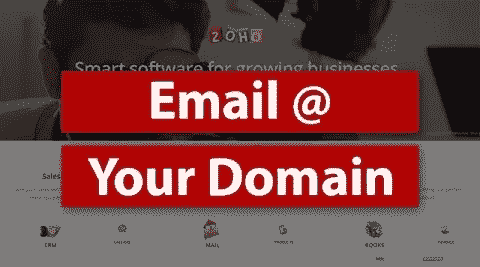

# 免费创建域电子邮件地址

> 原文：<https://medium.com/visualmodo/create-domain-email-address-for-free-bbea1400bb70?source=collection_archive---------0----------------------->

自定义域电子邮件可能看起来像是更大的品牌图片中的一个小细节，但它非常重要。一目了然，这就是它对客户、客户和/或熟人的意义所在:

自定义电子邮件地址=您已经创建了一个真实的[业务](https://visualmodo.com/) x 您的旧 gmail.com 或 yahoo.com 电子邮件地址=这是您的周末爱好

你是否知道，你可以创建一个免费的电子邮件与自己的域名从您的主机 [cPanel](https://cpanel.com/) ？

否则，您就错过了提高品牌知名度的机会。

说到提高品牌的知名度和可信度，我总是更喜欢使用以我的域名结尾的品牌 Email 地址。例如，联系@ [visualmodo](https://visualmodo.com/) 。com 看起来比 visualmodo@gmail.com 更专业。

最棒的是，这是免费的。那么为什么不使用自定义电子邮件域，这是免费与您的托管包？

在这篇文章中，我将向你展示如何创建一个具有域名的电子邮件帐户，以及如何将邮件从你的专业电子邮件转发到个人电子邮件帐户。这样，您可以轻松地从个人电子邮件地址发送和接收邮件，但客户将看到域名电子邮件地址。

# 创建您的域电子邮件

1.首先登录你的[托管](https://visualmodo.com/) cPanel。大多数情况下，cPanel 链接是[http://yourdomain.com/cpanel.](http://yourdomain.com/cpanel.)但是，您也可以从您的主提供商在注册时发送的电子邮件中获取您的 cPanel 链接和密码。

2.登录后，向下滚动并单击“mail”部分下的“**电子邮件帐户**”。

3.在下一页，您需要输入电子邮件的用户名并选择域名。输入密码，点击**创建账户**。

4.然后你会收到一个通知，像这样的“帐户创建”，你会发现你创建的电子邮件帐户在同一页。

5.现在返回 cPanel，点击 Mail 部分中的**转发器**。

*货运代理允许您将所有邮件的副本从一个电子邮件地址发送到另一个电子邮件地址，这样您就不需要同时检查两个帐户。请注意，转发的邮件仍将发送到原始地址。*

然后点击**增加货代**。

6.填写详细信息，点击**增加货代**。

现在，所有发送到 admin@yourbrand.com 的电子邮件都将发送到我的个人电子邮件地址。

希望这篇文章能帮助你用你的域名创建你的专业邮箱账户。如果你在这方面有任何问题，请随时通过评论来问我。如果你觉得这篇文章有用，请帮我在脸书、推特或谷歌+上分享这篇文章。