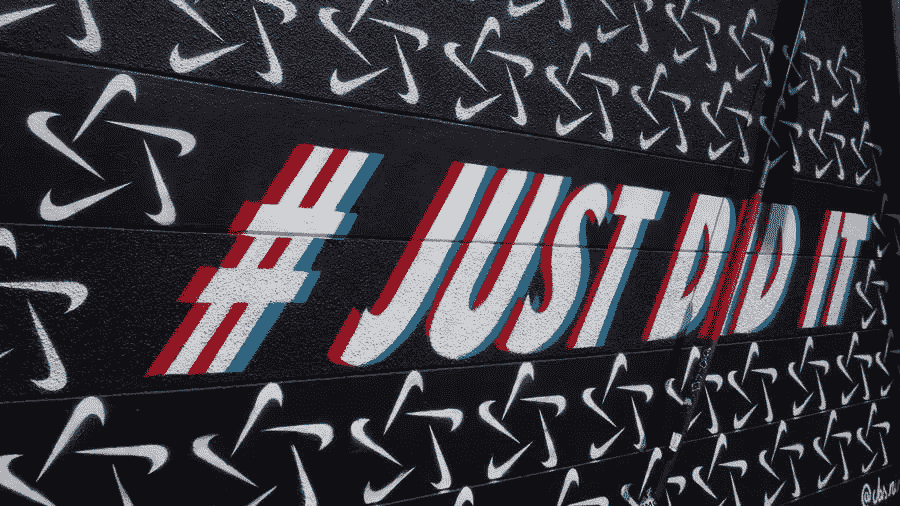

# 为你的企业创造一个标语

> 原文：<https://medium.com/visualmodo/creating-a-tagline-for-your-business-12790e188102?source=collection_archive---------0----------------------->

标语是一个简短有力的句子(句子片段也可以),它快速而令人难忘地传达了你的业务内容。它经常(但不总是)和你的品牌标志一起使用。标语不是口号。口号是营销活动中使用的临时“标语”。这些营销活动可能会持续很长时间，但口号是附属于特定的活动，而不是品牌名称或标志。标语比口号更持久，但有时口号表现得如此出色，以至于成为标语。

# 标语概述

它们很难写。如果你做错了，你将不得不忍受你糟糕的口号成为你生意中令人难忘的东西。

也就是说，标语也可以迫使你用几个词来集中你的业务；它可以提醒你和你的观众你到底在做什么；如果做得好，这是一个容易重复的口碑营销工具。

请注意，本文中提到的一些公司已经更新了他们的品牌。我提到了他们最受欢迎的标语，但不一定是他们最近的。

# 著名标语

你甚至没有意识到你看到一家公司的标语的次数和你看到的一样多。

*   我爱它(麦当劳)
*   做就是了(耐克)
*   思考不同(苹果)

公司在任何地方反复宣传他们的口号——在他们的广告、包装、网站和店面上，以及在他们的广告歌中。

你可能没有预算去疯狂地做广告，但是在你的品牌出现的任何地方使用你的标语并不需要额外的花费。

# 你为什么需要标语？

在这篇关于迷人营销的文章中，有一段有趣的引用自 Andy Crestodina，Orbit Media 的战略方向。他为摆脱他们公司的口号“[数字设计](https://visualmodo.com/wordpress-themes/)和生产”提出了理由，称他们认为保留它没有任何价值，而且它似乎比任何其他东西都更容易造成视觉混乱。

很公平，但请重读这句话:数字设计和制作。我认为这不是真正的口号。不朗朗上口，也没有创意；这只是一个描述。也许他们不需要或者不想要标语——但是依我看，他们也没有尝试过(至少在这个案例中没有)。

# 如何创建标语？

# 了解你的观众

在为你的企业创建标语之前，你必须了解你的目标受众。如果最好的标语能抓住情感，那么你必须首先理解客户的情感痛点。你的客户大多是职业妈妈，那么她们面临的一个问题可能是没有时间完成所有事情。如果你的标语展示了你的产品是如何解决这个问题的，你就已经用这几个字赚到了大钱。

# 头脑风暴你的生意

写一个有效的标语并用几句话概括你的业务是一个相当大的挑战。花时间搞清楚你的生意是关于什么的。找出定义你品牌的词语的最简单的方法之一是拿一张大纸或白板，开始写下你想到的东西。用线把相关的单词连起来，把有力量的圈起来。

一旦你有了一张写有单词的纸，开始画出你所拥有的，并把它们组合成一个短语，来定义你是谁，你做什么，或者你解决的问题。

喵 Mix 有一个易于记忆的口号，直击其工作的核心——为猫创造美味的食物。标语上写着“太好吃了，猫都指名要了。”你可能听过它的电视广告中的台词，伴随着猫喵喵的叫声，好像在索要食物。

# 研究竞争

标语是你从竞争者中脱颖而出的机会。你最不希望看到的是一个与已经在使用的标语惊人地相似的标语。

花时间列出你的竞争对手使用的所有标语。如果你知道他们用的是什么，你就能确保不会意外地创造出类似的标语。列出竞争对手使用的最有力的词语，并仔细检查你没有使用类似的词语或措辞。

# 了解你的业务目标，创建一个标语

了解你的商业目标和公司的宗旨，这样你就可以在你做的每一件事上体现出来，包括你的标语。如果你想一次用一个产品改变世界，你的标语应该在解释产品的同时反映这个深远的目标。

一个标语用一点点说了很多，但是你必须首先知道你的方向和你公司独特的销售主张(USP ),这样你才能把它传达给消费者。