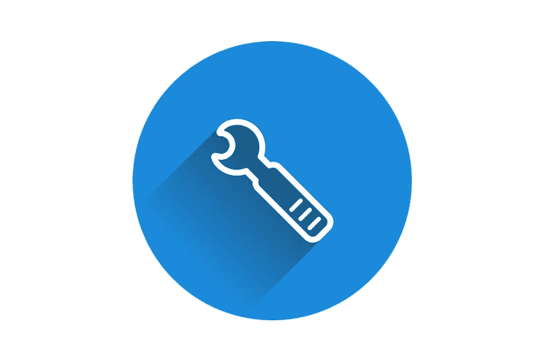

# 创建有效的网站维护计划

> 原文：<https://medium.com/visualmodo/creating-effective-website-care-plans-b2e0fd02e821?source=collection_archive---------1----------------------->

今天，拥有一个网站意味着要像对待生活中的其他事情一样去关心它。你的网站需要更新以便有效运行。不幸的是，大多数网站所有者在一般网站维护上吝啬，反过来，他们的网站也没有带来预期的业务。了解如何创建有效的网站维护计划。

运行你的网站而没有一个有效的保养计划就像希望你的车不需要换油一样。事实上，如果没有适当的维护，你将无法长时间驾驶你的车，你的网站也不例外。为了确保它给你的企业留下最好的印象，它应该看起来也是最好的。

# 不要设置它并忘记它

如果没有适当的关心和维护，你最终会得到一个低于标准的网站，无法完成工作。当你的领导访问你的网站，发现有什么问题，然后他们不会逗留。因此，你会失去生意。像死链接和宕机这样的问题会给你的网站留下负面印象。

# 创建有效的网站维护计划的好处

*   良好的网站性能

你的业务依赖于你的网站的表现。你会有潜在的客户，他们想通过你的网页注册或订阅你的产品和服务。因此，如果你的网站经历停机，你将失去这些有利可图的客户。这就是为什么你的网站应该被维护，以确保所有的插件和软件是最新的，并按预期运行。

*   正确的托管

你对主机的选择将决定你网站的加载速度。你不希望你的网站访问者经历更长的加载时间，因为这将使他们离开你的网站。根据分析，网站访问者在离开页面之前会等待五秒钟。有了有效的网站维护计划，你就可以确保你的网站加载速度快，并且永远吸引你的访客。

*   网站改进建议

你总是希望你的网站在任何时候都处于最佳状态。如果你不是专家，很难指出需要改进的网页元素。然而，有了网络保健计划，你就不必担心这一点。如果有的话，你的网站将会得到[专业人士的持续关注，以确保](https://visualmodo.com/10-essential-service-businesses-to-start-in-2020/)它在任何时候都在相应地工作。

# 网站维护计划:现在你知道了

你的网站架构不仅会破坏它的外观，也会破坏它的功能。为了防止这一点，重要的是要制定有效的网站维护计划，使您的网页保持运行，同时确保您的网站处于最佳状态。

好消息是，有了这些计划，你不必在钱包里留下一个凹痕。它们足够大，可以满足不同预算的不同网站所有者。他们同样可以定制，以满足您的需求。选择最吸引你的，就看你自己了！