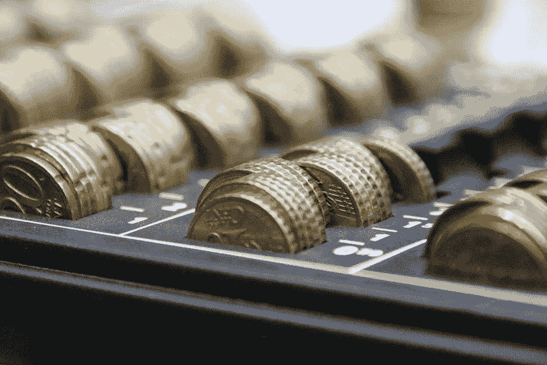

# 加密货币交易 4 步帮你带来利润

> 原文：<https://medium.com/visualmodo/cryptocurrency-trading-4-steps-that-will-help-you-to-bring-profit-89c6e600e2a5?source=collection_archive---------0----------------------->

如今，人们对一种新型虚拟货币——加密货币议论纷纷。他们中的一些人喜欢使用加密作为支付方式，他们中的一些人用它来赚钱。今天，我们将讨论让您的交易更容易、更赚钱的步骤，尤其是如果您是一名新人，对加密货币交易利润市场一无所知。

所以，首先，我需要告诉你，每一个成功的过程都需要以一种非常好的方式来组织。

这就是为什么我建议每个初学者遵循最重要的步骤。所以，我们开始吧！

# 第一步:加密货币交易利润

每个过程都需要一些准备和知识，密码交易也不例外。你需要做的第一步是获得一些关于加密市场和交易的额外知识。有些交易者花了几个月的时间阅读、搜索和学习技术分析，但是大部分新手认为这不重要。但事实如此。

你需要知道你要去哪里投资，你想使用哪种加密货币交易方式。

# 第二步

一旦你掌握了密码交易的基本知识，并能解释什么是止损，你就可以开始下一步了。这里你需要选择你要交易的交易所。

我假设你没有很多交易经验，这就是为什么最好从现货交易开始，使用币安。当然，如果你发现更好的，你可以选择另一家交易所。

# 第三步:加密货币交易利润

所有的加密专家都认为，将所有的加密资产存储在加密交换账户上是非常危险的。睡个好觉，不用担心你需要的资产，找到最好的加密钱包。

如果你只是想持有你的资产，你可以购买硬件钱包。这种钱包是最安全的。如果对你来说，最好有一个方便的钱包经常发送和接收资产，你可以下载移动和非托管的加密货币交易钱包。

# 第四步

现在你全副武装，准备开始交易了。如果你认为你有足够的经验和知识自己交易。所以，我可以祝你在加密货币交易中一切顺利！

但是，如果你有一些疑问，它会更好地使用加密信号通道。如果您选择合法渠道，您将收到高质量和高利润的加密预测。我真的希望你能找到最适合你的交易方式。此外，我会喜欢这个获得额外金钱的过程。

祝你好运！