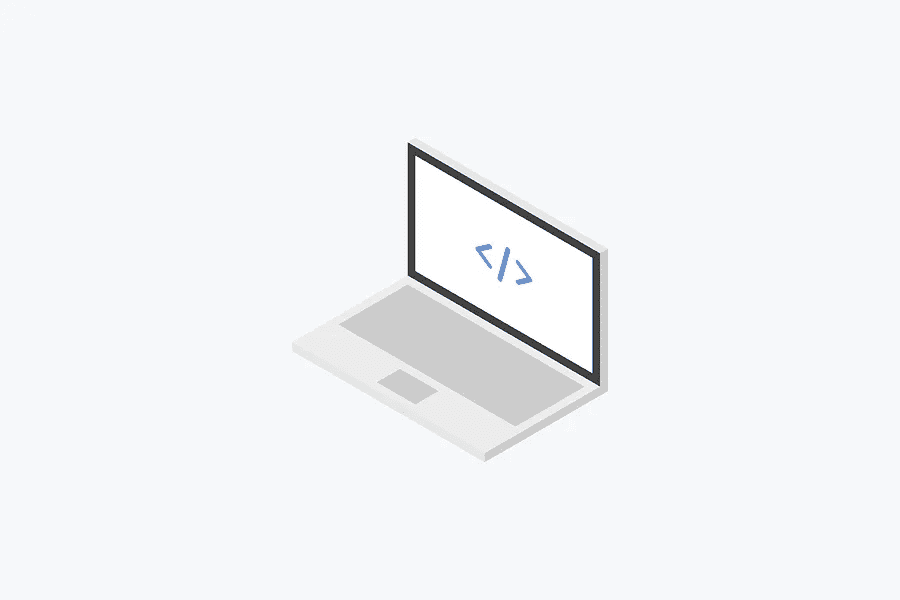

# 网站所有者的 CSS 基本提示

> 原文：<https://medium.com/visualmodo/css-basic-tips-for-website-owners-9f1a59986dab?source=collection_archive---------1----------------------->

每个拥有网站的人都会遇到这样的情况，他们需要改变代码行、风格、颜色或空间。这并不意味着你需要成为一名 web 开发人员，像专业人员一样编写 JavaScript 和 PHP 函数。此外，你将需要修补 HTML 和基本的 CSS，这是任何网页的基础，不管是不是 WordPress。在这篇文章中，你会学到一些基本的 CSS 技巧，每个网站所有者都需要知道。

CSS(层叠样式表)决定了你网站的布局和视觉效果——颜色、字体、页边距、大小等等。有了一些 CSS 基础知识，你就可以改变所有页面和文章的外观，或者专注于单个部分，然后[进行一次性的改变](https://visualmodo.com/change-link-underlines-webpage/)。

# 选择器、类和 id

在 CSS 中，一切的基础是一个选择器。简单地说，它是一个缩写，告诉代码以什么为目标。你可以用一个 p {}来定位网站上所有的单个段落。(适用于花括号之间的选择器的任何代码。)在很多情况下，这些元素选择器会与你用来构建网页的 HTML 标签对齐(比如 p {} targeting

或者 h2 {} and

## )。

之后，你有课。这些是你(或者你的主题/WP 本身)定义的特定类型的选择器。如果您希望只针对帖子的 H1 标题。另外，你可能有。后标题{}。CSS 类选择器位于选择器本身前面的点/句号旁边。这些用于针对站点范围的元素，而不是基础元素，如简单的 H1。请注意，基本选择器没有点或其他指示符，这意味着它们是基本 HTML。

CSS 中的 id 和一个类一样工作。所以，除了两个小的区别。在选择器前面有一个#表示它们，它们是为一个特定的实例命名的。

# 如何在你的站点上添加基本的 CSS？

如果你没有太多(或任何)CSS 经验，那也没关系！有了对基本面的基本了解，你可以完成很多事情。此外，有了 Jetpack 的自定义 CSS 功能，你就不需要担心修改主题文件或破坏你的网站。

1.  首先，在 Visualmodo WordPress 主题上，进入 WP >仪表板> Visualmodo >主题选项>自定义代码> CSS。
2.  其次，要启用自定义 CSS，导航到站点仪表板中的 Jetpack > Settings > Writing。因此，向下滚动到主题增强部分，打开增强 CSS 定制面板选项。
3.  最后，要添加 CSS，请转到外观>自定义>附加 CSS。在这里，您将键入您想要添加的实际 CSS。此外，CSS 编辑器使用颜色使区分选择器、属性和值变得更加容易。

# CSS 基本技巧:排版

一个最常见的 CSS 样式用于你的网站排版或字体。因此，要更改标题的颜色和大小(标题 1、标题 2 等)。)在整个站点中，使用此代码并根据需要修改值:
h1 {
color:# ff 5733；
font-size:36px；
}

其次，上面的例子修改了标题 CSS 基本提示 1。如果您想更改不同标题的颜色和字体大小。因此，像标题 3 一样，将 h1 选择器与 h3 交换，并对大小和颜色进行适当的调整:
H3 {
color:# ff 5733；
font-size:25px；
}

另外，要改变多个标题的颜色，用逗号分隔选择器:
h1，h2，h3，h4，h5，h6 {
color:# ff 5733；
}

最后，要让你所有的标题都大写，为了更有冲击力，用这个:
h1，h2，h3，h4，h5，h6 {
text-transform:大写；
}

# *   的功率

*   又名链接列表，当与

# 使用

CSS 的最大优势之一是使用

来实现样式的完全灵活性。此外，与不同，后者的内容被‘锁定’在

| 的单元格内。可以肯定地说，使用和适当的样式，大多数布局都是可以实现的，除了大量的表格内容。

 |