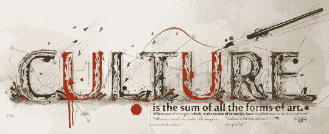
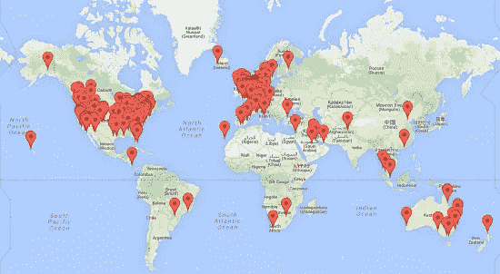

# 网站中的文化差异

> 原文：<https://medium.com/visualmodo/cultural-differences-in-websites-9f0ed8426ebe?source=collection_archive---------0----------------------->

在做网站评论时，我们会查看来自世界各地的网站。我们的大多数客户来自美国和欧洲，但我们也有来自澳大利亚、南非甚至中国的客户。不同国家的网站在颜色、图片、导航和网站结构的选择上有很大的不同。这让我想知道:这些差异是由于文化偏好吗？查看网站中的所有文化差异。

# 为什么文化差异很重要？

随着网络的发展和网络商店瞄准国际市场，文化差异和偏好在网页设计中变得非常重要。在一个国家设计的网页对其他国家的潜在客户同样有吸引力吗？如果你的商店设计与他们本国的网站风格相似，这些国际客户会更有可能购买你的产品吗？

很可能 Yoast.com 的设计吸引了西方观众，他们认为我们的头像有趣或有创意，而在中国或日本，我们的设计被认为是幼稚和没有吸引力的。在这种情况下，我们可以改变我们的设计，以便在远东做大生意…

# 我们自己研究的结果

大约两年前，我们做了一些研究，比较了美国和荷兰的网站。我们进行这项研究是为了启发我们设计自己的主题。我们决定将我们的关注点限制在美国和荷兰的牙医网站上(原因我将在这里不讨论)。

我们研究最突出的成果是使用了图片。在美国，一个网站有一个所谓的“微笑画廊”是很常见的，里面有许多照片，展示了满意的顾客漂亮的白牙。在荷兰(牙齿漂白根本不常见，事实上我们这里都有棕色的牙齿)这样的画廊是不存在的。这种文化差异只适用于牙医网站，尽管人们可以想象这种文化差异也可能出现在其他分支机构。

我们的研究还显示了实际设计和导航元素的差异。在表 1 中，我们展示了牙医网站中的一些内容和导航元素。我们显示了某个元素出现的地点的百分比。我们比较了美国牙医和荷兰牙医的网站。

表 1:牙医网站内容和导航元素的差异(美国与荷兰)美国荷兰社交媒体 50，025，7 推荐 41，525，7FAQ32，135，0 开放时间 67，979，9 搜索功能 13，224，8 页脚栏 65，148，1 标题 79，279，5 幻灯片放映 25，517，6 电影 15，16，5 网站数量 106433

我们的研究结果显示，美国网站更频繁地展示推荐，并在更多情况下在其网站上使用社交媒体。在荷兰网站，开放时间显示得更频繁，网站的搜索功能在更多情况下出现。美国网站通常在他们的网站上有幻灯片和电影。标题在这两个国家都同样使用，但是在荷兰的网站上通常没有页脚栏。这些网站上的差异很可能是由于美国和荷兰的牙医和牙科保险之间的差异。

颜色当然是主观的。但是从我们分析过的所有网站来看，可以肯定地说，蓝色和蓝绿色，加上白色背景，通常都是两种颜色

美国和荷兰的网站。主要区别在于网站上设置的情绪。荷兰网站有更商业化的方法，而美国网站更关注位置或快乐、微笑的人的照片。

# 从科学的角度来看

在一些科学搜索引擎(谷歌学术、皮卡塔)中快速搜索，很快让我对这个问题的科学观点有了一个相当好的想法。许多研究试图用 Hofstede 的模型来解释网页设计、内容和导航中的文化偏好(如 Callahan，2006)。在 Hofstede 的文化模型中，区分了五个维度，世界文化沿着这五个维度变化(都很有趣，但有点超出了本文的范围)。例如，使用 Hofstede 模型的研究表明，在更个人主义的国家(美国、澳大利亚),网站显示更多的个人图片，而在集体社会(例如中国),则显示更多的群体图片。与韩国或中国的网站相比，美国的网站也显得更加个性化(赵，梅西，墨菲和方，2003)。研究还表明导航按钮(有或没有文本)和网站结构的偏好存在差异(Lo & Gong，2005)。到目前为止，我还没有发现任何研究能令人信服地将文化差异与购物行为的差异联系起来。

这仍然是一个真正的问题:文化上不同的设计真的会导致更少的转化吗？如果我在我的网站上放更多的群组图片，我的网站在中国会转换得更好吗？你肯定会认为这会增加你的销售额。但是科学证据在哪里呢？如果你们中的任何人知道这样的研究是否已经执行，请务必让我知道！

# 我该拿这些信息怎么办？

如果你专注于当地市场:确保你的网站吸引当地公众。那就够了。仅仅生活在你当地的市场就已经给了你足够的专业知识去调查你的网站是否真的吸引了你的观众。如果你不确定:问问你的听众！

如果你的目标是国际公众，就像我们在 Yoast 所做的那样，明智的做法是考虑对你的网站进行一些修改，以使其对国际市场更具吸引力。我们自己的研究结果和科学文献暗示了网站之间文化差异的存在。因此*将你的内容翻译成不同的语言并根据文化提供不同的导航选项图片是有利可图的。将我们的插件页面翻译成日文，将我们的头像改成漫画风格的*可能是 Yoast 下一个伟大的步骤(对 [Erwin](https://yoast.com/about-us/erwin-brouwer/) 也是一个不错的挑战)；-).**

*但在你去学习中文之前，我会对这个话题做进一步的调查，并希望在几周内告诉你更多关于文化对转化和销售的影响。*

*来源:[https://visualmodo.com/](https://visualmodo.com/)*