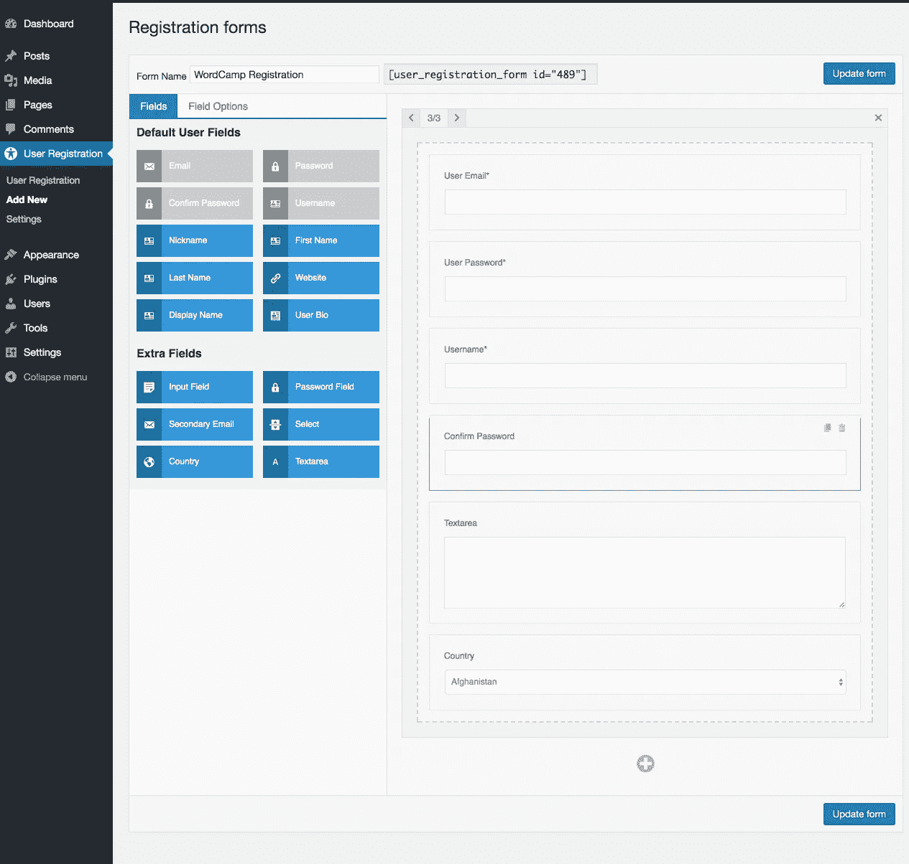
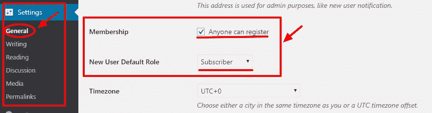
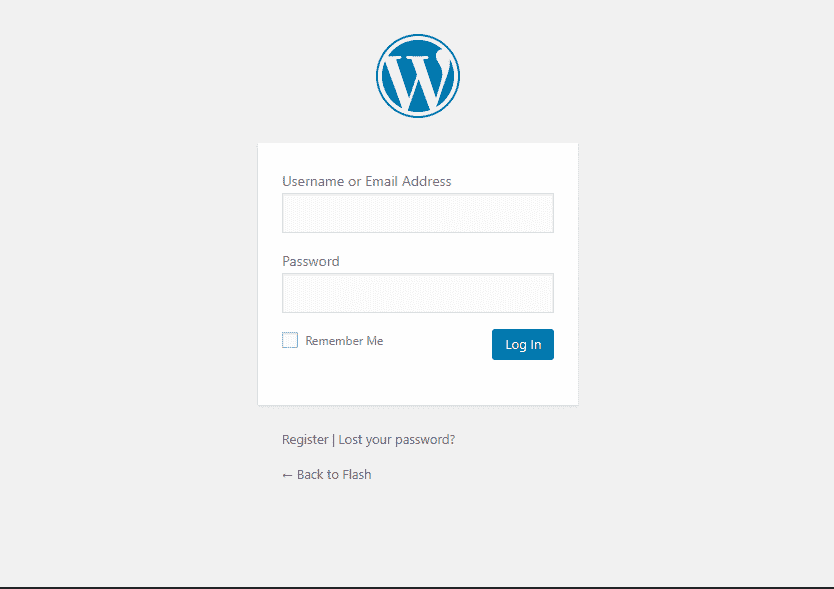
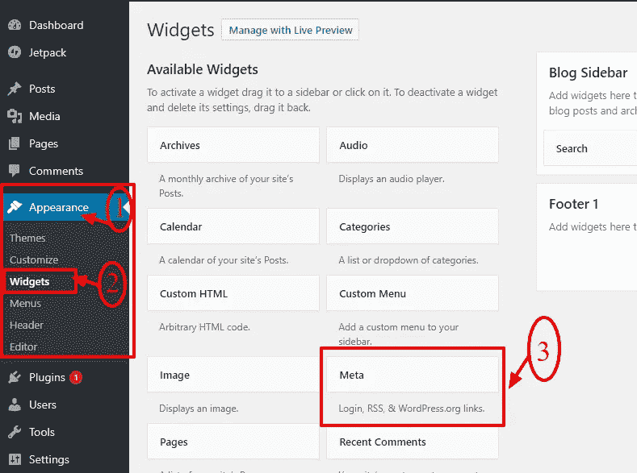
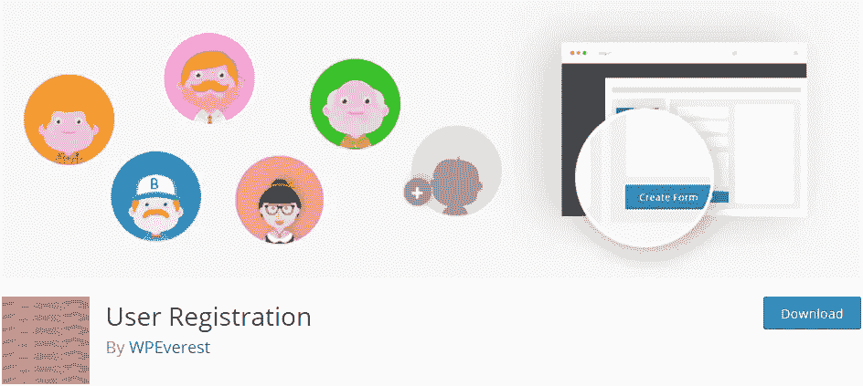
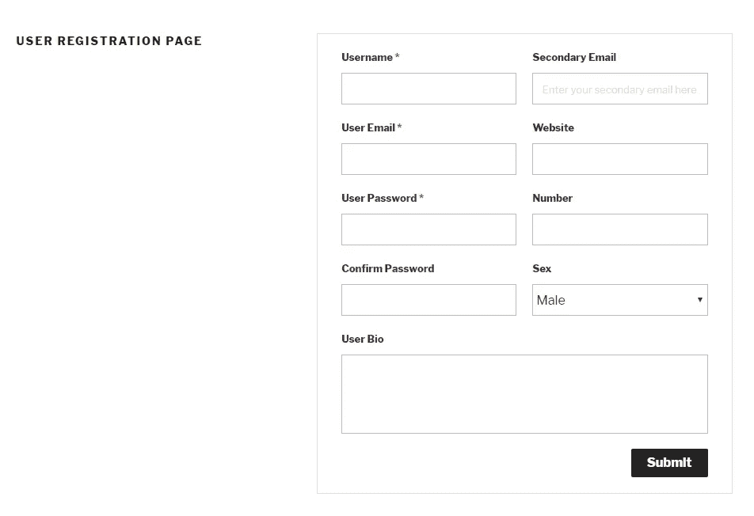

# 如何创建一个漂亮的 WordPress 用户注册表单？

> 原文：<https://medium.com/visualmodo/custohow-to-create-a-beautiful-wordpress-user-registration-form-f9dd3a7a81cd?source=collection_archive---------0----------------------->

## 变得容易

WordPress 用户注册是每个 WordPress 网站或博客必须具备的基本功能之一。鉴于网站成长或成功非常重要；WordPress 已经默认提供了会员/注册选项。然而，默认选项不够灵活，无法让您创建一个理想的漂亮而强大的用户[注册](https://visualmodo.com/)表单。

启用默认的 WordPress 注册选项后，你(作为网站所有者)可以收集用户名和用户电子邮件地址，而注册用户作为活跃用户不能做任何事情。因此，WordPress 专业人士已经想出了多种解决方案来轻松创建定制的**用户注册表单**。这篇文章是关于创建这种用户注册表单/页面的完整教程，尤其是对于初学者。

# 1.什么是 WordPress 用户注册？

简单来说，用户注册对于 WordPress 提供的会员选项来说是一个非常有用的功能。它允许您的网站访问者 ***在您的网站上“注册*** ”为“订户”或任何其他用户角色。作为网站所有者，您可以设置为“新注册用户”提供什么*用户角色*。

用户注册的一般逻辑是*在你的网站上为你的忠实网站访客提供一些特定的空间，让你的网站更具互动性和用户友好性*。毫无疑问，你的网站访问者是你最有价值的资产，他们的意见最重要。因此，为他们提供一个独立的用户空间肯定是值得的。🙂

通过用户注册，你可以为你的站点访问者提供一种站点的会员资格，并且允许一些特定的行为(评论文章，投稿，评论等等)。)

此外，您可以收集用户的电子邮件，并向注册用户发送一些有趣的内容。它可以是一份简单的欢迎他们加入你的网络的简讯，一些折扣券或节日优惠，关于你最近产品发布的信息或任何有趣的事情。这样，它有助于加强你和你的网站用户之间的联系，并发展你的在线业务。

这还不是全部。它有几个好处。在下一部分，我将会解释为什么 WordPress 用户注册对你的博客是至关重要的。

# 2.你为什么想允许用户在你的 WordPress 网站上注册？

如上所述，允许用户注册的最根本原因是允许 WordPress 站点上的会员功能。但这还不是全部。您可以使用几乎强大的用户注册表单做更多的事情，但是这些表单需要自定义创建。默认的[选项](https://visualmodo.com/)不会让你创建一个理想的完整的用户注册表单/页面。

我们将在接下来的部分中讨论如何创建定制的用户注册表单，所以让我们在这里快速检查一下创建强大的用户注册表单/页面的好处。

## I)扩大您的电子邮件列表，准备好有效的营销工具:

有了一个精心设计的漂亮的自定义用户注册页面，你可以吸引你的网站访问者，包括新的访问者来注册你的网站。随着您的电子邮件列表的增长，您可以将其用于营销目的。创建漂亮的时事通讯，并将其发送给注册用户。你将同时进行拓展和推广。

## ii)吸引用户，增加互动，规划成功

一个理想的用户注册表单不仅为你收集用户信息，还为注册用户留出一个专属空间。我指的是用户资料页面。他们可以创建自己的用户资料，管理他们的详细信息，并尽可能地为您的站点做出贡献。通过这种方式，用户会更加关注你的网站，互动增加，最终有助于你网站的成功。

## iii)更好地了解你的网站访问者并改进你的网站

使用自定义用户注册表单，您可以创建多个字段并收集更多用户信息。这样收集的信息有助于你更好地了解你的网站访问者，关于他们的兴趣、习惯等等。了解了你的网站最吸引他们或者他们不喜欢什么之后，你就可以对你的网站进行改进了。

## iv)非常适合访客博客

如果你想在你的网站上贡献一些内容，用户注册是一个理想的方式。您可以向感兴趣的用户提供“参与者”用户角色，他们可以通过该角色提交内容。

# 3.如何启用 WordPress 用户注册(默认)？

做完了基础，现在让我们开始步骤。创建 WordPress 用户注册表单/页面最基本的步骤是在 WP 设置中启用这个功能。虽然有[功能](https://visualmodo.com/)的限制，但是启用这个选项来创建*自定义用户注册表单*也是很重要的。换句话说，你应该启用这个“默认特性”来让任何自定义插件工作。

那么，让我们从步骤开始。

首先，去 WordPress 仪表盘，找到设置。进入“设置”中的“常规设置”,你会发现如下所示的会员选项。

***WP 管理面板* > *设置* > *通用。***

*如上图所示，您必须勾选“任何人都可以注册”选项。在下面，您可以看到“新用户默认角色”，默认情况下是“订户”。如果你愿意，你可以改变它。但是最好保持原样，因为“订户”被认为是新用户的最佳用户角色。*

*然后，向下滚动并点击“保存更改”。*

*一旦启用此选项，这将在您的 WP 登录页面上添加一个“注册”链接(例如*[www.yoursite.com/wp-login.php](http://www.yoursite.com/wp-login.php)*)。您可以在下面的动画中看到默认用户注册选项是如何工作的。*

正如你在上面看到的，现在用户可以输入用户名和电子邮件地址并注册到你的网站。因此，如果您希望注册表单上有更多的字段，您需要创建一个定制的用户注册表单。

此外，还有一个问题。要找到默认注册选项，用户必须找到你的 WP 登录 URL。对于用户来说，这看起来是一个很无聊的任务，或者如果你的站点访问者不知道如何找到登录页面，这是一个很困难的任务。

嗯，有一种方法可以使用“meta”小工具在网站前端显示“注册”链接。请按照下面给定的步骤在前端有链接。

首先，进入 WP 管理面板的**外观**菜单。然后，点击“[”**Widgets**](https://visualmodo.com/)”。然后，你可以看到，你可以看到所有可用的 WordPress 小部件的列表，包括' **Meta** '小部件。找到元部件。

***WP 管理面板* > *外观* > *小部件。***

接下来，将小部件拖放到 WordPress 站点上的小部件就绪区域。

现在你可以进入你的网站前端，如下图所示。你现在可以在你的站点上看到元内容(当我把小部件放在页脚时，在页脚)。

你可以在你的前端网站上显示注册链接，但是它最终会把你重定向到带有基本注册表单的 WordPress 登录页面。

因此，下一节将向您介绍如何创建一个漂亮且功能丰富的自定义用户注册表单的完整教程。

# 4.如何在 WordPress 上漂亮地创建自定义用户注册表单/页面？

感谢世界各地的 WordPress 爱好者，他们给了每个 WordPress 问题简单的解决方案。像任何事情一样，有很多 WordPress 注册插件可以让你创建漂亮的 WordPress 用户注册表单。

在网上众多可用的插件中，我们在这里选择了最好的 WordPress 用户注册插件'**用户注册'**。

这是一个令人惊异的 ***自由拖拽和*** 拖拽 ***注册表单生成器。它不仅仅是一个注册插件，也是一个 WordPress profile builder，让用户能够在你的网站上以一种简单而漂亮的方式创建和管理他们的用户资料。最值得注意的是，它非常用户友好和简单。***

**现在，我们将讨论如何使用该插件创建优雅的前端自定义用户注册表单。**

首先，安装插件。要安装插件，请转到“插件”和“添加新插件”。然后搜索*‘用户注册*’。插件可以直接从官方 WordPress 知识库安装。

一旦出现结果，通过 *WPEverest* 找到“用户注册”并点击**立即安装**。

***WP 管理面板* > *插件* > *新增。***

接下来，你必须激活插件。点击**激活**按钮。

接下来，您将被重定向到插件页面，在这里您可以看到来自用户注册插件的“欢迎”消息。如下图所示，可以看到两个按钮:**‘安装用户注册页面**’和**跳过设置’**。

第一个按钮将带您进入 ***自动插件设置过程*** ，包括安装插件提供的两个示例用户注册页面。它进一步带你一步一步地进入插件 ***设置*** 和 ***创建用户注册页面*** 。如果你想简单的配置插件，你可以点击第一个按钮。

如果您点击'**跳过设置**'，您需要手动逐个探索插件设置和功能。

让我们采取一种简单的方法，单击第一个按钮。然后，它会将你重定向到插件**设置**页面，如下图所示。

# A.用户注册插件设置

**通用选项**有许多主要的插件设置。

*   ***默认用户角色:*** 您可以选择默认用户角色为“订阅者”或“贡献者”，或者“作者”、“编辑”或“管理员”。订户通常用于新用户。
*   ***用户登录选项:*** 有三种用户登录选项:1。注册后手动登录。2.注册后自动登录。3.注册后的管理批准。
*   ***重定向网址:*** 您可以在此处输入用户注册成功后的重定向路径。比如:【www.yoursite.com/my-account】T4
*   ***注册网址:*** 您可以在这里输入用户注册页面网址。例如:[www.yoursite.com/registration-page](http://www.yoursite.com/registration-page)
*   ***阻止仪表板访问:*** 您可以在此选择阻止仪表板访问的用户角色。
*   ***启用强密码*** :此选项启用后可帮助您的站点用户在注册过程中选择强密码。
*   ***表单提交按钮标签*** :表单提交按钮标签默认为“提交”，可以修改为“注册”。

另一部分是**‘我的账户端点’**。您可以通过此选项更改特定的页面 URL 端点。或者您可以简单地保存默认端点。

插件设置中的另一个选项卡是“**集成**”。

您可以从这里插入 [Google reCAPTCHA](https://www.google.com/recaptcha/) 站点密钥和秘密密钥。添加 Google reCAPTCHA 有助于防止垃圾非人类机器人进入您的网站。

您几乎完成了插件配置设置。现在，您可以开始创建自定义用户注册页面了。但在此之前，您可能希望查看通过自动安装过程添加的注册页面示例。

转到 WP Dashboard 中页面菜单中的所有页面。在那里你会看到插件自动添加的两个页面“我的帐户”和“注册”(通过自动设置过程)。

***WP 管理面板* > *页面* > *所有页面。***

为了检查样本页面的外观，您只需点击页面下方的“**查看**”链接。

下面是默认注册表单在 2017 主题下的外观。注册表单的设计通常取决于您站点上的主题。

如果你想要简单的东西，你可以在你的 WP 网站上简单地使用默认的用户注册表单和页面。如果您需要多个字段和更多选项，您必须自己创建一个表单。所以，让我们开始如何使用这个插件创建一个自定义的用户注册表单。

# B.创建用户注册表单

为了创建一个新的自定义用户注册表单，你需要在 WP 管理面板的用户注册中选择“新建”。用户注册插件为创建新表单提供了一个高度直观、干净和[用户友好的](https://visualmodo.com/)界面。

***WP 管理面板* > *用户注册* > *添加新。***

现在，您可以看到如下图所示的页面。首先，给你的新表单起一个名字(比如用户注册)。在左侧，您可以**默认用户字段**和**额外字段**。并且，在页面的右边有一个**拖放表单编辑器**。现在你可以简单地*拖拽所需的字段*到表单编辑器，因为完整的界面是拖拽平台。

添加完所有必填字段后，您只需点击**创建表单**按钮。然后，插件会提供一个表单**短代码。**现在你可以在你网站的任何地方使用短代码，并显示你刚刚创建的表单。

# C.创建多列多行网格状表单

该插件充满了惊人的功能，包括创建网格状多列多行注册表单的能力。您可以创建一个最多有 **3 列**和**无限行**的表单。

要添加列，只需单击每行顶部显示的箭头 **(3/3)** 。要添加行，只需点击最后一行后显示的 **+(加号)**按钮。一个表单中**默认字段**只能使用一次，而**额外字段**可以使用任意多次。下面是 Twenty 主题中用户注册表单的前端预览。

看起来简单又优雅不是吗？

# D.探索字段选项

除了广泛的表单设置之外，该插件允许为每个字段提供大量的字段选项。

为了自定义一个字段，您必须通过单击来选择它。一旦选中，新标签**‘字段选项**’将打开，您可以在其中编辑详细信息。一旦您更改了所有字段的详细信息，您可以点击**更新表格**。

# E.如何以及在哪里显示新用户注册表单？

现在我们已经把 ***新*** 用户注册表单准备好了。我们有短码了，接下来怎么办？这里，我们将讨论如何以及在哪里显示表单。由于插件使用短代码方法，你可以很容易地在任何地方使用它，包括窗口小部件区域、页面和帖子。

为了在帖子/页面中显示插件，您需要打开帖子/页面编辑器。 ***WP 管理面板* > *页面* > *添加新/ WP 管理面板* > *帖子* > *添加新***

在帖子/页面编辑器中，您可以看到一个新按钮**“添加注册表”**添加到媒体按钮旁边。您可以简单地点击按钮，并选择您想要添加到该页面的表单。点击“添加表单”。并发布页面。现在，您可以在网站菜单、自定义菜单或 widget 区域的任何位置添加页面。

# 5.包扎

在这篇文章中，我试图解释你应该知道的关于 WP 用户注册的一切。希望这是有帮助的。如果你还有任何疑问，问题或任何事情，请随意写在下面的评论框中。