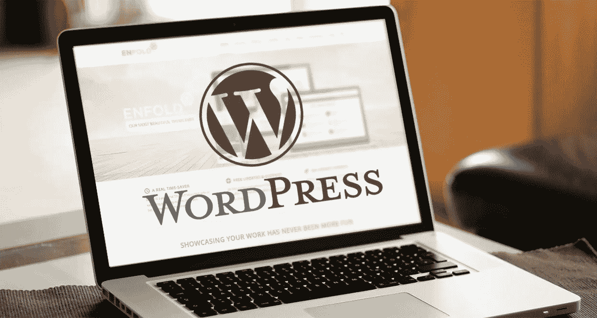

# 自定义 WordPress 开发-塞翁失马焉知非福

> 原文：<https://medium.com/visualmodo/custom-wordpress-development-a-blessing-in-disguise-acc6620bda22?source=collection_archive---------0----------------------->

自定义 WordPress 开发不是一个无法理解的技术术语。它和其他任何与“定制”相关的术语一样简单。WordPress 已经有了一些模板，但是只有少数几个可以定制。这些定制的设施有助于根据特定的需求和愿望设计和开发您的网站。

# 自定义 WordPress 开发

# 重要

在这个残酷竞争的时代，独特而有吸引力的网页布局是必不可少的。定制网站可能是你的优势，对你有利。定制经常被轻视或者被认为是一种选择，但是定制也有助于 SEO 排名。如果你的 WordPress 网站有一些你的竞争对手没有的东西，那么它会对你有利。它是通过牢记业务需求而特别创建的。

此外，定制确保了由于简单模板而可能导致的安全问题。简单主题的代码不利于安全，从而导致黑客攻击。具有定制知识的 WordPress 开发者可以很容易地创建强大的、独特的、不可破解的平台。

此外，它给了你在任何你想做的时候进行改变的自由。因此，你可以不断尝试什么适合你，什么不适合。

# 优势

任何定制的东西都会给你近乎完美的体验，定制的 WordPress 开发也是如此。[定制 WordPress 开发](http://www.kodematix.com/wordpress-development/)有很多优势。这里仅举几个例子:

WordPress 开发的定制可能对拥有多个网站的企业有用。这将节省开发时间。

如上所述，定制的 WordPress 网站将帮助你优化搜索引擎。它会给你定制的工具，让你的网站在搜索引擎上排名靠前，节省你的时间和成本。

这取决于你的创造力和[专业素养](https://visualmodo.com/)。你的网站可以随心所欲地定义你。有了 WordPress 的主题和模板，你可以添加一些定制的东西，向人们展示你对你的业务的观点。

定制的 WordPress 网站很容易管理，你不需要专业的帮助。你可以从你遇到的任何一台电脑上获得完全的控制权。

内容是王道，就像其他网站在 SEO 上排名一样，WordPress 网站也要求内容在 SEO 上排名。通过定制，您可以管理内容，如写作、编辑、添加图形和图像、设计、添加链接等。只要对你可行，你可以随时更新内容。

插件:插件是对定制 WordPress 开发有主要贡献的程序。这些插件可以让你包含照片库、视频播放器、会员程序、购物车等等。世界各地的[开发者](https://visualmodo.com/)社区以很低的成本共享了许多插件，这些插件可以很容易地集成到你的站点中。

所以，如果你觉得你现有的插件不能胜任工作，定制的应用程序和功能可以很容易地被开发和集成。

# 结论

定制化的 WordPress 开发对 WordPress 开发者以及对商业有创造力的人来说是一种变相的祝福。网站可以像你希望的那样有创造性和吸引力，你需要做的就是找到正确的自定义 WordPress 开发者。

## 丹尼尔·克拉克

**作者简介**:是一名网页设计师，近几年来一直在一家最好的网站设计公司工作。他想分享网页设计和开发相关的博客内容。