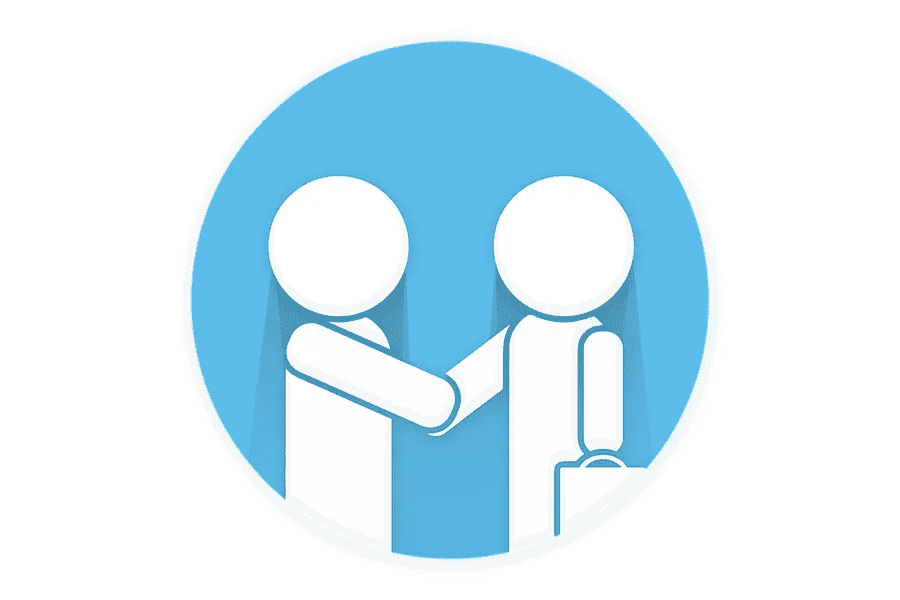

# 留住顾客是增加利润的最佳和独特策略

> 原文：<https://medium.com/visualmodo/customer-retention-the-best-and-unique-strategies-to-increase-profits-bfbb8e4b638?source=collection_archive---------0----------------------->

几年前，也许几个世纪前，顾客和企业之间的关系一直是富有同情心的。虽然近几十年来关于传统或现代营销的讨论发生了很多变化，但有一点仍然可以被认为是一个永久的规律，那就是始终不变。在这篇文章中，你将看到增加利润的顶级客户保持策略。

这个定律在市场营销和商业关系的讨论中总是稳扎稳打。我们所说的方向有两个主要部分，许多企业通常只满足于第一部分。但关键是，虽然第一部分很重要，但也有成功的赚钱企业专注于第二部分。下面，我们将向您简要介绍这两个部分:

# 第一部分:吸引顾客

你的业务是什么，以及你如何与你的听众交流，都无关紧要。无论是现代还是传统商业，企业对客户(B2C)营销，还是联盟营销，你的业务是第一规则，事实上，是你吸引客户的第一个重要因素。

事实上，这是企业开始盈利的第一步，也是最重要的一步。要赢得新客户并促使他们购买你的产品和服务，有几项任务、策略和技巧必须根据你的业务类型正确实施。

例如，许多公司、商店，甚至自由职业者都以特别折扣开始，鼓励人们成为他们的顾客。许多这些企业成功地用同样的方式将自己介绍给观众，然后将他们中的很大一部分变成了固定的忠实顾客。

# 第二部分:顾客保留策略

如上所述，在现代商业中取得成功的第一步，尤其是网上商业，是找到一种方法向你的观众介绍你自己，并把他们变成顾客。但这只是战斗的一半，正如前面提到的，许多企业满足于此，并把所有的精力、精力和金钱都花在这上面。然而，我们在本节中解释的第二部分是一个繁荣企业的重要部分，甚至可能是客户获取问题中更重要的部分。

如果你的重点是留住客户，并鼓励他们成为你的常客，确保你采取了可能取得成功的最重要的一步。这种说法背后有许多原因，也许以下是一些最重要的原因:

# 什么是客户维系，为什么它如此重要？

既然我们对客户获取和客户保持之间的区别有了更好的理解，在本文中，我们将更深入地探讨这个话题。客户保留是一套业务运营和战略，其主要目标是增加之前与这些业务有过互动的客户数量。抛开上面提到的好处，寻找新客户总是很难，而且成本很高，这也是为什么每个公司都喜欢把现有客户变成老客户，而不是依赖新客户。

*   专业客户服务

通常很容易说，每个企业都是以客户为中心的企业。这可能会导致许多企业继续假装接受错误的灌输，这是许多公司和企业破产的一个主要因素。所以，还是认真对待这个问题比较好。从谈论和提出客户服务的想法到付诸实践。

在这类问题中，你的第一个问题应该是，如果客户出于任何原因请求支持你的任何产品或服务，你应该怎么做？如果他们的问题没有按照你通常的指导方针解决怎么办？这正是你需要管理的。

你提供客户服务(售前和售后服务)的主要目标是让他们满意，并对他们产生信任感。为了实现客户满意度，您必须根据标准框架来定义您的客户服务。以下是一些帮助你开始的基本提示:

## 避免等待顾客:顾客保留策略

在与企业讨论支持时，最糟糕的经历之一就是等待时间太长，并且没有收到运营商的明确回应。尽管如此，许多公司仍在这个问题上苦苦挣扎，由于他们在这方面的不足，他们很容易惹恼他们的客户，错过许多机会。你需要确保你的企业不存在这个问题。许多客户通常讨厌听到“等我把您连接到相关部分”这句话因此，最好是提前向客户提供每个部门的数量或支持，或者通过关键支持力量尽可能多地引导客户。信不信由你，关注这样一个看似无关紧要的问题，对用户的潜意识是有 100%的作用的。

*   使用联系反馈

反馈是当今改善企业的最佳方式之一。说到留住客户，你需要特别注意从联系人那里获得反馈。尤其是有过向你购买经历的客户。当你的主要精力放在业务上时，你几乎把所有的时间都花在了业务上，这意味着你没有足够的精力去倾听和接受反馈。所以一定要提供一个桥梁或者一个有用的工具，尽快得到用户的反馈。您可以使用用户体验来更快、更智能、更有效地改善您的业务活动，并通过这种反馈了解重要的提示和赚钱方法。

同样重要的是，这样的行动对你的一部分和上述的好处。此外，这样做的好处是，你的观众和客户会对你感觉良好，他们的意见很重要，这种感觉值得尊敬。

*   利用社交媒体的巨大潜力。

如今，社交网络不再是一个单独的选择，而是企业的一个重要组成部分。尤其是如果你的企业是互联网企业，社交媒体将是你成功的跳板。我们已经在管理网站的其他几篇文章中讨论了社交媒体难以形容的重要性。但是在这里，我们要重申他们在讨论客户保持方面的重要性。

*   个性化内容:客户保持策略

在这一部分，我们想教你一个非常非常简单的技巧。但与此同时，你可能从来没有想过的优秀反馈。更不用说这个简单的技巧作为提高客户生产力的方法了。并且知道如何保存它们。

根据简单而可靠的科学研究。每一个人的名字，都将是那个人在文本中所能听到或看到的最美、最有影响力的声音。事实上，这种说法是一个科学事实，在所有人类中几乎都是一样的。那么，你认为有没有办法在商业讨论中利用这个事实呢？当然可以！但是怎么做呢？在你的网站或社交网络订阅者订阅你的网站简讯或订阅系统后。此外，你所要做的就是在你的通知系统中输入他们的名字。每次向该人发送通知或电子邮件时启动电子邮件。从那个人的名字开始。

总而言之，如果你能想出一些不寻常的东西。然后，他们必须重新考虑他们的立场。甚至可以说，这种方法可以成为与你的观众进行坦诚和双向交流的火花。

# 通过培训和信息留住客户

除了提供优质的产品和服务，成功的公司伴随着他们的联系人和客户，甚至在核心业务之外。当客户从你这里购买时，你应该将他们添加到你的培训和信息列表中。事实上，你是在鼓励这些客户继续追随你。甚至在你第一次购买之后，不仅仅是因为你的产品。而且还因为你提供的统计数据和有用的信息，而且对客户来说也同样迅速。变得坚定忠诚。

我们所说的训练和信息可以用在任何领域，尤其是新潮的东西。尽管如此，如果你选择与你的业务产品有某种关联的培训内容。服务和活动，然后您可以双击。被击中！

如果你只向你的老顾客提供上述几种。所以，让他们知道这些优惠是专门为像那个人这样的特定的人提供的。然后你就可以让顾客感觉良好，顾客正在购买。最后，成为常客会让你完全满意。

# 客户保持策略总结

尽管这些方法并没有涵盖客户维系方面的所有解决方案。所以，毫无疑问，如果你能在生意中做到这些。你会达到每个人都期待的结果。我们重申，留住客户远比吸引新客户更重要。留住老客户意味着让他们对你保持忠诚。以最好的方式推广你，最终为你的企业卖出更多！如果你的公司是以客户为中心的，并希望非常有利可图。遵循本文中的提示，并在您的行业中实施它们。