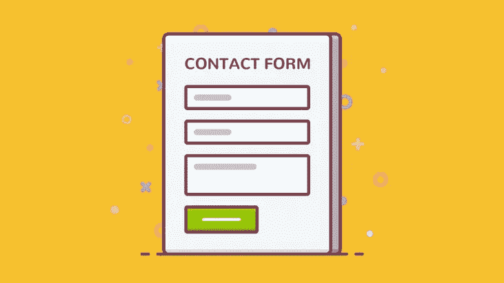

# 定制联系表单 7 WordPress 插件指南

> 原文：<https://medium.com/visualmodo/customizing-contact-form-7-wordpress-plugin-guide-4e1e4880b8b3?source=collection_archive---------0----------------------->

拥有超过 100 万活跃用户的 Contact Form 7 是 WordPress 最受欢迎的联系人表单插件之一。它们最大的缺点是你添加的现成表单看起来非常简单。令人欣慰的是，在你的 WordPress 主题中使用 CSS 可以很容易地设计 Contact Form 7 的样式。在这篇文章中，我们将在 WordPress 中定制联系表格 7。

Contact Form 7 允许你使用简单的 HTML 标记(它为你生成)创建多个联系表单。一旦创建好了，每个表单都可以通过在您希望表单出现的地方放置相应的短代码来快速部署；在页面、帖子或小部件区域。通过表单提交的邮件将被发送到插件设置中提供的电子邮件地址，垃圾邮件将通过支持 CAPTCHA 和 Akismet 来打击。

联系表 7 非常简单，似乎任何人都可以有效地使用它。造型也是为了简单。但对某些人来说可能太简单了。默认情况下，Contact Form 7 插件不会设计其表单的样式。他们拥有的任何样式都是 WordPress 主题样式表中默认样式的结果。

# 基本联系方式

不幸的是，这种形式虽然简单灵活，但可能不如网站上的其他元素设计得漂亮。让许多原本快乐的用户寻找更多样式选项来替代 Form 7。不过值得庆幸的是，只需要一点 CSS，就不需要插件了。

在今天的帖子中，我将分享一系列技巧，这些技巧将为任何人在使用任何主题定制 contact Form 7 时开辟各种各样的造型可能性。

# 编辑联系表 7

重要的是，当添加自定义 CSS 时，不要将其添加到 Contact Form 7 或父主题的样式表中。一旦主题和/或插件被更新，你所做的任何修改或添加都会被覆盖。

相反，您会希望将下面的 CSS 添加到您的子主题的 CSS 中。你也可以使用 Jetpack 上的自定义 CSS 功能，或者如果你的主题在其管理面板中提供了自定义 CSS 的部分，你也可以使用它。好了，现在我们知道在哪里放置我们下面要看的样式，让我们开始吧！

# 定制联系表单 7 WordPress 插件指南

让我们开始在定制联系表格 7 中制作一些将自己应用到整个表格中的将军。我们可以通过使用类选择器 **.wpcf7** 然后在它下面添加样式来实现。

(我还强烈建议您将我在下面写的注释掉的标题放在样式表中，以表示您的 Contact Form 7 样式的开始位置。)

/*联系人表单 7 样式
————————————————*/
. wpcf 7 {
背景色:# F0F0F0
边框:5px solid # 666666
}

将上述代码添加到样式表后，用 Contact Form 7 创建的每个表单都将具有您刚刚定义的背景和边框样式。下面是一个例子。

如你所见，有一些间距问题。要解决这个问题，您需要调整边框和内部表单元素之间的边距。您可以使用下面的代码来实现这一点。

. wpcf7-form {
左边距:25px
右边距:25px
margin-top:25px；

在我的测试站点上，这导致了以下结果:

*注意:这些风格可能会以稍微不同的方式影响你的表单，因为我们很可能会使用不同的主题。这并不意味着这段代码不适合你，只是你可能需要稍微调整一下数字来让你的站点运行良好。*

# 全局自定义联系人表单

当涉及到[样式](https://visualmodo.com/)联系人表单 7 时，人们有一个更常见的请求，那就是他们如何调整字段的宽度。特别是没有延伸很远的消息区域。

下面的代码会将消息区域扩展到您想要的宽度(调整后)。我在示例中设置了 95%,因为这是我想象的用例中看起来最好的。您也可以根据自己的需要进行设置——使用百分比或固定像素数。

. wpcf7-textarea {
宽度:85%；
}

您也可以通过调整**输入**类别选择器来调整其他字段的宽度。

. wpcf7 输入{
宽度:50%；
}

如果您不想使用相同的标准来调整所有的输入字段，您可以通过选择您感兴趣的字段来深入查看。在下面的例子中，我选择只改变我的文本字段，这样我的提交按钮也不会受到影响。

. wpcf7-text {
宽度:50%；
}

经过以上所有的改变，我可以设计你在下面看到的表单了。

我个人不想改变我的按钮颜色，但我认为这很可能是另一个共同的愿望。所以如果你想改变你的按钮颜色，你可以使用下面的 CSS 来进行[实验](https://visualmodo.com/blog/)。

. wpcf7-submit {
后台:# 555555；
颜色:# ffffff
}

有了这些 CSS，用 Contact Form 7 创建的每个表单将看起来像上面的最终图像。但是，当您特别希望一个表单看起来与所有其他表单不同时，会发生什么呢？

# 如何设计特定表单的样式

获取对特定表单进行样式编辑所需的特定 CSS ID 可能有点麻烦，但稍加修改就可以做到。

你要做的第一件事就是将表单短代码添加到你的站点中并预览它。(您会注意到，在这个短代码中有一个 ID 数字，但这实际上不是您需要的完整 ID。)

然后，使用 Google Chrome 的 inspect element 功能或其他浏览器中的类似功能，查看表单的代码。用这个你会找到完整的表格 ID。

在我的情况下，我的短代码中的 ID 号是 **4407** 。完整的 ID 竟然是 **wpcf7-f4407-p4405-o1** 。这意味着我可以使用下面的代码，根据不同于我的站点范围设置的各种标准，对特定的表单进行进一步的编辑。

#wpcf7-f4407-p4405-o1 {
背景色:# 333333；
边框:5px 纯色# 0074A2
}

# 自定义联系人表单 7 字段

您可以对特定字段做同样的事情。不用在你的浏览器中寻找一个特定的 CSS 类或 ID，你所要做的就是在表单生成器中添加它。

当您生成一个标签放在表单构建器中时，您会注意到有两个创建 ID、类或两者的选项。

在这个例子中，我选择创建一个名为**定制字段**的类。如果你做同样的事情(或类似的事情),你就可以使用你的新 id(或类)来设置这个字段的样式，如下所示。

# customized-field {
color:# ffffff；
边框:2px solid # 333333
}

# 复选框和按钮的自定义表单

默认情况下，复选框和半径从左到右显示。但是由于个人偏好或特定的用例，从上到下显示它们可能更好，您可以使用下面两个选项中的一个。

要从上到下在左侧显示您的复选框或圆形按钮，请使用。

. wpcf7-list-item {
显示:block
}

要从上到下在右侧显示复选框和圆形按钮，请使用。还要确保当您[为该选项生成](https://awards.visualmodo.com/)标签时，您选择了“标签优先”复选框。

. wpcf7-list-item {
显示:表格-行；
}
. wpcf 7-list-item * {
显示:表格单元格；
}

# 删除字段标题

这个技巧不需要像上面的其他技巧一样使用 CSS，而是对 Contact Form 7 表单生成器中使用的标记进行简单的调整。

有时没有必要使用字段标题，尤其是当您可以在字段中放置占位符文本来解释哪些信息属于字段时。

如果你的网站就是这种情况，那么你所要做的就是在表单生成器中删除标题，然后添加占位符文本，就像我在下面的例子中所做的那样。

【Email * your-mail 占位符“电子邮件地址”】

【textarea your-message 占位符“跟我说话”】< /p >

结果是一个更干净的形式，更少的混乱。

# 最后的话

我希望我已经在上面的例子中展示了定制联系人表单 7 插件的方式。的确，它确实需要一点修补，但对于一个免费插件来说，这可能是意料之中的。

我认为缺少默认的样式选项是为什么这个插件对很多人都很好的一个重要原因。因此，任何从中获得大量价值、想要更多风格的人都应该花几分钟时间投入到上述代码示例的版本中，这才是公平的。

你有什么自己的联系方式吗？你有什么喜欢的东西想分享吗？在下面的评论中给我们留言吧！