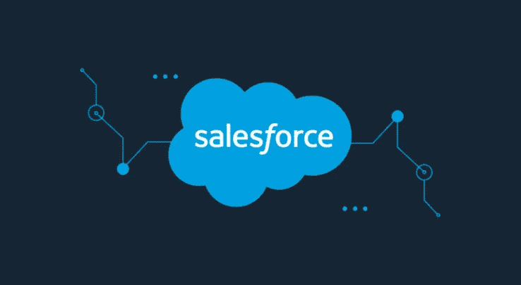

# 根据您的业务需求定制 Salesforce 实施

> 原文：<https://medium.com/visualmodo/customizing-salesforce-implementation-for-your-business-needs-72a8a1c6dd9f?source=collection_archive---------0----------------------->

Salesforce 现在是头号 CRM，它提供了数千种独特且用户友好的功能。根据您的运营性质和您所代表的行业领域，Salesforce 实施中有许多可用的自定义选项。对于 Salesforce 的新成员来说，最初让它为您独特的业务需求服务是一件非常困难的事情，但是随着您的业务发展和变化的需要，像 Salesforce 这样的特色 CRM 将开始展示它的魔力来回报您最初的努力。在本文中，我们试图帮助您配置 Salesforce，了解如何通过集成对其进行定制，重新设计业务流程，以及如何开发一些定制应用程序。

# 让 Salesforce 实施为您服务

有了 CRM，你的工具必须为你工作，也应该反过来。这些建议会有所帮助。

# 进行自定义配置

即使 Salesforce 考虑到各种企业的需求提供了许多选项，您的业务运营的独特方式也应该为您决定该工具的行为。Salesforce 顾问应该能够设置 Salesforce，以便通过优化工作流为您的用户提供基本组件和数据。

# 平台可用性优化

首先，Salesforce 没有使用资金，一个主要障碍是用户的接受和保留。最后，为了确保这一点，您需要借助 APEX 编程语言定制 UI。除了 VisualForce，这是一个开发的前端框架。

# 添加自定义功能

尽管 Salesforce 能够自己做很多事情，但它不能满足您的所有需求。像 Flosum.com 这样的优秀顾问可以为您添加所需的功能，如触发操作、自定义计算、创建适当的工作流等等。

# 将 Salesforce 组织与其他组织集成

Salesforce 用户也可以通过 Salesforce 使用其他应用程序的功能和数据。我们可以集成任何云应用程序进行双向同步，还可以无缝共享数据。有了这一功能，您可以将业务管理置于自动驾驶状态，并将精力集中在探索新的可能性上。您应该探索 Salesforce 集成线索以了解更多信息。

# Salesforce 自定义应用程序开发实施

处理一个商业应用程序，大多数时候，你可能需要一些内置特性之外的额外功能。这需要应用程序或集成的定制配置。因此，优秀的 Salesforce 开发人员将帮助您从头开始构建应用程序。了解您的需求和需要执行的功能。这可以在开发的 Lightening 平台的帮助下在 Salesforce customization 中完成。

# 社区云的定制

Salesforce 社区云是一个参与平台，可以帮助您以各种方式发展业务。通过与客户、员工以及合作伙伴保持联系。通过 Salesforce 社区云与所有这些社区进行有效且及时的协调将有助于降低您的整体营销成本，增加销售额，降低客户获取成本，使客户关怀更加及时和简单，并有助于构建合作伙伴[网络](https://visualmodo.com/the-role-of-your-business-website-in-the-age-of-social-media/)。所有在这些社区内进行的活动都像团队讨论一样。游戏化、群体化、适度化，除了分析，一切都可以在这个平台上更高效、更协作地运行。

# 客户参与

通过实施 Salesforce，您可以更有效地吸引客户。满足自助服务社区的需求。因此，您可以节省大量时间，并帮助您卖得更好。通过 Salesforce 客户服务管理的活动有:

*   常见问题解答和知识共享。
*   客户可以创建自己的用例。
*   将未回答的问题上报。
*   分配徽章以识别不同类别的成员。
*   授权成员认可其他成员
*   社区 e-com 整合。
*   衡量会员活动并进行分析。

# 合作伙伴参与

通过 Salesforce 云，您可以帮助供应商。经销商。除合作伙伴外，经销商还应通过创建满足其需求的社区，与您一起发展业务。社区活动包括但不限于:

*   与客户分享销售线索信息
*   第三方系统的集成
*   通过避免渠道冲突来管理销售线索
*   创建合作伙伴销售渠道
*   启动联合营销战略
*   自动添加应用程序
*   创建自定义报告和仪表板

# Salesforce 对员工参与的实施

通过有效管理员工社区，通过实施 Salesforce，可以更容易地与他们保持联系并更长时间地保留他们作为社区的一部分。所以，这让他们在工作中更有效率、更快乐。通过员工社区:

*   您可以让他们随时随地访问文件和信息。
*   使用小组来组织活动和团队。
*   在公司范围内共享视频和记录。
*   自动生成主题页面
*   使用户能够关注他们感兴趣的话题并保持更新。
*   将主题专家与员工联系起来。

# 更好地关注业务影响

在考虑 Salesforce 定制时，您的业务目标应该是这个过程的驱动力。这就是为什么 Salesforce 咨询公司应该了解您的业务目标和行业挑战的原因。您需要将定制更多地集中在提高生产率上。因此，手动过程的自动化，提高了数据质量。最后，您可能需要其他定制解决方案来更好地管理业务。

# 借助 Salesforce 实施加快应用交付

在 Force.com 上开发有助于加快移动应用开发和创新的整体步伐。此外，还有一个特性 web 应用程序层，只需要最少的定制代码。此外，提供了许多开发更新工具，以缩短整个开发周期。

# 灵活性和适应性

Force.com 平台提供不同的选项来创建或定制各种应用程序的用户界面。因此，为了更好地控制用户界面，你可以在 Force.com 上使用 VisualForce。哪个全面的框架可以为设备上的任何应用创建和运行任何用户界面？

# Salesforce 实施的最佳安全性

Salesforce.com 可以定期运行外部和内部审计来检查任何漏洞。Force.com 数据公司的所有数据都符合 SAS 70 Type II、ISO 27001 和 SysTrust 认证标准。安全性是所有商业企业和管理实体的主要关注点，Salesforce 被证明是一个很受信任的名称。

总的来说，Salesforce 是一个高度灵活的定制开发平台，可以横向和纵向扩展。总之，pod 架构的力量是如此独特的定制资源，以确保高性能。应用程序、数据库、搜索功能、负载平衡器、电子邮件、存储和备份服务器等等。