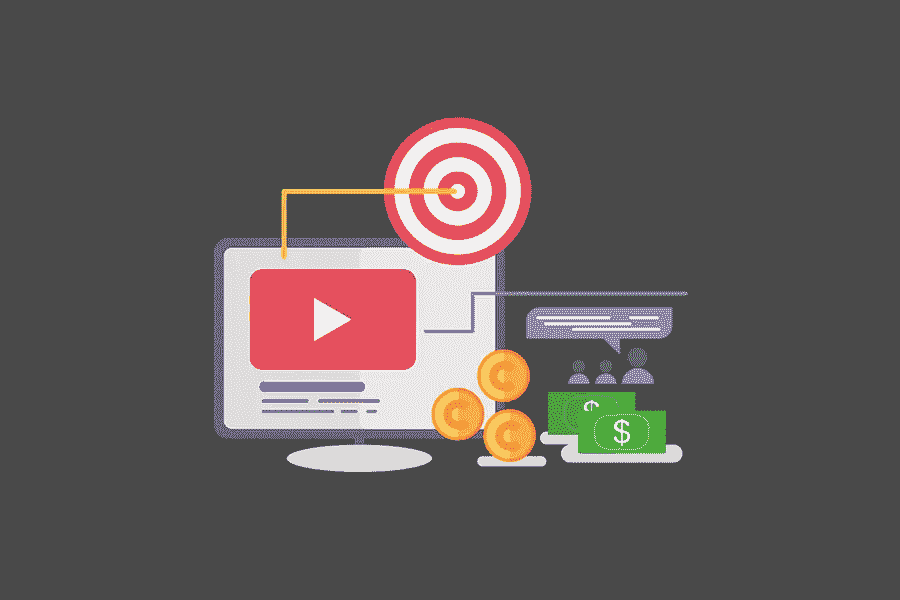

# 揭穿:关于视频营销的 9 个神话

> 原文：<https://medium.com/visualmodo/debunking-9-myths-about-video-marketing-bc0ab4dff879?source=collection_archive---------0----------------------->

视频营销是吸引新线索和获得转化的有力工具。更重要的是，74%的网络流量来自视频(2017 年统计。)此外，越来越多的公司将视频营销作为建立品牌知名度和提高销售额的最优先渠道之一。在这篇揭露文章中，你会看到关于视频营销的九个误区。

尽管如此，仍有 31%的品牌在日常营销活动中不使用视频营销。

为什么？

因为视频营销神话。这些神话迫使企业不惜一切代价避免使用视频营销。

在本帖中，你将熟悉 9 个将被揭穿的视频营销神话。

开始吧！

# 1.视频营销是一件昂贵的事情

第一个误区是视频营销太贵。

是真的还是假的？

这个问题的答案是“视情况而定”,因为你既可以创作需要坚实投资的视频内容，也可以完全免费。

比方说，你决定录制一些视频，并邀请了一位特殊的嘉宾。这位客人在你的领域里是一位知名的有影响力的人。你必须向这个有影响力的人支付一笔可观的钱，让这个人参与你的视频。

另一方面，如果你为你的视频、场景想出了一个主意，并对视频材料最终会是什么样子有了一个清晰的愿景，你就能省下一大笔钱。只要向一些视频制作公司解释你想在你的视频中看到什么，并在你的预算允许的情况下尽可能多的投资。

# 2.你不能跟踪视频统计

这个神话是完全错误的。哪怕你用的是 YouTube 这样的免费视频平台。是的，你将无法获得关于你的视频表现的超级详细的分析。然而，YouTube 允许你跟踪视频营销统计数据，比如你的视频的覆盖范围、参与度和观众。

但是这些统计数据并没有为您提供您想要的更详细、更丰富的信息。但是，如果使用 Brid 这样的企业级平台。电视，您将可以使用高级类型的分析。

正如你所看到的，视频营销是非常可追踪的。这完全取决于你在工作中使用什么视频平台。

# 3.只有精通技术的人才能录制视频内容

另一个很多人担心的错觉。你不必是一个精通技术的人来创作营销主题的视频内容。

要录制涵盖营销相关主题的视频材料，您必须是真正的营销专业人士。但是没人说你一定是专业的视频制作人。你可以用你的智能手机(就像加里·维纳查克在他那个时代做的那样)或者用一个简单的摄像机来录制你的第一段视频。

另外，有很多视频营销工具可供你选择，自己制作视频内容。

请记住，视频营销不是关于过程本身的技术方面；它是关于你提供给你的目标受众的信息。因此，你应该首先关注内容。

# 4.你必须知道如何写视频脚本

这个流言说每个营销视频都需要一个脚本。根据定义，视频脚本是概述你的营销视频将如何运行的文档。它由以下要素组成:

*   场景描述
*   对话
*   方向
*   相机线索
*   后期制作说明

如你所见，任何视频脚本都是一个全面的文档，需要一些关于如何创建它的额外知识。很可能，你不需要为此而烦恼，因为不是每个营销视频都需要它。

是的，你可以雇一个专业作家，他会倾听你的营销想法，然后把它们变成剧本。但是它花费你金钱和时间。

相反，创建一个未来视频的大纲，写一个你将要覆盖的场景。在你开始拍摄视频材料之前，先读几遍。最终，你将不再需要使用脚本。