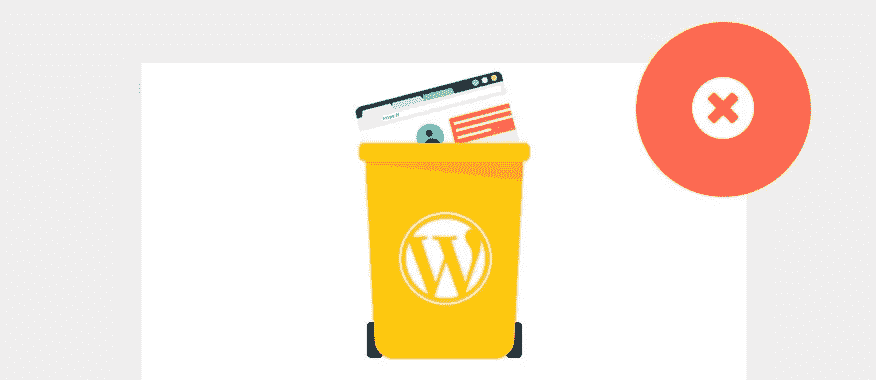

# 通过 FTP 删除 WordPress 插件

> 原文：<https://medium.com/visualmodo/delete-wordpress-plugins-via-ftp-1fa0141ffb6?source=collection_archive---------0----------------------->

在这篇文章中，你将学习如何通过 FTP 删除 WordPress 插件，这是非常有用的，一旦一些插件可以击落你的网站，所以不可能以正常的方式删除插件，在你的 WordPress 仪表板内，所以，按照这个删除有问题的插件，使你的网站回来。

# 如何删除 WordPress 插件？

不可否认，WordPress 是领先的或者最好的 CMS。像 blogger 一样，WordPress 允许你改变你选择的主题，并添加与你的需求相关的小部件。

WordPress 不再仅仅来自博客，它有各种各样的插件，让你可以在网上做任何你想做的事情，包括建立杂志、电子商务、预订系统、目录等等。一些 WordPress 插件可以让你优化你的网站的功能和性能，比如图片的延迟加载，搜索引擎的优化插件，安全插件等等。

现代网站管理员被许多有用的[插件](https://visualmodo.com/)淹没了，他们可以把这些插件放到他们的网站上。有时，从不同的开发者那里下载和安装这些插件会导致错误，由于不兼容而危及整个网站。这些不兼容性可能是通过代码、数据库和执行相同的功能造成的。当我说妥协，这将意味着你的整个网站将离线几个小时到几天。这个错误可能会让你损失金钱和客户。

现在，为了防止这种“离线”状态，如果你安装的插件有不兼容的问题，那么你应该立刻决定哪些应该保留，哪些应该停用。比方说，你的网站已经关闭了很长一段时间，你不能登录到你的网站卸载导致错误的插件。这个图坦能让你不通过管理板而是通过你的 **FTP** 来停用或删除一个[插件。](https://wordpress.org/plugins/)

在第一个截图告诉我们登录到您的主机提供商和访问我们的 FTP，特别是在文件管理器。在你的文件管理器上，你必须找到你安装 WordPress 的目录。寻找名为 **"** wp-content **"** 的文件夹。访问文件夹，进入下一步。

# 在 WP-Content 文件夹中

如果你在 WP-Content 文件夹中，寻找另一个名为**“plugins”**的文件夹。

# 删除“插件”目录中的插件

在 **"plugins"** 文件夹中，你可以看到许多文件夹，这些文件夹代表你在网站上安装或下载的插件。

寻找代表你的不兼容插件的**文件夹名**，然后你可以通过重命名和删除你当前目录下的文件夹来卸载它。

现在，重命名文件夹名称而不是删除它的好处是，您仍然可以从该插件访问存储的数据。

差不多就这些了，谢谢你的阅读！留下你的[反馈](https://visualmodo.com/)，分享你自己的经历。