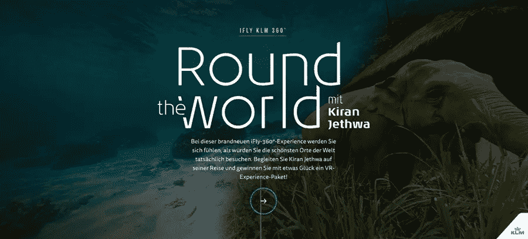

# 现在就用这些尖端的网页设计趋势来设计未来

> 原文：<https://medium.com/visualmodo/design-for-the-future-now-with-these-cutting-edge-web-design-trends-bc2428732d25?source=collection_archive---------0----------------------->

2019 年就要到了，当我们进入这十年的最后一年时，预计会发现你的提要被年度回顾甚至十年回顾列表所淹没。回顾过去的趋势是一种有趣的方式来看看我们已经走了多远，但是当你计划一个网站设计或者重新设计的时候，用前沿网页设计趋势来展望未来。计算机渲染能力每年都在提高，所以要利用人们浏览你网站的所有新方式，给他们一些新鲜的东西，一些能刺激他们感官的东西，让他们知道他们正在看一些很棒的内容。

# 前沿网页设计趋势

准备好像 2019 年一样设计了吗？看看明年的八大网络趋势:

# 小故障

感觉数字世界和现实世界之间的界限比以往任何时候都模糊。不要指望 2019 年会有所改变。事实上，预计它会成为更多的焦点，以至于设计师们会玩这个概念，做“如果”的工作他们设计中的场景。如果一次大规模的 DDOS 攻击把你锁在了支票账户之外，或者让你无法订购食品杂货，那该怎么办？想想你家里所有使用物联网的东西。现在想想，如果你的冰箱或进入你家的键盘被黑了，或者如果 Alexa 决定反抗，会发生什么。

这听起来可能有些牵强，但在 2019 年，真的不是。这就是格林奇艺术的玩法。浮华的设计提醒我们，我们只是生活在快速数字化世界中的人类，没有人能够真正确定我们在这个数字世界中的位置……或者我们将如何理解它的崩溃。

# 有机形状

曾经有一段时间，普通屏幕的分辨率确实限制了网站上可以出现的图形种类。网站网格非常明显；设计元素有棱角和对称。现在不是这样的了。

继续我们的数字世界与自然世界相遇的主题，2019 年突出的网页设计趋势之一将是使用看起来自然、感觉自然的形状，这些形状可以在设备屏幕上爬行、渗透和滴落。像这样的形状让我们想起大自然，因为大自然并不完美。想象一棵藤蔓蜿蜒爬上花园的墙壁，或者雨滴飞溅在窗户上。这些形状感觉是活的。他们感觉很新鲜。当你计划你的网站的新设计时，使用手绘的设计来赋予它生命。

# 设计的多样性

互联网连接着世界。现在，你可以和另一个大陆的人聊天，接受一份你从未去过的国家的工作。2019 年，设计师们将加大努力，通过多样化的图像来展示世界的真实面貌。

设计的多样性并不是什么新鲜事。还记得苹果在表情符号中增加了多种肤色选项吗？预计 2019 年将有更多这方面的举措。期待在明年的设计中看到不同肤色、不同文化、不同性别和不同人生阶段的人的图像。互联网不仅仅是年轻的独联体白人的专利，设计师们清楚地表明了这一点。期待看到更少的库存照片和更多来自人们实际生活的原始、真实、坦率的图像，因为展示人类多样化的经历是在传达我们的多样性和我们的力量。

# 屏幕友好的衬线

就像有机形状变得流行是因为技术使它们成为可能一样，准备好在 2019 年在你的屏幕上看到更多的衬线字体。很长一段时间，在网页上很难找到衬线字体，因为它们会使副本难以阅读。这仍然是事实——如果你有大量的网页文本，衬线字体可能不是正确的选择。

但是对于你网站上更大的内容，比如你的标题和行动号召，衬线字体可以将它分类，并准确地将你的读者吸引到你想要它去的地方。使用衬线字体来分隔突出的文本和真正传达你的品牌的文本，比如你的标志。网站访问者可能不会注意到他们为什么会被你的字体吸引，因为让我们面对现实吧，不是设计师的人不会如此仔细地分析字体，但是相信选择粗体衬线字体会让你的网站感觉新鲜，因为人们只是不习惯在网站上看到它们。

# 视频，视频，视频

自 2010 年初以来，视频越来越受欢迎，这一趋势在 2019 年不会放缓。事实上，恰恰相反的情况正在发生:它正在上升。

为什么？几个原因。一个是谷歌最近改变了它的搜索算法，将视频内容的网站推至搜索引擎回报率高于标准页面的位置。另一个原因是，视频只是让沟通变得快捷和容易。阅读需要时间，即使文章很短。视频传递你的信息，而不会让浏览者放慢速度，停止他们正在做的事情，专注于你网站的文本。视频也很容易分享，这使它成为向世界发布短消息的完美媒介。

你网站上的视频甚至不需要那么复杂。这也可以是一个简单的方法来摆脱无聊，静态的背景。用视频背景展示你的[品牌](https://visualmodo.com/blog/)在行动。

# 与聊天机器人进行更好的对话

我们打赌你们中的很多人还记得 SmarterChild 和不太受欢迎的 AIM 聊天机器人。最近，你可能已经与 Siri 或谷歌助手进行了对话。

2019 年，期待与聊天机器人有更多的对话。并期望他们更聪明。机器学习和人工智能的进步使得聊天机器人能够更多地了解他们交谈的人，并让他们找到他们想要的东西，自动化了许多以前需要电子邮件或电话的互动。预计聊天机器人会在你访问的网站上更加突出，对你的询问反应更快，比过去更有个性，有着友好的面孔。

# 黑色和白色

你知道你的调色板对你的整体品牌有多重要。你可能花了很多时间来构建完美的调色板，尽可能多地讲述你的故事。太棒了……2018 年。2019 年，所有酷孩子都将放弃色彩，选择大胆的黑白造型。

黑色是大胆的。很有主见。声音很大。白色干净、清爽、鲜明。它们一起创造了你无法不看的图像。没有颜色，你的眼睛更容易被图像中的纹理和形状所吸引。你需要慢下来看两遍，这需要你在我们快如闪电的现代网络世界中暂时按下“暂停”按钮。

不要认为这意味着颜色正在完全消失。在明天引人注目的网页上，颜色将被有选择地用来突出关键信息和行动号召——转化的内容。

# 微交互

微交互是当你把鼠标放在图片和文本上时发生的小动画。他们的反馈是“嘿，是的，我们看到你在做什么。”最有效的微交互是用户没有预料到的。让他们有趣，让他们流行，让他们感到诱人和温暖，尽管只是屏幕上的动画片段，人。

并不是所有的微交互都是动画。有些是声音。并不是所有的微交互都是鼠标悬停；有些是在用户滚动或输入数据时发生的。无论如何使用它们，它们都是用来识别用户在做什么的。它们在热情人类用户和冷酷无情的设备之间架起了一座桥梁。这样，它们与聊天机器人和有机形状没有太大区别——它们让网页感觉像有自己的生命。

# 需要一个设计师把你的网站带入 2019 年？

想要更多网页设计灵感？在 99designs 上查看令人惊叹的[网站设计](https://99designs.com/web-design)。有一百万种方法来扭曲和重新想象明年[崭露头角的网页设计趋势](https://99designs.com/blog/trends/web-design-trends-2019/)，我们迫不及待地想看看你会想出什么！